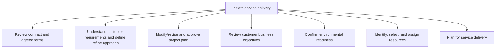
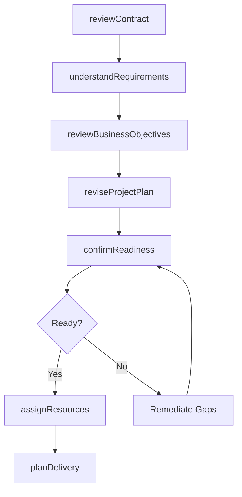

# Initiate service delivery

> Business-as-Code definition for service delivery initiation. Models contract review, customer requirements analysis, project plan revision, business objective alignment, readiness confirmation, resource assignment, and delivery planning as programmable workflows.

## Overview

Collaborating with the customer to understand service needs. Review, understand, and modify the delivery scope with the organization needs of the customer in mind. Confirm readiness and identify, select, and assign resources. Plan for service delivery.

## Process Hierarchy



## GraphDL

```yaml
initiate:
  object: Service Delivery
  actor: EngagementManager
  result: DeliveryKickoff
```

## Actions

| Action | Description |
|--------|-------------|
| reviewContract | Review contract terms and agreed service scope with stakeholders |
| understandRequirements | Analyze customer requirements and refine delivery approach |
| reviseProjectPlan | Modify and approve project plan based on refined requirements |
| reviewBusinessObjectives | Align delivery approach with customer business objectives |
| confirmReadiness | Verify environment, tools, and infrastructure readiness |
| assignResources | Identify, select, and assign qualified resources to engagement |
| planDelivery | Establish detailed plan of action for service delivery execution |

## Events

| Event | Description |
|-------|-------------|
| contractReviewed | Contract terms and scope reviewed with all parties |
| requirementsUnderstood | Customer requirements analyzed and approach refined |
| projectPlanRevised | Project plan updated and approved by stakeholders |
| businessObjectivesReviewed | Delivery aligned with customer business goals |
| readinessConfirmed | Environment and infrastructure validated for delivery |
| resourcesAssigned | Qualified resources allocated to engagement |
| deliveryPlanned | Detailed delivery plan established and communicated |

## Searches

| Search | Description |
|--------|-------------|
| getContractTerms | Retrieve contract scope, terms, and agreed deliverables |
| getRequirements | Query customer requirements by engagement or category |
| getResourceAssignments | List assigned resources by engagement, skill, or role |
| getReadinessStatus | Check environment and infrastructure readiness checklist |
| getDeliveryPlan | Retrieve delivery plan milestones and timeline |

## Process Flow



## RACI Matrix

| Activity | Responsible | Accountable | Consulted | Informed |
|----------|-------------|-------------|-----------|----------|
| reviewContract | EngagementManager | ServiceDeliveryDirector | Legal, Sales | Finance |
| understandRequirements | SolutionArchitect | EngagementManager | Customer, ProductTeam | DeliveryTeam |
| assignResources | ResourceCoordinator | EngagementManager | ResourcePlanning, HR | DeliveryTeam |
| planDelivery | ProjectManager | EngagementManager | DeliveryLeads, Customer | Executive |

## Sub-Processes

| ID | Name | Description |
|----|------|-------------|
| 5.3.1.1 | Review contract and agreed terms | Meeting with the customer, partner, and/or supplier to review the terms of the solutions contract an |
| 5.3.1.2 | Understand customer requirements and define refine approach | Taking the customer requirements for a solution and applying those requirements to a refined approac |
| 5.3.1.3 | Modify/revise and approve project plan | Updating the project plan to align with the new solution approach agreed upon with the customer. |
| 5.3.1.4 | Review customer business objectives | Aligning the customer business objectives with the agreed service delivery solution. |
| 5.3.1.5 | Confirm environmental readiness | Confirming that the organization has the recourses necessary to meet the expectations for the soluti |
| 5.3.1.6 | Identify, select, and assign resources | Identifying, selecting, and assigning resources required to deliver service to the customer. Ensure  |
| 5.3.1.7 | Plan for service delivery | Establishing a plan of action to successfully render a solution for service delivery. |

## Related Processes

| Process | Relationship |
|---------|-------------|
| 5.2.2 Create and manage resource plan | Upstream - resource plan provides staffing for engagement |
| 5.1.1 Establish service delivery governance | Upstream - governance standards guide initiation procedures |
| 5.3.2 Execute service delivery | Downstream - initiation hands off to execution phase |
| 3.3 Manage selling activities | Upstream - sales handoff triggers delivery initiation |

## Related Departments

| Department | Role |
|-----------|------|
| Engagement Management | Primary owner of delivery initiation and customer onboarding |
| Resource Management | Assigns and schedules resources for the engagement |
| Solution Architecture | Refines approach based on customer requirements |
| Legal | Reviews contract terms and ensures compliance |

## Related Occupations

| Occupation | Involvement |
|-----------|-------------|
| Engagement Manager | Overall initiation coordination and customer relationship |
| Solution Architect | Requirements analysis and approach refinement |
| Project Manager | Delivery planning and resource scheduling |

## KPIs

| KPI | Description | Unit |
|-----|-------------|------|
| Initiation Cycle Time | Average time from contract signing to delivery kickoff | Days |
| Resource Assignment Fill Rate | Percentage of required roles staffed by kickoff date | % |
| Readiness Gate Pass Rate | Percentage of engagements passing readiness review on first attempt | % |
| Customer Alignment Score | Customer satisfaction with initiation and planning process | Score (1-10) |

## Usage

```typescript
import { initiateServiceDelivery } from '@headlessly/initiate-service-delivery'

const client = initiateServiceDelivery()

// Review contract and terms
const review = await client.reviewContract({
  contractId: 'CTR-2025-0234',
  stakeholders: ['delivery-lead', 'legal', 'finance'],
  reviewDeadline: '2025-06-01'
})

// Assign resources to engagement
const assignments = await client.assignResources({
  engagementId: 'ENG-2025-0567',
  requiredRoles: [
    { role: 'Project Manager', count: 1, startDate: '2025-06-15' },
    { role: 'Solution Architect', count: 2, startDate: '2025-06-15' },
    { role: 'Developer', count: 4, startDate: '2025-07-01' }
  ]
})
```
