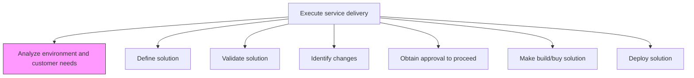
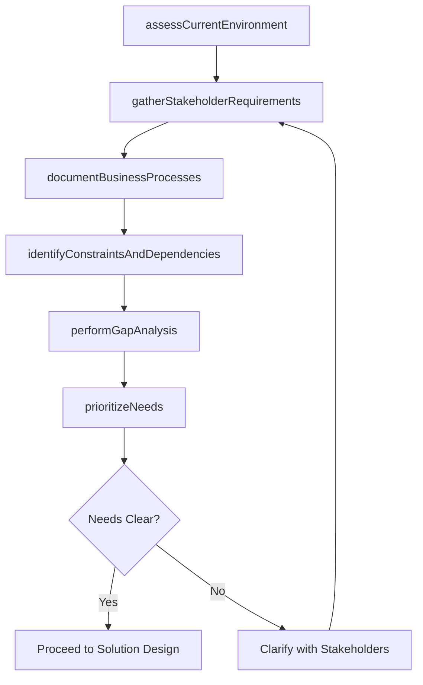

# Analyze environment and customer needs

> Business-as-Code definition for conducting a thorough assessment of the customer's operating environment, technical landscape, and evolving needs to inform the design of an effective service delivery solution.

## Overview

Understanding the needs of the customer and providing the necessary resources to meet those requirements within the scope of the organization.

## Process Hierarchy



## GraphDL

```yaml
analyze:
  object: Environment And Customer Needs
  actor: BusinessAnalyst
  result: NeedsAssessmentReport
```

## Actions

| Action | Description |
|--------|-------------|
| assessCurrentEnvironment | Evaluate the customer's existing systems, processes, and infrastructure |
| gatherStakeholderRequirements | Conduct interviews and workshops to capture stakeholder needs |
| documentBusinessProcesses | Map current-state business processes impacted by the service |
| identifyConstraintsAndDependencies | Catalog technical, organizational, and regulatory constraints |
| performGapAnalysis | Compare current state against desired outcomes to identify gaps |
| prioritizeNeeds | Rank customer needs by business impact and urgency |

## Events

| Event | Description |
|-------|-------------|
| environmentAssessed | Customer environment evaluation completed |
| stakeholderRequirementsGathered | Stakeholder needs captured and documented |
| businessProcessesDocumented | Current-state process maps created |
| constraintsIdentified | Technical and organizational constraints cataloged |
| gapAnalysisCompleted | Gap analysis between current and desired state finished |
| needsPrioritized | Customer needs ranked and approved |

## Searches

| Search | Description |
|--------|-------------|
| getNeedsAssessment | Retrieve the needs assessment report for an engagement |
| findStakeholderRequirements | List requirements filtered by stakeholder, priority, or category |
| getGapAnalysis | Retrieve gap analysis results for an engagement |
| findConstraints | List constraints by type or severity |
| getProcessMaps | Retrieve documented business process maps |

## Process Flow



## RACI Matrix

| Activity | Responsible | Accountable | Consulted | Informed |
|----------|-------------|-------------|-----------|----------|
| assessCurrentEnvironment | BusinessAnalyst | EngagementManager | Client IT | DeliveryTeam |
| gatherStakeholderRequirements | BusinessAnalyst | EngagementManager | Client Stakeholders | SolutionArchitect |
| performGapAnalysis | SolutionArchitect | EngagementManager | BusinessAnalyst | ProjectManager |
| prioritizeNeeds | EngagementManager | ServiceDeliveryManager | Client | DeliveryTeam |

## Related Processes

| Process | Relationship |
|---------|-------------|
| 5.3.1.2 Understand customer requirements | Upstream - initial requirements inform deeper analysis |
| 5.3.2.2 Define solution | Downstream - needs assessment drives solution definition |
| 5.3.1.4 Review customer business objectives | Parallel - business objectives contextualize needs analysis |

## Related Departments

| Department | Role |
|-----------|------|
| Service Delivery | Owns needs analysis and environment assessment |
| Business Analysis | Conducts stakeholder interviews and gap analysis |
| Solution Architecture | Evaluates technical environment constraints |
| Account Management | Provides customer relationship and business context |

## Related Occupations

| Occupation | Involvement |
|-----------|-------------|
| Business Analyst | Primary needs assessment executor |
| Solution Architect | Evaluates technical environment |
| Engagement Manager | Oversees analysis and stakeholder alignment |

## KPIs

| KPI | Description | Unit |
|-----|-------------|------|
| Requirements Capture Rate | Percentage of stakeholder needs documented | % |
| Gap Coverage | Percentage of identified gaps addressed in solution design | % |
| Analysis Cycle Time | Time from analysis start to needs assessment completion | Days |
| Stakeholder Satisfaction | Stakeholder rating of needs analysis thoroughness | Score (1-5) |

## Usage

```typescript
import { analyzeEnvironmentAndCustomerNeeds } from '@headlessly/analyze-environment-and-customer-needs'

const analysis = analyzeEnvironmentAndCustomerNeeds()

// Assess current customer environment
const environment = await analysis.assessCurrentEnvironment({
  engagementId: 'eng-789',
  areas: ['infrastructure', 'applications', 'processes', 'data'],
  assessmentDepth: 'comprehensive'
})

// Perform gap analysis
const gaps = await analysis.performGapAnalysis({
  environmentId: environment.id,
  desiredOutcomes: ['reduce-cycle-time', 'improve-quality', 'lower-cost'],
  priorityFramework: 'business-impact'
})

// Prioritize customer needs
const priorities = await analysis.prioritizeNeeds({
  gapAnalysisId: gaps.id,
  stakeholderInput: true,
  rankingMethod: 'weighted-scoring'
})
```
