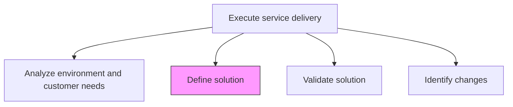
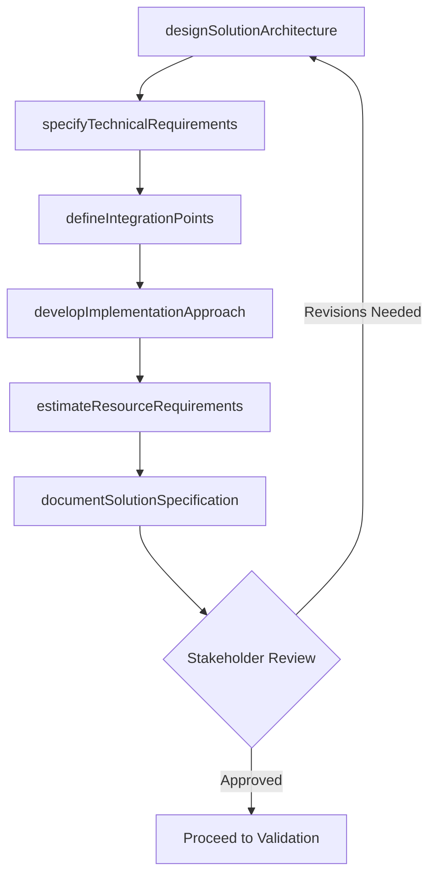

# Define solution

> Business-as-Code definition for designing and specifying the service delivery solution that addresses identified customer needs, including architecture, components, integration points, and implementation approach.

## Overview

Creating a plan of action to provide service delivery to the customer through a possible solution. This solution should be in response to a collaborative effort made by the organization and the customer to meet service delivery needs.

## Process Hierarchy



## GraphDL

```yaml
define:
  object: Solution
  actor: SolutionArchitect
  result: SolutionSpecification
```

## Actions

| Action | Description |
|--------|-------------|
| designSolutionArchitecture | Create the high-level architecture and component structure of the solution |
| specifyTechnicalRequirements | Document detailed technical specifications and system requirements |
| defineIntegrationPoints | Identify and design integration touchpoints with existing systems |
| developImplementationApproach | Outline the phased approach for solution implementation |
| estimateResourceRequirements | Determine the people, tools, and budget needed for the solution |
| documentSolutionSpecification | Produce the complete solution specification document for review |

## Events

| Event | Description |
|-------|-------------|
| solutionArchitectureDesigned | High-level solution architecture completed |
| technicalRequirementsSpecified | Detailed technical specifications documented |
| integrationPointsDefined | System integration touchpoints identified and designed |
| implementationApproachDeveloped | Phased implementation plan outlined |
| resourceRequirementsEstimated | Resource and budget estimates completed |
| solutionSpecificationDocumented | Complete solution specification published for review |

## Searches

| Search | Description |
|--------|-------------|
| getSolutionSpecification | Retrieve the solution specification for an engagement |
| findSolutionComponents | List solution components filtered by type or status |
| getIntegrationPoints | Retrieve integration design details for a solution |
| findResourceEstimates | Get resource and cost estimates for a solution |

## Process Flow



## RACI Matrix

| Activity | Responsible | Accountable | Consulted | Informed |
|----------|-------------|-------------|-----------|----------|
| designSolutionArchitecture | SolutionArchitect | EngagementManager | Client Technical Lead | DeliveryTeam |
| specifyTechnicalRequirements | TechnicalLead | SolutionArchitect | BusinessAnalyst | ProjectManager |
| estimateResourceRequirements | ProjectManager | EngagementManager | ResourceManager | Finance |
| documentSolutionSpecification | SolutionArchitect | EngagementManager | QualityAssurance | All Stakeholders |

## Related Processes

| Process | Relationship |
|---------|-------------|
| 5.3.2.1 Analyze environment and customer needs | Upstream - needs assessment drives solution definition |
| 5.3.2.3 Validate solution | Downstream - solution specification is validated |
| 5.3.2.4 Identify changes | Downstream - solution definition reveals change requirements |

## Related Departments

| Department | Role |
|-----------|------|
| Solution Architecture | Owns solution design and specification |
| Service Delivery | Provides delivery feasibility input |
| Engineering | Validates technical approach and estimates |
| Project Management | Plans implementation approach and resource allocation |

## Related Occupations

| Occupation | Involvement |
|-----------|-------------|
| Solution Architect | Primary solution designer |
| Technical Lead | Specifies technical requirements |
| Business Analyst | Ensures solution addresses business needs |
| Project Manager | Plans implementation and estimates resources |

## KPIs

| KPI | Description | Unit |
|-----|-------------|------|
| Solution Definition Time | Time from needs assessment to completed specification | Days |
| Specification Completeness | Percentage of required specification sections completed | % |
| First-Pass Approval Rate | Percentage of solutions approved without major revisions | % |
| Requirements Traceability | Percentage of customer needs traced to solution components | % |

## Usage

```typescript
import { defineSolution } from '@headlessly/define-solution'

const solution = defineSolution()

// Design solution architecture
const architecture = await solution.designSolutionArchitecture({
  engagementId: 'eng-789',
  needsAssessmentId: 'needs-456',
  pattern: 'microservices',
  targetEnvironment: 'hybrid-cloud'
})

// Specify technical requirements
const specs = await solution.specifyTechnicalRequirements({
  architectureId: architecture.id,
  categories: ['performance', 'security', 'scalability', 'availability']
})

// Document complete solution specification
await solution.documentSolutionSpecification({
  architectureId: architecture.id,
  specsId: specs.id,
  reviewers: ['client-cto', 'engagement-manager', 'qa-lead']
})
```
