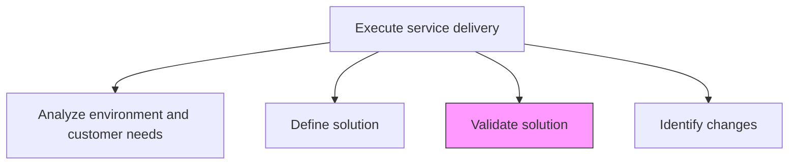
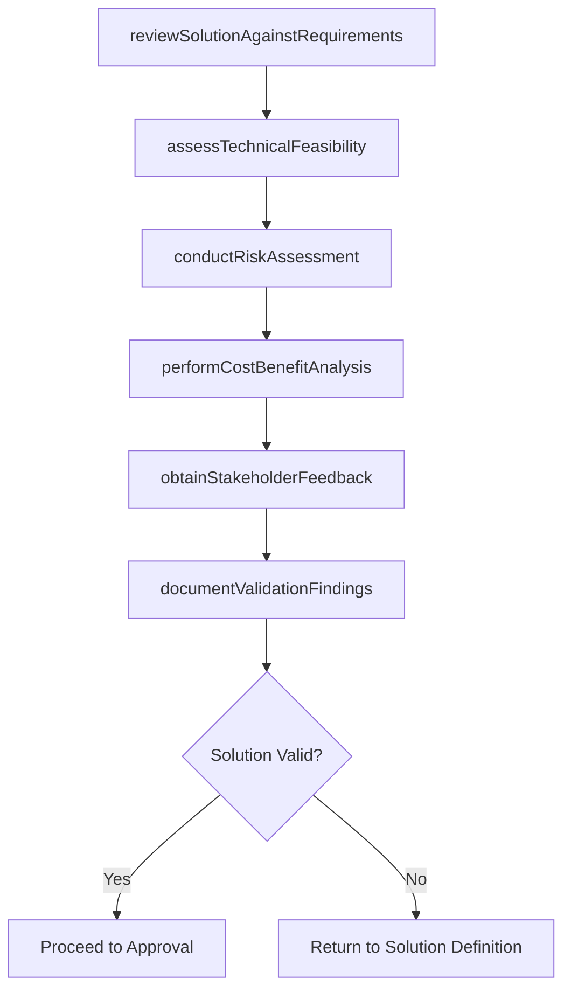

# Validate solution

> Business-as-Code definition for verifying that the proposed service delivery solution meets all customer requirements, technical standards, and business constraints before proceeding with implementation.

## Overview

Validating that the proposed solution is feasible and provides the needed services for the customer.

## Process Hierarchy



## GraphDL

```yaml
validate:
  object: Solution
  actor: QualityAssuranceLead
  result: ValidationReport
```

## Actions

| Action | Description |
|--------|-------------|
| reviewSolutionAgainstRequirements | Verify solution components trace back to documented customer requirements |
| assessTechnicalFeasibility | Evaluate whether the proposed solution is technically achievable within constraints |
| conductRiskAssessment | Identify and evaluate risks associated with the proposed solution |
| performCostBenefitAnalysis | Compare solution costs against expected business benefits |
| obtainStakeholderFeedback | Gather input from customer and internal stakeholders on the solution design |
| documentValidationFindings | Record all validation results, gaps, and recommended adjustments |

## Events

| Event | Description |
|-------|-------------|
| solutionReviewedAgainstRequirements | Requirements traceability verification completed |
| technicalFeasibilityAssessed | Technical feasibility evaluation finished |
| riskAssessmentConducted | Solution risk assessment documented |
| costBenefitAnalyzed | Cost-benefit analysis completed |
| stakeholderFeedbackObtained | Stakeholder input on solution design collected |
| validationFindingsDocumented | Validation report published with findings and recommendations |

## Searches

| Search | Description |
|--------|-------------|
| getValidationReport | Retrieve the validation report for a proposed solution |
| findValidationGaps | List gaps identified during solution validation |
| getRiskAssessment | Get risk assessment results for a solution |
| findValidationHistory | Retrieve past validation iterations for a solution |

## Process Flow



## RACI Matrix

| Activity | Responsible | Accountable | Consulted | Informed |
|----------|-------------|-------------|-----------|----------|
| reviewSolutionAgainstRequirements | QualityAssuranceLead | EngagementManager | BusinessAnalyst | SolutionArchitect |
| assessTechnicalFeasibility | TechnicalLead | SolutionArchitect | Engineering | ProjectManager |
| conductRiskAssessment | ProjectManager | EngagementManager | QualityAssurance | Client |
| performCostBenefitAnalysis | EngagementManager | ServiceDeliveryManager | Finance | Client |

## Related Processes

| Process | Relationship |
|---------|-------------|
| 5.3.2.2 Define solution | Upstream - solution specification is the subject of validation |
| 5.3.2.4 Identify changes | Downstream - validation findings may trigger changes |
| 5.3.2.5 Obtain approval to proceed | Downstream - validated solution proceeds to approval |

## Related Departments

| Department | Role |
|-----------|------|
| Quality Assurance | Owns solution validation and requirements traceability |
| Solution Architecture | Validates technical design and feasibility |
| Finance | Conducts cost-benefit analysis |
| Risk Management | Evaluates solution risks and mitigation strategies |

## Related Occupations

| Occupation | Involvement |
|-----------|-------------|
| Quality Assurance Lead | Primary validation executor |
| Solution Architect | Technical feasibility reviewer |
| Risk Analyst | Conducts risk assessment |
| Financial Analyst | Performs cost-benefit analysis |

## KPIs

| KPI | Description | Unit |
|-----|-------------|------|
| Validation Cycle Time | Time from validation start to completion | Days |
| Requirements Coverage | Percentage of requirements verified against solution | % |
| First-Pass Validation Rate | Percentage of solutions passing validation without rework | % |
| Risk Identification Rate | Number of risks identified per solution component | Count |

## Usage

```typescript
import { validateSolution } from '@headlessly/validate-solution'

const validation = validateSolution()

// Review solution against requirements
const traceability = await validation.reviewSolutionAgainstRequirements({
  solutionId: 'sol-456',
  requirementsBaseline: 'needs-assessment-v2',
  coverageThreshold: 0.95
})

// Conduct risk assessment
const risks = await validation.conductRiskAssessment({
  solutionId: 'sol-456',
  riskCategories: ['technical', 'operational', 'financial', 'schedule'],
  mitigationRequired: true
})

// Document validation findings
await validation.documentValidationFindings({
  solutionId: 'sol-456',
  traceabilityId: traceability.id,
  riskAssessmentId: risks.id,
  recommendation: 'approved-with-conditions'
})
```
