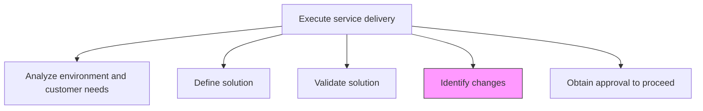
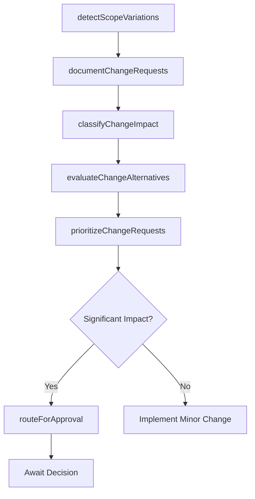

# Identify changes

> Business-as-Code definition for detecting, documenting, and classifying modifications to the original solution scope, requirements, or delivery approach that arise during service execution.

## Overview

Realizing issues within the original drafted solution and providing changes to correct those issues.

## Process Hierarchy



## GraphDL

```yaml
identify:
  object: Changes
  actor: ProjectManager
  result: ChangeRequest
```

## Actions

| Action | Description |
|--------|-------------|
| detectScopeVariations | Monitor delivery activities for deviations from the approved solution scope |
| documentChangeRequests | Formally capture proposed changes with justification and impact details |
| classifyChangeImpact | Assess each change's impact on scope, timeline, cost, and quality |
| evaluateChangeAlternatives | Analyze alternative approaches to address the identified need |
| prioritizeChangeRequests | Rank change requests by business urgency and delivery impact |
| routeForApproval | Submit classified change requests through the appropriate approval workflow |

## Events

| Event | Description |
|-------|-------------|
| scopeVariationDetected | Deviation from approved solution scope identified |
| changeRequestDocumented | Formal change request created and submitted |
| changeImpactClassified | Change impact on scope, cost, and timeline assessed |
| changeAlternativesEvaluated | Alternative approaches analyzed for identified change |
| changeRequestsPrioritized | Change requests ranked by urgency and impact |
| changeRoutedForApproval | Change request submitted to approval authority |

## Searches

| Search | Description |
|--------|-------------|
| findChangeRequests | List change requests filtered by engagement, status, or priority |
| getChangeImpact | Retrieve impact assessment details for a change request |
| findPendingChanges | List change requests awaiting review or approval |
| getChangeHistory | Retrieve the full change history for an engagement |

## Process Flow



## RACI Matrix

| Activity | Responsible | Accountable | Consulted | Informed |
|----------|-------------|-------------|-----------|----------|
| detectScopeVariations | DeliveryTeam | ProjectManager | EngagementManager | Client |
| documentChangeRequests | ProjectManager | EngagementManager | SolutionArchitect | Finance |
| classifyChangeImpact | ProjectManager | EngagementManager | TechnicalLead | ResourceManager |
| routeForApproval | ProjectManager | EngagementManager | Client | ServiceDeliveryManager |

## Related Processes

| Process | Relationship |
|---------|-------------|
| 5.3.2.3 Validate solution | Upstream - validation findings may trigger change identification |
| 5.3.2.5 Obtain approval to proceed | Downstream - significant changes require formal approval |
| 5.3.1.3 Modify/revise and approve project plan | Related - project plan updates may result from changes |

## Related Departments

| Department | Role |
|-----------|------|
| Project Management | Owns change identification and documentation |
| Service Delivery | Detects scope variations during execution |
| Solution Architecture | Evaluates technical impact of proposed changes |
| Finance | Assesses cost impact of change requests |

## Related Occupations

| Occupation | Involvement |
|-----------|-------------|
| Project Manager | Primary change identification coordinator |
| Solution Architect | Assesses technical change impact |
| Business Analyst | Documents change requirements and alternatives |

## KPIs

| KPI | Description | Unit |
|-----|-------------|------|
| Change Detection Time | Average time from variation occurrence to formal documentation | Days |
| Change Request Volume | Number of change requests per engagement | Count |
| Change Impact Accuracy | Accuracy of initial impact assessments vs. actual outcomes | % |
| Change Processing Time | Average time from request creation to approval decision | Days |

## Usage

```typescript
import { identifyChanges } from '@headlessly/identify-changes'

const changes = identifyChanges()

// Document a change request
const request = await changes.documentChangeRequests({
  engagementId: 'eng-789',
  title: 'Additional integration with legacy ERP',
  description: 'Customer requires integration with on-premise ERP not in original scope',
  requestedBy: 'client-project-sponsor',
  category: 'scope-expansion'
})

// Classify change impact
const impact = await changes.classifyChangeImpact({
  changeRequestId: request.id,
  dimensions: ['scope', 'timeline', 'cost', 'quality'],
  estimatedEffort: '3-weeks'
})

// Route for approval
await changes.routeForApproval({
  changeRequestId: request.id,
  impactId: impact.id,
  approvalPath: ['engagement-manager', 'client-sponsor', 'steering-committee']
})
```
