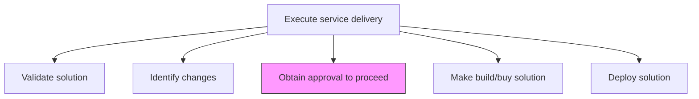
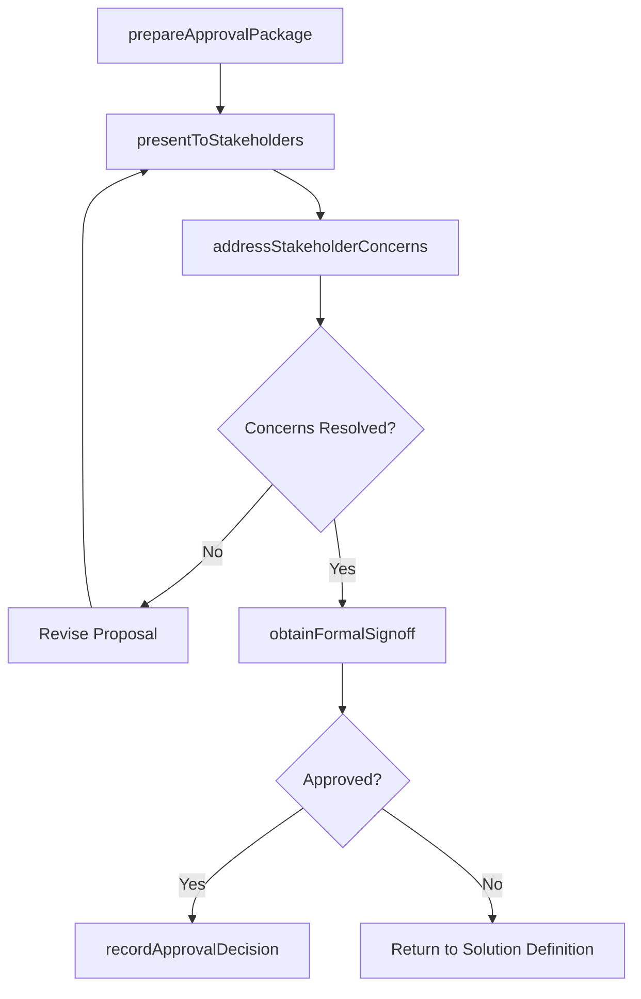

# Obtain approval to proceed

> Business-as-Code definition for securing formal authorization from customer and internal stakeholders to advance the service delivery solution through each gate, ensuring alignment on scope, cost, and timeline.

## Overview

Gaining approval from all avenues to proceed with providing solutions for service delivery.

## Process Hierarchy



## GraphDL

```yaml
obtain:
  object: Approval To Proceed
  actor: EngagementManager
  result: ApprovalDecision
```

## Actions

| Action | Description |
|--------|-------------|
| prepareApprovalPackage | Assemble the solution specification, validation results, and impact analysis for review |
| presentToStakeholders | Present the solution proposal to decision-makers for evaluation |
| addressStakeholderConcerns | Respond to questions, objections, and requests for clarification |
| obtainFormalSignoff | Secure documented approval from authorized decision-makers |
| recordApprovalDecision | Document the approval outcome, conditions, and any contingencies |

## Events

| Event | Description |
|-------|-------------|
| approvalPackagePrepared | Solution review package assembled and ready for presentation |
| stakeholdersPresentedTo | Solution proposal presented to decision-makers |
| stakeholderConcernsAddressed | Questions and objections resolved |
| formalSignoffObtained | Authorized decision-makers provided documented approval |
| approvalDecisionRecorded | Approval outcome and conditions documented |

## Searches

| Search | Description |
|--------|-------------|
| getApprovalStatus | Retrieve current approval status for a solution or change request |
| findPendingApprovals | List items awaiting stakeholder approval |
| getApprovalHistory | Retrieve the approval decision trail for an engagement |
| findApprovalConditions | List conditions attached to an approval decision |

## Process Flow



## RACI Matrix

| Activity | Responsible | Accountable | Consulted | Informed |
|----------|-------------|-------------|-----------|----------|
| prepareApprovalPackage | ProjectManager | EngagementManager | SolutionArchitect | DeliveryTeam |
| presentToStakeholders | EngagementManager | ServiceDeliveryManager | ProjectManager | AccountManager |
| obtainFormalSignoff | EngagementManager | ServiceDeliveryManager | Client Sponsor | Finance |
| recordApprovalDecision | ProjectManager | EngagementManager | Legal | All Stakeholders |

## Related Processes

| Process | Relationship |
|---------|-------------|
| 5.3.2.3 Validate solution | Upstream - validation results are included in approval package |
| 5.3.2.4 Identify changes | Upstream - change requests may require approval |
| 5.3.2.6 Make build/buy solution | Downstream - approval authorizes solution construction |

## Related Departments

| Department | Role |
|-----------|------|
| Service Delivery | Sponsors approval process and presents to stakeholders |
| Project Management | Prepares approval documentation and tracks decisions |
| Finance | Reviews cost implications and budget authorization |
| Legal | Validates contractual alignment of approved changes |

## Related Occupations

| Occupation | Involvement |
|-----------|-------------|
| Engagement Manager | Primary approval coordinator and presenter |
| Project Manager | Prepares approval materials and records decisions |
| Account Manager | Facilitates client-side approval navigation |

## KPIs

| KPI | Description | Unit |
|-----|-------------|------|
| Approval Cycle Time | Time from package submission to final decision | Days |
| First-Submission Approval Rate | Percentage of proposals approved without revision | % |
| Stakeholder Response Time | Average time for stakeholders to provide feedback | Days |
| Conditional Approval Rate | Percentage of approvals granted with conditions | % |

## Usage

```typescript
import { obtainApprovalToProceed } from '@headlessly/obtain-approval-to-proceed'

const approval = obtainApprovalToProceed()

// Prepare approval package
const package_ = await approval.prepareApprovalPackage({
  engagementId: 'eng-789',
  solutionId: 'sol-456',
  validationReportId: 'val-123',
  includeSections: ['executive-summary', 'solution-design', 'risk-assessment', 'cost-estimate']
})

// Present to stakeholders
await approval.presentToStakeholders({
  packageId: package_.id,
  stakeholders: ['client-cto', 'client-cfo', 'program-director'],
  meetingDate: '2026-04-01',
  format: 'steering-committee'
})

// Record approval decision
await approval.recordApprovalDecision({
  packageId: package_.id,
  decision: 'approved',
  conditions: ['complete-security-review', 'finalize-data-migration-plan'],
  approvedBy: ['client-cto', 'program-director']
})
```
