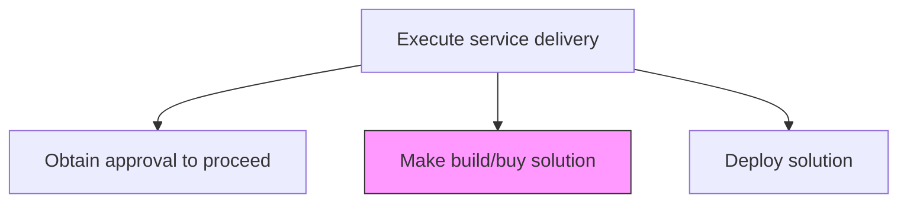
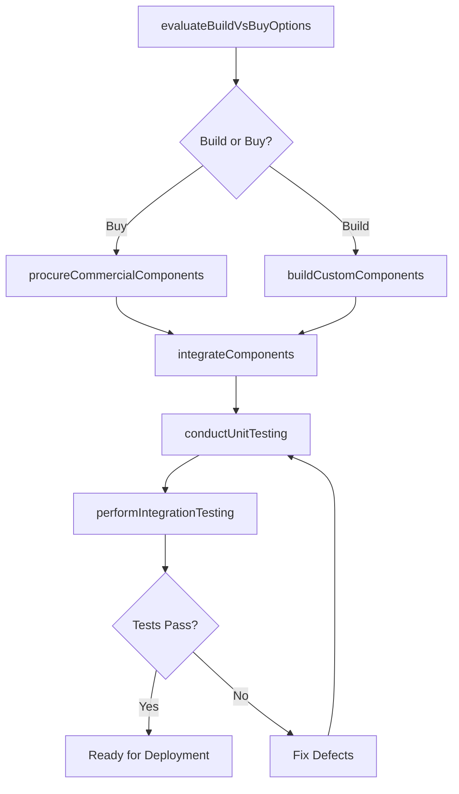

# Make build/buy solution

> Business-as-Code definition for executing the construction, procurement, or combination of custom-built and commercially acquired components to assemble the approved service delivery solution.

## Overview

Constructing or purchasing solutions necessary to provide service delivery.

## Process Hierarchy



## GraphDL

```yaml
make:
  object: Build/buy Solution
  actor: DeliveryLead
  result: ConstructedSolution
```

## Actions

| Action | Description |
|--------|-------------|
| evaluateBuildVsBuyOptions | Assess whether to custom-build, purchase, or combine components for each solution element |
| procureCommercialComponents | Acquire third-party products, licenses, or services needed for the solution |
| buildCustomComponents | Develop custom components, integrations, and configurations per specifications |
| integrateComponents | Assemble and connect custom-built and purchased components into a unified solution |
| conductUnitTesting | Test individual components to verify they meet specifications |
| performIntegrationTesting | Validate that integrated components function correctly together |

## Events

| Event | Description |
|-------|-------------|
| buildBuyOptionsEvaluated | Build vs. buy decision completed for all solution components |
| commercialComponentsProcured | Third-party products and licenses acquired |
| customComponentsBuilt | Custom development and configuration completed |
| componentsIntegrated | Solution components assembled and connected |
| unitTestingCompleted | Individual component testing finished |
| integrationTestingPassed | Integrated solution testing passed |

## Searches

| Search | Description |
|--------|-------------|
| getSolutionComponents | List all components of a solution with build/buy classification |
| findProcurementStatus | Get procurement status for commercial components |
| getBuildProgress | Retrieve development progress for custom components |
| findTestResults | List test results filtered by component, type, or status |
| getIntegrationStatus | Get integration status across solution components |

## Process Flow



## RACI Matrix

| Activity | Responsible | Accountable | Consulted | Informed |
|----------|-------------|-------------|-----------|----------|
| evaluateBuildVsBuyOptions | SolutionArchitect | EngagementManager | Procurement | Finance |
| procureCommercialComponents | ProcurementManager | EngagementManager | Legal | ProjectManager |
| buildCustomComponents | DeliveryLead | SolutionArchitect | TechnicalLead | QualityAssurance |
| performIntegrationTesting | QualityAssuranceLead | DeliveryLead | TechnicalLead | Client |

## Related Processes

| Process | Relationship |
|---------|-------------|
| 5.3.2.5 Obtain approval to proceed | Upstream - approval authorizes solution construction |
| 5.3.2.7 Deploy solution | Downstream - constructed solution is deployed to production |
| 5.3.2.4 Identify changes | Parallel - changes during construction trigger the change process |

## Related Departments

| Department | Role |
|-----------|------|
| Service Delivery | Owns solution construction and assembly |
| Engineering | Builds custom components and integrations |
| Procurement | Acquires commercial products and licenses |
| Quality Assurance | Validates component and integration quality |

## Related Occupations

| Occupation | Involvement |
|-----------|-------------|
| Delivery Lead | Coordinates overall solution construction |
| Software Engineer | Builds custom components and integrations |
| Procurement Manager | Manages vendor acquisition and licensing |
| QA Engineer | Executes testing and validation |

## KPIs

| KPI | Description | Unit |
|-----|-------------|------|
| Build Completion Rate | Percentage of custom components completed on schedule | % |
| Procurement Lead Time | Average time from requisition to component availability | Days |
| Defect Density | Number of defects per component during testing | Count |
| Integration Success Rate | Percentage of integrations passing on first attempt | % |
| Build vs. Buy Cost Ratio | Actual cost compared to initial build/buy estimates | Ratio |

## Usage

```typescript
import { makeBuildBuySolution } from '@headlessly/make-build-buy-solution'

const build = makeBuildBuySolution()

// Evaluate build vs. buy options
const decisions = await build.evaluateBuildVsBuyOptions({
  solutionId: 'sol-456',
  components: ['api-gateway', 'data-pipeline', 'reporting-dashboard', 'auth-module'],
  evaluationCriteria: ['cost', 'time-to-market', 'customization', 'support']
})

// Build custom components
const custom = await build.buildCustomComponents({
  solutionId: 'sol-456',
  components: decisions.buildComponents,
  methodology: 'agile',
  sprintDuration: '2-weeks'
})

// Perform integration testing
const results = await build.performIntegrationTesting({
  solutionId: 'sol-456',
  testSuites: ['end-to-end', 'performance', 'security'],
  acceptanceCriteria: 'validation-report-v2'
})
```
