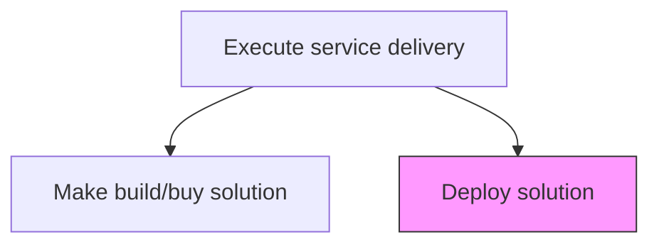
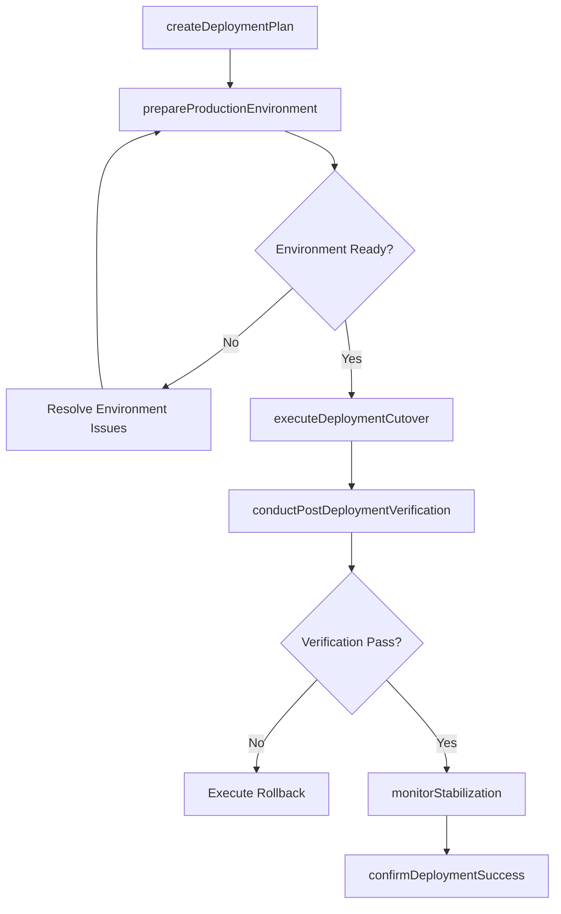

# Deploy solution

> Business-as-Code definition for releasing the completed service delivery solution into the customer's production environment, including cutover planning, go-live execution, and post-deployment stabilization.

## Overview

Providing the customer with promised services and solutions.

## Process Hierarchy



## GraphDL

```yaml
deploy:
  object: Solution
  actor: DeploymentManager
  result: DeploymentConfirmation
```

## Actions

| Action | Description |
|--------|-------------|
| createDeploymentPlan | Develop the cutover plan with steps, rollback procedures, and communication schedule |
| prepareProductionEnvironment | Configure and validate the target production environment for deployment |
| executeDeploymentCutover | Perform the actual deployment of solution components to production |
| conductPostDeploymentVerification | Verify all solution components are operational in the production environment |
| monitorStabilization | Monitor solution performance during the initial stabilization period |
| confirmDeploymentSuccess | Obtain formal confirmation that the deployment meets acceptance criteria |

## Events

| Event | Description |
|-------|-------------|
| deploymentPlanCreated | Cutover plan with rollback procedures documented |
| productionEnvironmentPrepared | Target environment configured and validated |
| deploymentCutoverExecuted | Solution components deployed to production |
| postDeploymentVerified | Production verification checks passed |
| stabilizationCompleted | Initial stabilization period concluded successfully |
| deploymentSuccessConfirmed | Formal deployment acceptance obtained |

## Searches

| Search | Description |
|--------|-------------|
| getDeploymentPlan | Retrieve the deployment plan for an engagement |
| findDeploymentStatus | Get current deployment status across solution components |
| getPostDeploymentChecks | List post-deployment verification results |
| findDeploymentIssues | List issues encountered during or after deployment |
| getStabilizationMetrics | Retrieve performance metrics from the stabilization period |

## Process Flow



## RACI Matrix

| Activity | Responsible | Accountable | Consulted | Informed |
|----------|-------------|-------------|-----------|----------|
| createDeploymentPlan | DeploymentManager | EngagementManager | TechnicalLead | Client IT |
| executeDeploymentCutover | DeploymentManager | TechnicalLead | Operations | All Stakeholders |
| conductPostDeploymentVerification | QualityAssuranceLead | DeploymentManager | Client | EngagementManager |
| confirmDeploymentSuccess | EngagementManager | ServiceDeliveryManager | Client | DeliveryTeam |

## Related Processes

| Process | Relationship |
|---------|-------------|
| 5.3.2.6 Make build/buy solution | Upstream - constructed solution is the deployment input |
| 5.3.3.1 Conduct service delivery project review | Downstream - deployment outcome is reviewed |
| 5.3.3.3 Confirm delivery according to contract terms | Downstream - deployment confirmation supports contract verification |

## Related Departments

| Department | Role |
|-----------|------|
| Service Delivery | Owns deployment execution and cutover |
| Operations | Manages production environment readiness |
| Quality Assurance | Conducts post-deployment verification |
| Customer Support | Prepares for post-go-live support |

## Related Occupations

| Occupation | Involvement |
|-----------|-------------|
| Deployment Manager | Primary deployment coordinator |
| DevOps Engineer | Executes technical deployment procedures |
| Operations Manager | Manages production environment |
| Support Engineer | Provides post-deployment stabilization support |

## KPIs

| KPI | Description | Unit |
|-----|-------------|------|
| Deployment Success Rate | Percentage of deployments completed without rollback | % |
| Deployment Downtime | Duration of service interruption during cutover | Hours |
| Post-Deployment Defect Rate | Number of critical defects found within stabilization period | Count |
| Time to Stabilization | Duration from go-live to confirmed stable operation | Days |
| Deployment Plan Adherence | Percentage of deployment steps executed as planned | % |

## Usage

```typescript
import { deploySolution } from '@headlessly/deploy-solution'

const deployment = deploySolution()

// Create deployment plan
const plan = await deployment.createDeploymentPlan({
  engagementId: 'eng-789',
  solutionId: 'sol-456',
  targetDate: '2026-05-15',
  strategy: 'blue-green',
  rollbackProcedure: 'automated'
})

// Execute deployment cutover
const cutover = await deployment.executeDeploymentCutover({
  planId: plan.id,
  approvedBy: 'deployment-manager',
  notifyStakeholders: true
})

// Confirm deployment success
await deployment.confirmDeploymentSuccess({
  cutoverId: cutover.id,
  verificationChecks: 'all-passed',
  stabilizationDays: 5,
  signedOffBy: ['client-it-director', 'engagement-manager']
})
```
