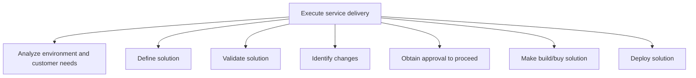
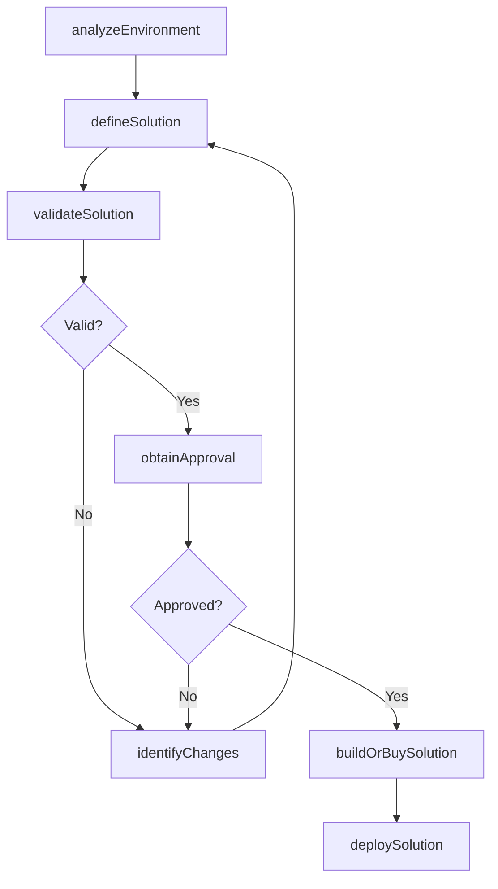

# Execute service delivery

> Business-as-Code definition for service delivery execution. Models environment analysis, solution definition, validation, change identification, approval workflows, build-or-buy decisions, and solution deployment as programmable workflows.

## Overview

Carrying out service delivery to the customer by creating and deploying the necessary solution. Analyze need and create a solution. Validate the solution and make changes if needed. Obtain approval to build/buy solution and then deploy solution to customer.

## Process Hierarchy



## GraphDL

```yaml
execute:
  object: Service Delivery
  actor: DeliveryLead
  result: DeployedSolution
```

## Actions

| Action | Description |
|--------|-------------|
| analyzeEnvironment | Assess customer environment and specific service needs |
| defineSolution | Design solution approach based on requirements and constraints |
| validateSolution | Verify solution feasibility and alignment with customer expectations |
| identifyChanges | Detect scope changes and assess impact on timeline and resources |
| obtainApproval | Secure stakeholder approval to proceed with solution delivery |
| buildOrBuySolution | Construct custom solution or procure third-party components |
| deploySolution | Implement and deploy the completed solution to the customer |

## Events

| Event | Description |
|-------|-------------|
| environmentAnalyzed | Customer environment assessment completed |
| solutionDefined | Solution design documented and presented to stakeholders |
| solutionValidated | Solution feasibility confirmed and customer sign-off obtained |
| changesIdentified | Scope changes documented with impact assessment |
| approvalObtained | Stakeholder authorization to proceed received |
| solutionBuilt | Solution constructed or procured and ready for deployment |
| solutionDeployed | Solution implemented in customer environment |

## Searches

| Search | Description |
|--------|-------------|
| getSolutionDesign | Retrieve solution design details by engagement or version |
| getChangeRequests | Query change requests by status, impact, or engagement |
| getApprovalStatus | Check approval workflow status for pending decisions |
| getDeploymentStatus | Track solution deployment progress and milestones |
| getEnvironmentAssessment | Retrieve customer environment analysis results |

## Process Flow



## RACI Matrix

| Activity | Responsible | Accountable | Consulted | Informed |
|----------|-------------|-------------|-----------|----------|
| analyzeEnvironment | SolutionArchitect | DeliveryLead | Customer, IT | EngagementManager |
| defineSolution | SolutionArchitect | DeliveryLead | Engineering, Customer | Sales |
| validateSolution | QALead | DeliveryLead | Customer, SolutionArchitect | Executive |
| deploySolution | DeploymentEngineer | DeliveryLead | IT, Operations | Customer |

## Sub-Processes

| ID | Name | Description |
|----|------|-------------|
| 5.3.2.1 | Analyze environment and customer needs | Understanding the needs of the customer and providing the necessary resources to meet those requirem |
| 5.3.2.2 | Define solution | Creating a plan of action to provide service delivery to the customer through a possible solution. T |
| 5.3.2.3 | Validate solution | Validating that the proposed solution is feasible and provides the needed services for the customer. |
| 5.3.2.4 | Identify changes | Realizing issues within the original drafted solution and providing changes to correct those issues. |
| 5.3.2.5 | Obtain approval to proceed | Gaining approval from all avenues to proceed with providing solutions for service delivery. |
| 5.3.2.6 | Make build/buy solution | Constructing or purchasing solutions necessary to provide service delivery. |
| 5.3.2.7 | Deploy solution | Providing the customer with promised services and solutions. |

## Related Processes

| Process | Relationship |
|---------|-------------|
| 5.3.1 Initiate service delivery | Upstream - initiation provides plan and resources for execution |
| 5.3.3 Complete service delivery | Downstream - execution hands off to completion and closeout |
| 5.1.1 Establish service delivery governance | Upstream - governance standards guide execution practices |
| 6.0 Manage Customer Service | Parallel - customer issues during execution feed service management |

## Related Departments

| Department | Role |
|-----------|------|
| Service Delivery | Primary owner of solution design, build, and deployment |
| Engineering | Builds custom solution components |
| Quality Assurance | Validates solution against requirements and standards |
| Customer Success | Manages customer relationship during execution |

## Related Occupations

| Occupation | Involvement |
|-----------|-------------|
| Delivery Lead | Overall execution management and stakeholder coordination |
| Solution Architect | Solution design and technical direction |
| Deployment Engineer | Solution implementation and deployment |

## KPIs

| KPI | Description | Unit |
|-----|-------------|------|
| On-Time Delivery Rate | Percentage of milestones delivered by committed date | % |
| Change Request Rate | Number of scope changes per engagement | Count |
| Solution Acceptance Rate | Percentage of solutions accepted on first validation | % |
| Deployment Success Rate | Percentage of deployments completed without rollback | % |

## Usage

```typescript
import { executeServiceDelivery } from '@headlessly/execute-service-delivery'

const client = executeServiceDelivery()

// Analyze customer environment
const analysis = await client.analyzeEnvironment({
  engagementId: 'ENG-2025-0567',
  scope: ['infrastructure', 'integrations', 'data-landscape'],
  assessmentDepth: 'detailed'
})

// Deploy solution
const deployment = await client.deploySolution({
  engagementId: 'ENG-2025-0567',
  solutionVersion: '2.1.0',
  environment: 'production',
  rollbackPlan: true,
  validationChecks: ['smoke-test', 'integration-test', 'performance-test']
})
```
