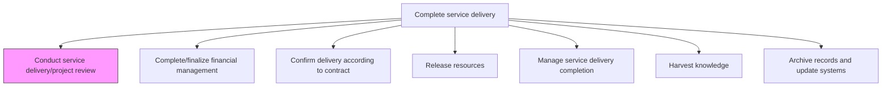
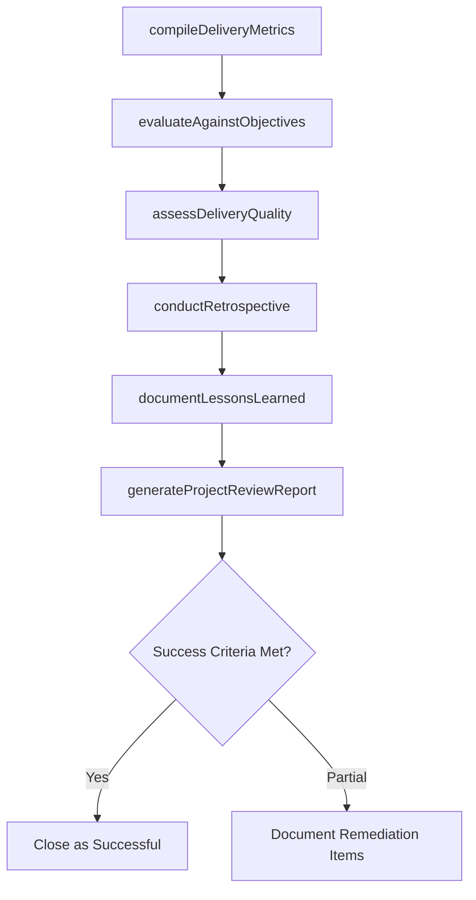

# Conduct service delivery/project review and evaluate success

> Business-as-Code definition for performing a comprehensive post-delivery review that evaluates project outcomes against objectives, captures lessons learned, and assesses overall engagement success.

## Overview

Reviewing the entire service delivery process to evaluate the success of the project from beginning to end.

## Process Hierarchy



## GraphDL

```yaml
conduct:
  object: Service Delivery/project Review And Evaluate Success
  actor: EngagementManager
  result: ProjectReviewReport
```

## Actions

| Action | Description |
|--------|-------------|
| compileDeliveryMetrics | Gather quantitative performance data from the entire delivery lifecycle |
| evaluateAgainstObjectives | Compare actual outcomes to the customer business objectives and success criteria |
| assessDeliveryQuality | Review quality gate results, defect trends, and customer satisfaction scores |
| conductRetrospective | Facilitate a structured retrospective with the delivery team and stakeholders |
| documentLessonsLearned | Capture what went well, what could improve, and actionable recommendations |
| generateProjectReviewReport | Produce the formal project review report with findings and success evaluation |

## Events

| Event | Description |
|-------|-------------|
| deliveryMetricsCompiled | Performance metrics from delivery lifecycle gathered |
| objectivesEvaluated | Actual outcomes compared against success criteria |
| deliveryQualityAssessed | Quality and satisfaction assessment completed |
| retrospectiveConducted | Team retrospective session completed |
| lessonsLearnedDocumented | Lessons learned captured and categorized |
| projectReviewReportGenerated | Formal project review report published |

## Searches

| Search | Description |
|--------|-------------|
| getProjectReviewReport | Retrieve the project review report for an engagement |
| findLessonsLearned | List lessons learned filtered by engagement, category, or theme |
| getObjectiveOutcomes | Get actual vs. planned outcomes for engagement objectives |
| findDeliveryMetrics | Retrieve delivery performance metrics by phase or category |

## Process Flow



## RACI Matrix

| Activity | Responsible | Accountable | Consulted | Informed |
|----------|-------------|-------------|-----------|----------|
| compileDeliveryMetrics | ProjectManager | EngagementManager | DeliveryTeam | Finance |
| evaluateAgainstObjectives | EngagementManager | ServiceDeliveryManager | Client | AccountManager |
| conductRetrospective | ProjectManager | EngagementManager | DeliveryTeam | HR |
| generateProjectReviewReport | EngagementManager | ServiceDeliveryManager | QualityAssurance | All Stakeholders |

## Related Processes

| Process | Relationship |
|---------|-------------|
| 5.3.2.7 Deploy solution | Upstream - deployment outcome feeds into review |
| 5.3.3.6 Harvest knowledge | Downstream - review findings are inputs for knowledge harvesting |
| 5.3.1.4 Review customer business objectives | Related - original objectives are the baseline for success evaluation |

## Related Departments

| Department | Role |
|-----------|------|
| Service Delivery | Owns project review and success evaluation |
| Quality Assurance | Provides quality metrics and assessment data |
| Account Management | Captures client perspective on engagement success |
| Project Management | Compiles delivery metrics and facilitates retrospective |

## Related Occupations

| Occupation | Involvement |
|-----------|-------------|
| Engagement Manager | Primary review conductor and report author |
| Project Manager | Compiles metrics and facilitates retrospective |
| Quality Manager | Provides quality assessment data |
| Account Manager | Gathers client success feedback |

## KPIs

| KPI | Description | Unit |
|-----|-------------|------|
| Objective Achievement Rate | Percentage of customer objectives met or exceeded | % |
| Customer Satisfaction Score | Client rating of overall engagement experience | Score (1-10) |
| On-Time Delivery Rate | Percentage of milestones delivered on schedule | % |
| Budget Variance | Difference between actual and budgeted engagement cost | % |
| Lessons Captured | Number of actionable lessons documented per engagement | Count |

## Usage

```typescript
import { conductServiceDeliveryProjectReview } from '@headlessly/conduct-service-delivery-project-review-and-evaluate-success'

const review = conductServiceDeliveryProjectReview()

// Compile delivery metrics
const metrics = await review.compileDeliveryMetrics({
  engagementId: 'eng-789',
  phases: ['initiation', 'execution', 'deployment'],
  metricCategories: ['schedule', 'budget', 'quality', 'scope']
})

// Evaluate against objectives
const evaluation = await review.evaluateAgainstObjectives({
  metricsId: metrics.id,
  objectivesBaseline: 'objectives-alignment-report-v1',
  successCriteria: 'defined-at-initiation'
})

// Generate project review report
await review.generateProjectReviewReport({
  evaluationId: evaluation.id,
  includeRetrospective: true,
  distributeTo: ['client-sponsor', 'service-delivery-leadership', 'account-team']
})
```
