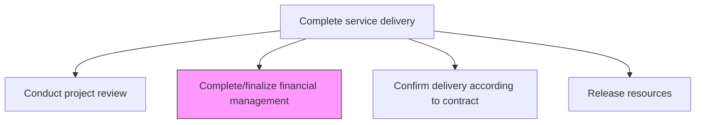
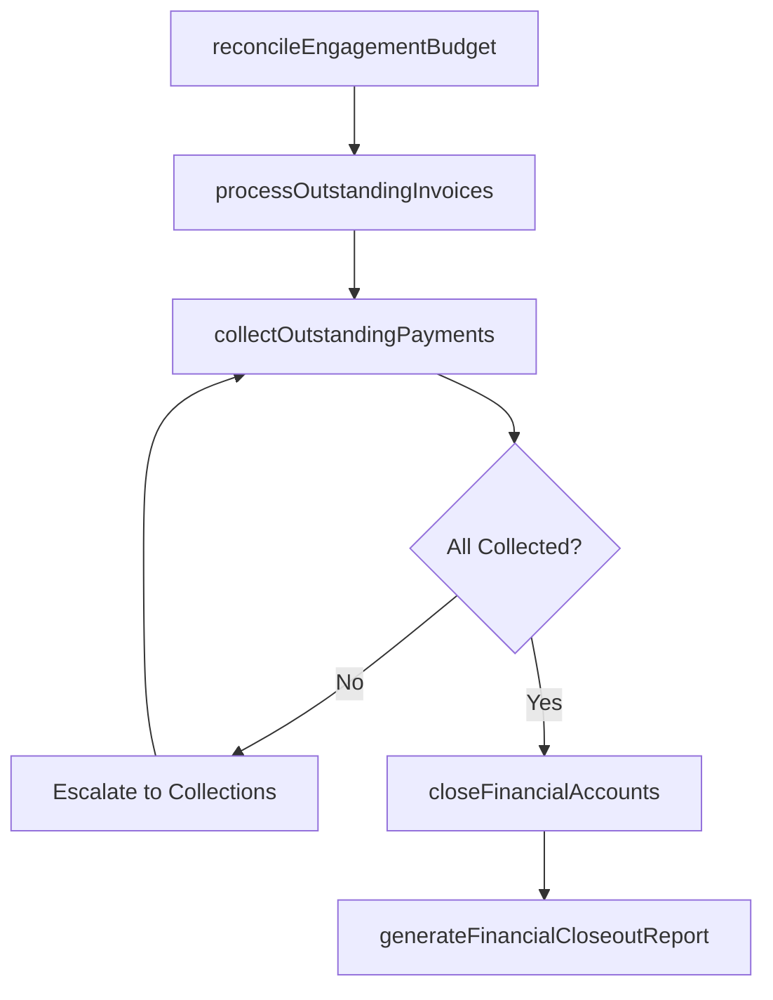

# Complete/finalize financial management activities

> Business-as-Code definition for closing out all financial obligations, reconciling engagement budgets, processing final invoices, and ensuring complete financial settlement for the service delivery engagement.

## Overview

Ensuring all payments are received and all activates therein are completed.

## Process Hierarchy



## GraphDL

```yaml
completeFinalize:
  object: Financial Management Activities
  actor: FinanceManager
  result: FinancialCloseoutReport
```

## Actions

| Action | Description |
|--------|-------------|
| reconcileEngagementBudget | Compare actual expenditures against the approved engagement budget |
| processOutstandingInvoices | Generate and submit final invoices for remaining deliverables and expenses |
| collectOutstandingPayments | Follow up on unpaid invoices and ensure all receivables are collected |
| closeFinancialAccounts | Close engagement-specific cost centers, purchase orders, and billing codes |
| generateFinancialCloseoutReport | Produce the final financial summary documenting all revenues, costs, and variances |

## Events

| Event | Description |
|-------|-------------|
| engagementBudgetReconciled | Actual vs. budgeted expenditures reconciled |
| outstandingInvoicesProcessed | Final invoices generated and submitted |
| outstandingPaymentsCollected | All receivables collected or escalated |
| financialAccountsClosed | Engagement cost centers and billing codes closed |
| financialCloseoutReportGenerated | Final financial summary report published |

## Searches

| Search | Description |
|--------|-------------|
| getFinancialCloseoutReport | Retrieve the financial closeout report for an engagement |
| findOutstandingInvoices | List unpaid invoices for an engagement |
| getBudgetVariance | Get budget vs. actual variance details |
| findOpenFinancialItems | List financial items pending closure |

## Process Flow



## RACI Matrix

| Activity | Responsible | Accountable | Consulted | Informed |
|----------|-------------|-------------|-----------|----------|
| reconcileEngagementBudget | FinanceManager | EngagementManager | ProjectManager | ServiceDeliveryManager |
| processOutstandingInvoices | FinanceManager | EngagementManager | AccountManager | Client |
| collectOutstandingPayments | AccountsReceivable | FinanceManager | AccountManager | EngagementManager |
| generateFinancialCloseoutReport | FinanceManager | ServiceDeliveryManager | EngagementManager | Executive |

## Related Processes

| Process | Relationship |
|---------|-------------|
| 5.3.3.1 Conduct service delivery project review | Parallel - financial review complements project review |
| 5.3.3.3 Confirm delivery according to contract terms | Related - contract confirmation triggers final billing |
| 5.3.3.5 Manage service delivery completion | Downstream - financial closeout is a completion prerequisite |

## Related Departments

| Department | Role |
|-----------|------|
| Finance | Owns budget reconciliation and financial closeout |
| Accounts Receivable | Manages invoice processing and payment collection |
| Account Management | Facilitates client billing communication |
| Project Management | Provides expense and budget tracking data |

## Related Occupations

| Occupation | Involvement |
|-----------|-------------|
| Finance Manager | Primary financial closeout executor |
| Accounts Receivable Specialist | Processes invoices and collections |
| Engagement Manager | Approves financial closeout and variances |

## KPIs

| KPI | Description | Unit |
|-----|-------------|------|
| Budget Variance | Difference between actual spend and approved budget | % |
| Days Sales Outstanding | Average days to collect payment after invoicing | Days |
| Invoice Accuracy | Percentage of invoices processed without errors | % |
| Financial Close Cycle Time | Time from engagement end to financial closeout completion | Days |

## Usage

```typescript
import { completeFinalizeFinancialManagement } from '@headlessly/complete-finalize-financial-management-activities'

const finance = completeFinalizeFinancialManagement()

// Reconcile engagement budget
const reconciliation = await finance.reconcileEngagementBudget({
  engagementId: 'eng-789',
  budgetBaseline: 'approved-budget-v3',
  includeCategories: ['labor', 'travel', 'licenses', 'subcontractors']
})

// Process outstanding invoices
await finance.processOutstandingInvoices({
  engagementId: 'eng-789',
  invoiceType: 'final',
  dueDate: '2026-07-15',
  includeExpenses: true
})

// Generate financial closeout report
await finance.generateFinancialCloseoutReport({
  reconciliationId: reconciliation.id,
  reportFormat: 'executive-summary',
  distributeTo: ['cfo', 'engagement-manager', 'account-manager']
})
```
