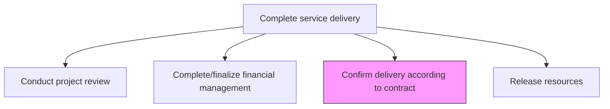
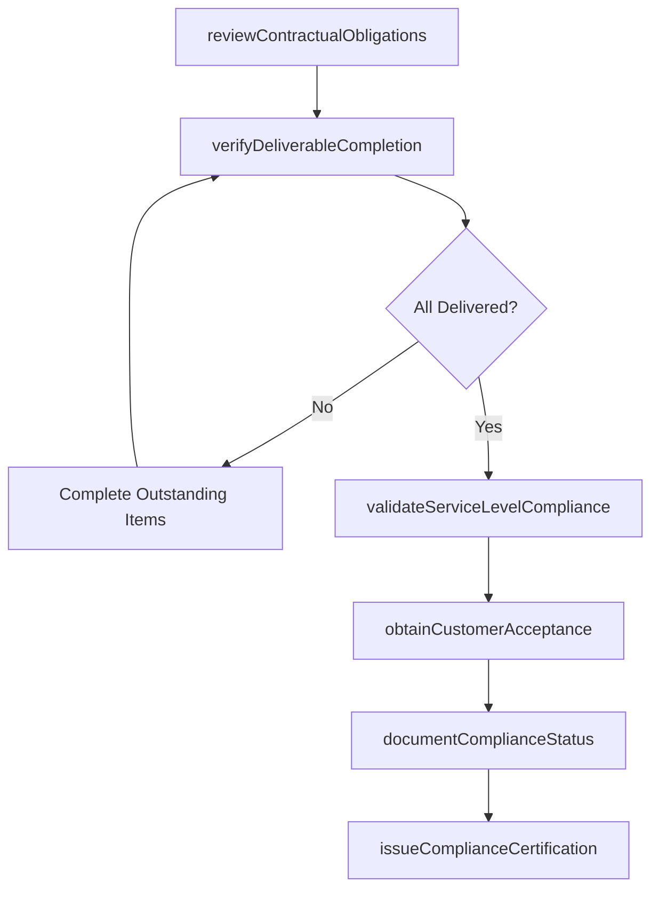

# Confirm delivery according to contract terms

> Business-as-Code definition for verifying that all contractual obligations, deliverables, service levels, and acceptance criteria have been fulfilled before formally closing the engagement.

## Overview

Confirming that the organization has satisfied all terms of the delivery contract set forth in collaboration between the organization and customer.

## Process Hierarchy



## GraphDL

```yaml
confirm:
  object: Delivery According To Contract Terms
  actor: EngagementManager
  result: ContractComplianceCertification
```

## Actions

| Action | Description |
|--------|-------------|
| reviewContractualObligations | Map all contractual commitments and verify each has been addressed |
| verifyDeliverableCompletion | Confirm all contracted deliverables have been produced and accepted |
| validateServiceLevelCompliance | Check that agreed service levels and performance standards were met |
| obtainCustomerAcceptance | Secure formal written acceptance from the customer for all deliverables |
| documentComplianceStatus | Record the compliance status of each contractual obligation |
| issueComplianceCertification | Generate and sign the formal contract compliance certification |

## Events

| Event | Description |
|-------|-------------|
| contractualObligationsReviewed | All contractual commitments mapped and checked |
| deliverableCompletionVerified | All deliverables confirmed as produced and accepted |
| serviceLevelComplianceValidated | Service level adherence confirmed |
| customerAcceptanceObtained | Formal customer acceptance received |
| complianceStatusDocumented | Compliance status of all obligations recorded |
| complianceCertificationIssued | Formal contract compliance certification signed |

## Searches

| Search | Description |
|--------|-------------|
| getContractComplianceStatus | Retrieve compliance status for all contractual obligations |
| findOutstandingDeliverables | List deliverables not yet accepted by the customer |
| getServiceLevelResults | Get service level performance results against targets |
| findAcceptanceRecords | Retrieve customer acceptance documentation |

## Process Flow



## RACI Matrix

| Activity | Responsible | Accountable | Consulted | Informed |
|----------|-------------|-------------|-----------|----------|
| reviewContractualObligations | EngagementManager | ServiceDeliveryManager | Legal | ProjectManager |
| verifyDeliverableCompletion | ProjectManager | EngagementManager | DeliveryTeam | QualityAssurance |
| obtainCustomerAcceptance | EngagementManager | ServiceDeliveryManager | Client | AccountManager |
| issueComplianceCertification | EngagementManager | ServiceDeliveryManager | Legal | Finance |

## Related Processes

| Process | Relationship |
|---------|-------------|
| 5.3.1.1 Review contract and agreed terms | Related - original contract review provides the compliance baseline |
| 5.3.3.2 Complete/finalize financial management activities | Parallel - contract compliance triggers final billing |
| 5.3.3.5 Manage service delivery completion | Downstream - compliance certification is a completion prerequisite |

## Related Departments

| Department | Role |
|-----------|------|
| Service Delivery | Owns contract compliance verification |
| Legal | Validates contractual interpretation and compliance documentation |
| Quality Assurance | Verifies deliverable quality against acceptance criteria |
| Account Management | Facilitates customer acceptance process |

## Related Occupations

| Occupation | Involvement |
|-----------|-------------|
| Engagement Manager | Primary contract compliance verifier |
| Contract Manager | Validates legal compliance and certification |
| Project Manager | Tracks deliverable completion status |
| Account Manager | Coordinates customer acceptance |

## KPIs

| KPI | Description | Unit |
|-----|-------------|------|
| Contract Compliance Rate | Percentage of contractual obligations fully satisfied | % |
| Deliverable Acceptance Rate | Percentage of deliverables accepted on first submission | % |
| SLA Achievement Rate | Percentage of service levels met or exceeded | % |
| Time to Acceptance | Average time from deliverable submission to customer acceptance | Days |

## Usage

```typescript
import { confirmDeliveryAccordingToContractTerms } from '@headlessly/confirm-delivery-according-to-contract-terms'

const compliance = confirmDeliveryAccordingToContractTerms()

// Review contractual obligations
const obligations = await compliance.reviewContractualObligations({
  engagementId: 'eng-789',
  contractId: 'contract-456',
  sections: ['deliverables', 'service-levels', 'milestones', 'warranties']
})

// Obtain customer acceptance
const acceptance = await compliance.obtainCustomerAcceptance({
  obligationsId: obligations.id,
  deliverables: obligations.deliverableList,
  acceptanceMethod: 'formal-signoff',
  signatories: ['client-project-sponsor', 'client-cto']
})

// Issue compliance certification
await compliance.issueComplianceCertification({
  obligationsId: obligations.id,
  acceptanceId: acceptance.id,
  certifiedBy: 'engagement-manager',
  effectiveDate: '2026-06-30'
})
```
