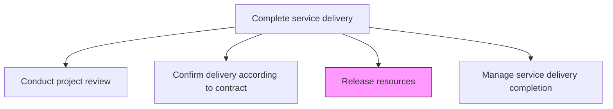
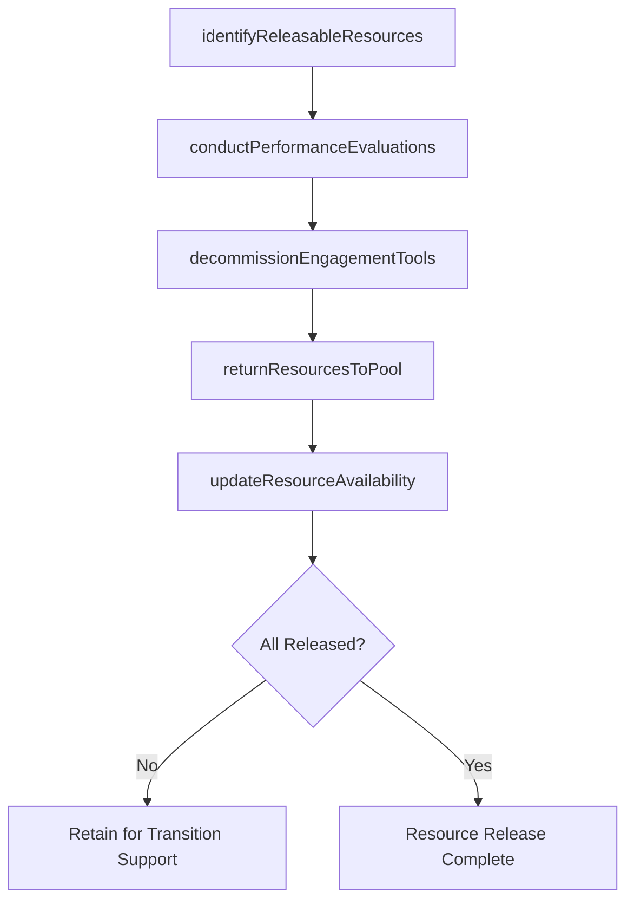

# Release resources

> Business-as-Code definition for formally discharging delivery team members from engagement commitments, returning personnel to the resource pool, and decommissioning engagement-specific infrastructure and tools.

## Overview

Discharging leveraged resources from service delivery commitments upon completion. Returning resources to the resource pool.

## Process Hierarchy



## GraphDL

```yaml
release:
  object: Resources
  actor: ResourceManager
  result: ResourceReleaseConfirmation
```

## Actions

| Action | Description |
|--------|-------------|
| identifyReleasableResources | Determine which team members and assets are ready for release based on completion status |
| conductPerformanceEvaluations | Complete end-of-engagement performance reviews for each team member |
| decommissionEngagementTools | Revoke access to client systems and decommission engagement-specific environments |
| returnResourcesToPool | Formally release personnel back to the resource pool for reassignment |
| updateResourceAvailability | Update resource management systems to reflect newly available capacity |

## Events

| Event | Description |
|-------|-------------|
| releasableResourcesIdentified | Resources eligible for release confirmed |
| performanceEvaluationsCompleted | End-of-engagement performance reviews finished |
| engagementToolsDecommissioned | Client access revoked and engagement environments shut down |
| resourcesReturnedToPool | Personnel formally released to resource pool |
| resourceAvailabilityUpdated | Resource management systems updated with available capacity |

## Searches

| Search | Description |
|--------|-------------|
| findReleasableResources | List resources eligible for release from an engagement |
| getResourceReleaseStatus | Retrieve release status for engagement team members |
| findResourceAvailability | Get updated availability for released resources |
| getPerformanceEvaluations | Retrieve end-of-engagement performance evaluations |

## Process Flow



## RACI Matrix

| Activity | Responsible | Accountable | Consulted | Informed |
|----------|-------------|-------------|-----------|----------|
| identifyReleasableResources | ProjectManager | EngagementManager | ResourceManager | DeliveryTeam |
| conductPerformanceEvaluations | EngagementManager | ServiceDeliveryManager | HR | Team Members |
| decommissionEngagementTools | TechnicalLead | EngagementManager | Client IT | Security |
| returnResourcesToPool | ResourceManager | ServiceDeliveryManager | EngagementManager | HR |

## Related Processes

| Process | Relationship |
|---------|-------------|
| 5.3.3.3 Confirm delivery according to contract terms | Upstream - contract confirmation authorizes resource release |
| 5.2.2.6 Monitor and manage resource capacity and availability | Downstream - released resources update capacity planning |
| 5.3.3.5 Manage service delivery completion | Related - resource release is a completion activity |

## Related Departments

| Department | Role |
|-----------|------|
| Resource Management | Owns resource release and pool reassignment |
| Service Delivery | Authorizes resource release based on engagement status |
| Human Resources | Receives performance evaluations and career development data |
| IT Security | Manages access revocation and system decommissioning |

## Related Occupations

| Occupation | Involvement |
|-----------|-------------|
| Resource Manager | Primary resource release coordinator |
| Engagement Manager | Authorizes release and conducts evaluations |
| IT Security Analyst | Executes access revocation procedures |

## KPIs

| KPI | Description | Unit |
|-----|-------------|------|
| Release Cycle Time | Time from engagement completion to full resource release | Days |
| Resource Utilization at Release | Average utilization rate of resources at time of release | % |
| Bench Time After Release | Average days resources spend unassigned after release | Days |
| Access Revocation Compliance | Percentage of system access revoked within policy timeframe | % |

## Usage

```typescript
import { releaseResources } from '@headlessly/release-resources'

const release = releaseResources()

// Identify releasable resources
const resources = await release.identifyReleasableResources({
  engagementId: 'eng-789',
  completionStatus: 'all-deliverables-accepted',
  transitionPeriod: '1-week'
})

// Conduct performance evaluations
await release.conductPerformanceEvaluations({
  engagementId: 'eng-789',
  teamMembers: resources.releasable.map(r => r.id),
  evaluationTemplate: 'end-of-engagement-review'
})

// Return resources to pool
await release.returnResourcesToPool({
  resourceIds: resources.releasable.map(r => r.id),
  availableFrom: '2026-07-01',
  skills: resources.releasable.map(r => r.updatedSkills)
})
```
