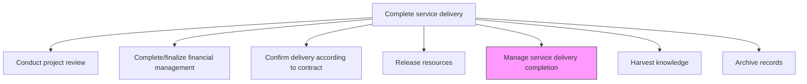
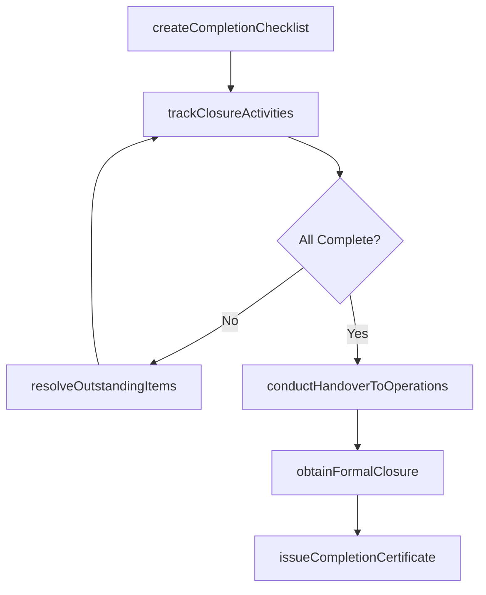

# Manage service delivery completion

> Business-as-Code definition for orchestrating the end-to-end closure of a service delivery engagement, ensuring all administrative, operational, and relationship activities are completed in an orderly manner.

## Overview

Ensuring that all aspects of the service delivery process are completed both internally and externally.

## Process Hierarchy



## GraphDL

```yaml
manage:
  object: Service Delivery Completion
  actor: EngagementManager
  result: CompletionCertificate
```

## Actions

| Action | Description |
|--------|-------------|
| createCompletionChecklist | Define the comprehensive checklist of all closure activities required |
| trackClosureActivities | Monitor progress of all completion workstreams and their dependencies |
| resolveOutstandingItems | Address any remaining open items, issues, or action items from delivery |
| conductHandoverToOperations | Transition ongoing support responsibilities to the operations or client team |
| obtainFormalClosure | Secure formal closure sign-off from customer and internal leadership |
| issueCompletionCertificate | Generate the official completion certificate documenting engagement closure |

## Events

| Event | Description |
|-------|-------------|
| completionChecklistCreated | Comprehensive closure checklist established |
| closureActivitiesTracked | All completion workstreams monitored and progress updated |
| outstandingItemsResolved | Remaining open items and issues addressed |
| handoverToOperationsCompleted | Support responsibilities transitioned to operations |
| formalClosureObtained | Customer and internal sign-off on engagement closure received |
| completionCertificateIssued | Official completion certificate generated and distributed |

## Searches

| Search | Description |
|--------|-------------|
| getCompletionStatus | Retrieve overall completion status for an engagement |
| findOutstandingItems | List unresolved items blocking engagement closure |
| getClosureChecklist | Retrieve the completion checklist with item statuses |
| findCompletionCertificates | Search for completion certificates by engagement or date |

## Process Flow



## RACI Matrix

| Activity | Responsible | Accountable | Consulted | Informed |
|----------|-------------|-------------|-----------|----------|
| createCompletionChecklist | ProjectManager | EngagementManager | DeliveryTeam | ServiceDeliveryManager |
| trackClosureActivities | ProjectManager | EngagementManager | All Workstream Leads | Finance |
| conductHandoverToOperations | TechnicalLead | EngagementManager | OperationsManager | Client |
| obtainFormalClosure | EngagementManager | ServiceDeliveryManager | Client Sponsor | All Stakeholders |

## Related Processes

| Process | Relationship |
|---------|-------------|
| 5.3.3.1 Conduct service delivery project review | Upstream - review findings inform completion activities |
| 5.3.3.2 Complete/finalize financial management activities | Parallel - financial closeout is a completion prerequisite |
| 5.3.3.3 Confirm delivery according to contract terms | Parallel - contract compliance is a completion prerequisite |
| 5.3.3.4 Release resources | Parallel - resource release is coordinated during completion |

## Related Departments

| Department | Role |
|-----------|------|
| Service Delivery | Owns overall completion orchestration |
| Project Management | Tracks closure activities and manages checklist |
| Operations | Receives handover of ongoing support responsibilities |
| Account Management | Manages client relationship during closure |

## Related Occupations

| Occupation | Involvement |
|-----------|-------------|
| Engagement Manager | Primary completion orchestrator |
| Project Manager | Tracks and coordinates closure activities |
| Operations Manager | Receives handover for ongoing support |
| Account Manager | Maintains client relationship through closure |

## KPIs

| KPI | Description | Unit |
|-----|-------------|------|
| Completion Cycle Time | Time from delivery end to formal engagement closure | Days |
| Checklist Completion Rate | Percentage of closure checklist items completed on time | % |
| Outstanding Item Resolution Time | Average time to resolve items blocking closure | Days |
| Handover Satisfaction | Operations team rating of handover quality | Score (1-5) |

## Usage

```typescript
import { manageServiceDeliveryCompletion } from '@headlessly/manage-service-delivery-completion'

const completion = manageServiceDeliveryCompletion()

// Create completion checklist
const checklist = await completion.createCompletionChecklist({
  engagementId: 'eng-789',
  categories: ['financial', 'contractual', 'resource', 'knowledge', 'operational', 'administrative']
})

// Conduct handover to operations
await completion.conductHandoverToOperations({
  engagementId: 'eng-789',
  operationsTeam: 'ops-team-alpha',
  handoverPackage: ['runbooks', 'architecture-docs', 'support-procedures', 'escalation-contacts']
})

// Issue completion certificate
await completion.issueCompletionCertificate({
  engagementId: 'eng-789',
  checklistId: checklist.id,
  signedBy: ['engagement-manager', 'client-sponsor'],
  effectiveDate: '2026-06-30'
})
```
