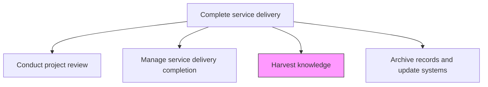
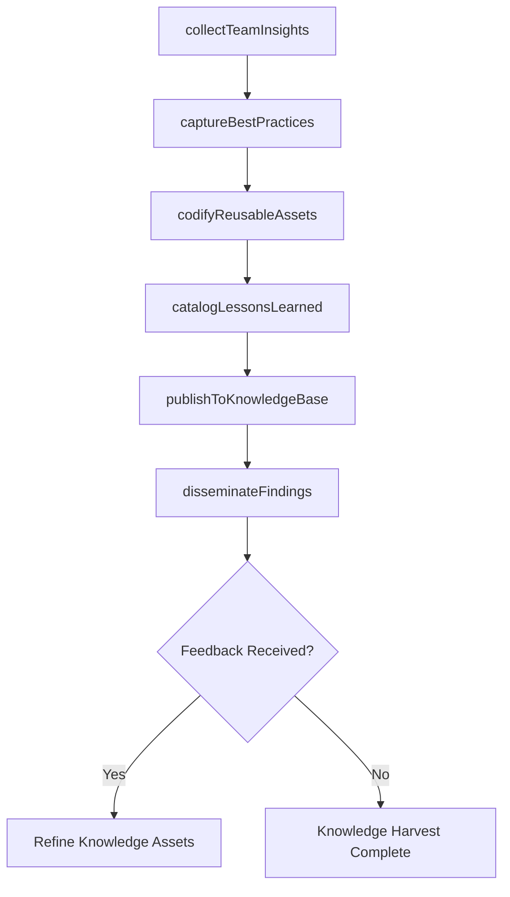

# Harvest knowledge

> Business-as-Code definition for systematically capturing, codifying, and disseminating the institutional knowledge, best practices, and reusable assets generated during service delivery for organizational learning.

## Overview

Garnering feedback from all avenues to collect a knowledge base concerning services rendered.

## Process Hierarchy



## GraphDL

```yaml
harvest:
  object: Knowledge
  actor: KnowledgeManager
  result: KnowledgeAsset
```

## Actions

| Action | Description |
|--------|-------------|
| collectTeamInsights | Gather experiences, observations, and tacit knowledge from delivery team members |
| captureBestPractices | Identify and document repeatable practices that contributed to engagement success |
| codifyReusableAssets | Package templates, tools, frameworks, and accelerators for future reuse |
| catalogLessonsLearned | Organize and tag lessons learned for searchability and future reference |
| publishToKnowledgeBase | Add harvested knowledge to the organization's knowledge management repository |
| disseminateFindings | Share key insights and best practices with relevant teams and practice areas |

## Events

| Event | Description |
|-------|-------------|
| teamInsightsCollected | Delivery team experiences and observations gathered |
| bestPracticesCaptured | Repeatable success practices documented |
| reusableAssetsCodified | Templates and accelerators packaged for reuse |
| lessonsLearnedCataloged | Lessons organized, tagged, and categorized |
| knowledgePublished | Harvested knowledge added to organizational repository |
| findingsDisseminated | Key insights shared with relevant practice areas |

## Searches

| Search | Description |
|--------|-------------|
| findKnowledgeAssets | Search knowledge assets by engagement, topic, or practice area |
| getBestPractices | Retrieve best practices filtered by domain or service type |
| findLessonsLearned | List lessons learned by category, engagement, or severity |
| getReusableAssets | Retrieve packaged templates and accelerators by type |

## Process Flow



## RACI Matrix

| Activity | Responsible | Accountable | Consulted | Informed |
|----------|-------------|-------------|-----------|----------|
| collectTeamInsights | KnowledgeManager | EngagementManager | DeliveryTeam | HR |
| captureBestPractices | KnowledgeManager | ServiceDeliveryManager | ProjectManager | PracticeLeads |
| codifyReusableAssets | KnowledgeManager | ServiceDeliveryManager | SolutionArchitect | DeliveryTeam |
| disseminateFindings | KnowledgeManager | ServiceDeliveryManager | PracticeLeads | All Staff |

## Related Processes

| Process | Relationship |
|---------|-------------|
| 5.3.3.1 Conduct service delivery project review | Upstream - review findings are primary inputs for knowledge harvesting |
| 5.3.3.7 Archive records and update systems | Downstream - harvested knowledge is archived for long-term retention |
| 5.1.1.3 Manage service delivery development and direction | Related - knowledge insights inform delivery capability development |

## Related Departments

| Department | Role |
|-----------|------|
| Knowledge Management | Owns knowledge capture and repository management |
| Service Delivery | Provides source material from engagement experiences |
| Learning and Development | Integrates knowledge into training programs |
| Practice Management | Applies best practices to practice area standards |

## Related Occupations

| Occupation | Involvement |
|-----------|-------------|
| Knowledge Manager | Primary knowledge harvesting coordinator |
| Engagement Manager | Provides engagement context and facilitates team input |
| Practice Lead | Integrates knowledge into practice standards |
| Training Specialist | Incorporates findings into training curricula |

## KPIs

| KPI | Description | Unit |
|-----|-------------|------|
| Knowledge Assets Created | Number of knowledge assets produced per engagement | Count |
| Reuse Rate | Percentage of knowledge assets reused in subsequent engagements | % |
| Knowledge Harvest Completion | Percentage of engagements completing knowledge harvesting | % |
| Time to Knowledge Publication | Average time from engagement end to knowledge publication | Days |

## Usage

```typescript
import { harvestKnowledge } from '@headlessly/harvest-knowledge'

const knowledge = harvestKnowledge()

// Collect team insights
const insights = await knowledge.collectTeamInsights({
  engagementId: 'eng-789',
  methods: ['structured-interviews', 'retrospective-notes', 'survey'],
  participants: ['delivery-team', 'project-manager', 'technical-lead']
})

// Codify reusable assets
const assets = await knowledge.codifyReusableAssets({
  engagementId: 'eng-789',
  assetTypes: ['solution-template', 'estimation-model', 'testing-framework'],
  generalizationLevel: 'industry-agnostic'
})

// Publish to knowledge base
await knowledge.publishToKnowledgeBase({
  insightsId: insights.id,
  assetsId: assets.id,
  tags: ['cloud-migration', 'financial-services', 'agile-delivery'],
  accessLevel: 'organization-wide'
})
```
