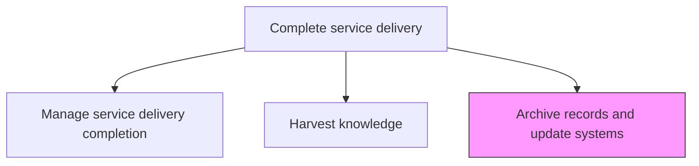
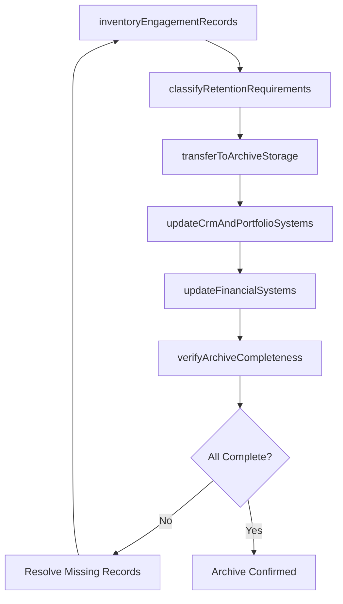

# Archive records and update systems

> Business-as-Code definition for preserving all engagement documentation in long-term storage, updating organizational systems of record, and ensuring compliance with record retention policies.

## Overview

Completing and archiving all records associated with requested services. Update all necessary systems to reflect those changes.

## Process Hierarchy



## GraphDL

```yaml
archive:
  object: Records And Update Systems
  actor: RecordsManager
  result: ArchiveConfirmation
```

## Actions

| Action | Description |
|--------|-------------|
| inventoryEngagementRecords | Catalog all documents, deliverables, and correspondence from the engagement |
| classifyRetentionRequirements | Determine retention periods and storage requirements based on record type and policy |
| transferToArchiveStorage | Move engagement records to long-term archive storage with appropriate access controls |
| updateCrmAndPortfolioSystems | Update CRM, portfolio management, and reference databases with engagement outcomes |
| updateFinancialSystems | Close engagement records in accounting, billing, and time-tracking systems |
| verifyArchiveCompleteness | Confirm all required records have been archived and systems updated |

## Events

| Event | Description |
|-------|-------------|
| engagementRecordsInventoried | Complete catalog of engagement documents created |
| retentionRequirementsClassified | Retention periods and storage requirements determined |
| recordsTransferredToArchive | Engagement records moved to long-term storage |
| crmAndPortfolioSystemsUpdated | CRM and portfolio databases updated with outcomes |
| financialSystemsUpdated | Accounting and billing systems closed for engagement |
| archiveCompletenessVerified | Archive completeness confirmed |

## Searches

| Search | Description |
|--------|-------------|
| getArchiveStatus | Retrieve archive completion status for an engagement |
| findArchivedRecords | Search archived records by engagement, type, or date range |
| getRetentionSchedule | Retrieve retention schedule for engagement records |
| findSystemUpdateStatus | List system update status across all organizational systems |

## Process Flow



## RACI Matrix

| Activity | Responsible | Accountable | Consulted | Informed |
|----------|-------------|-------------|-----------|----------|
| inventoryEngagementRecords | RecordsManager | ProjectManager | DeliveryTeam | EngagementManager |
| classifyRetentionRequirements | RecordsManager | Legal | Compliance | EngagementManager |
| transferToArchiveStorage | RecordsManager | IT | Security | ProjectManager |
| updateCrmAndPortfolioSystems | ProjectManager | EngagementManager | AccountManager | ServiceDeliveryManager |

## Related Processes

| Process | Relationship |
|---------|-------------|
| 5.3.3.6 Harvest knowledge | Upstream - harvested knowledge is archived for long-term retention |
| 5.3.3.5 Manage service delivery completion | Related - archiving is a final completion activity |
| 5.3.3.2 Complete/finalize financial management activities | Related - financial records are part of the archive |

## Related Departments

| Department | Role |
|-----------|------|
| Records Management | Owns record inventory, classification, and archiving |
| IT | Manages archive storage infrastructure and access controls |
| Legal | Defines retention requirements and compliance standards |
| Finance | Provides financial records for archiving |
| Project Management | Supplies project documentation and deliverables |

## Related Occupations

| Occupation | Involvement |
|-----------|-------------|
| Records Manager | Primary archiving coordinator |
| Project Manager | Provides engagement documentation |
| Compliance Officer | Validates retention policy adherence |
| Database Administrator | Updates organizational systems of record |

## KPIs

| KPI | Description | Unit |
|-----|-------------|------|
| Archive Completion Time | Time from engagement closure to full archive completion | Days |
| Record Completeness | Percentage of required records successfully archived | % |
| System Update Accuracy | Percentage of organizational systems correctly updated | % |
| Retention Compliance Rate | Percentage of records archived in accordance with retention policy | % |

## Usage

```typescript
import { archiveRecordsAndUpdateSystems } from '@headlessly/archive-records-and-update-systems'

const archive = archiveRecordsAndUpdateSystems()

// Inventory engagement records
const inventory = await archive.inventoryEngagementRecords({
  engagementId: 'eng-789',
  recordTypes: ['contracts', 'deliverables', 'correspondence', 'financials', 'project-plans'],
  includeDigitalAssets: true
})

// Transfer to archive storage
await archive.transferToArchiveStorage({
  inventoryId: inventory.id,
  storageLocation: 'enterprise-archive',
  retentionPeriod: '7-years',
  accessLevel: 'restricted'
})

// Verify archive completeness
const verification = await archive.verifyArchiveCompleteness({
  engagementId: 'eng-789',
  checkSystems: ['crm', 'portfolio', 'finance', 'timetracking'],
  auditTrail: true
})
```
