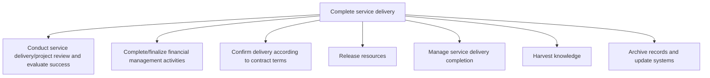
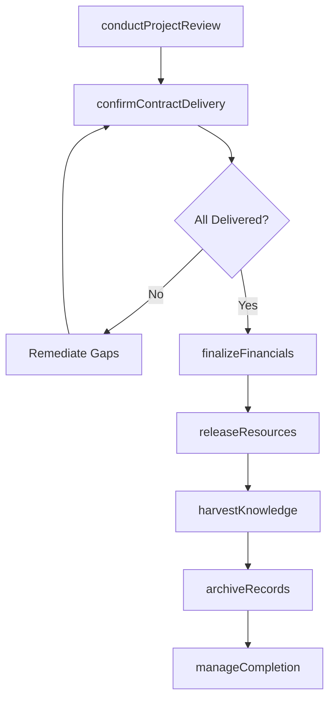

# Complete service delivery

> Business-as-Code definition for service delivery completion. Models project review, financial closeout, contract confirmation, resource release, completion management, knowledge harvesting, and records archiving as programmable workflows.

## Overview

Implementing final steps to complete service delivery to the customer. Evaluate success through project review, complete finance activities, and confirm delivery. Release resources and manage completion by harvesting knowledge and systems by archiving records.

## Process Hierarchy



## GraphDL

```yaml
complete:
  object: Service Delivery
  actor: EngagementManager
  result: ClosedEngagement
```

## Actions

| Action | Description |
|--------|-------------|
| conductProjectReview | Evaluate delivery success against original objectives and KPIs |
| finalizeFinancials | Complete all financial activities including invoicing and reconciliation |
| confirmContractDelivery | Verify all contract terms and deliverables have been satisfied |
| releaseResources | Discharge assigned resources from engagement commitments |
| manageCompletion | Coordinate all internal and external closeout activities |
| harvestKnowledge | Capture lessons learned, best practices, and reusable assets |
| archiveRecords | Archive engagement records and update organizational systems |

## Events

| Event | Description |
|-------|-------------|
| projectReviewConducted | Post-delivery review completed with success evaluation |
| financialsFinalized | All invoices processed and financial records closed |
| contractDeliveryConfirmed | Customer sign-off received on all contract deliverables |
| resourcesReleased | Team members returned to resource pool |
| completionManaged | All closeout activities coordinated and confirmed |
| knowledgeHarvested | Lessons learned documented and shared with organization |
| recordsArchived | Engagement records archived and systems updated |

## Searches

| Search | Description |
|--------|-------------|
| getProjectReview | Retrieve post-delivery review results and success metrics |
| getFinancialSummary | Query engagement financial summary including margin and variance |
| getDeliverableStatus | Check completion status of all contracted deliverables |
| getLessonsLearned | Retrieve knowledge harvested from completed engagements |
| getArchivedRecords | Query archived engagement records by project or client |

## Process Flow



## RACI Matrix

| Activity | Responsible | Accountable | Consulted | Informed |
|----------|-------------|-------------|-----------|----------|
| conductProjectReview | ProjectManager | EngagementManager | Customer, DeliveryTeam | Executive |
| finalizeFinancials | FinanceAnalyst | EngagementManager | Finance, Billing | Controller |
| confirmContractDelivery | EngagementManager | ServiceDeliveryDirector | Customer, Legal | Sales |
| harvestKnowledge | KnowledgeManager | EngagementManager | DeliveryTeam, QA | Organization |

## Sub-Processes

| ID | Name | Description |
|----|------|-------------|
| 5.3.3.1 | Conduct service delivery/project review and evaluate success | Reviewing the entire service delivery process to evaluate the success of the project from beginning  |
| 5.3.3.2 | Complete/finalize financial management activities | Ensuring all payments are received and all activates therein are completed. |
| 5.3.3.3 | Confirm delivery according to contract terms | Confirming that the organization has satisfied all terms of the delivery contract set forth in colla |
| 5.3.3.4 | Release resources | Discharging leveraged resources from service delivery commitments upon completion. Returning resourc |
| 5.3.3.5 | Manage service delivery completion | Ensuring that all aspects of the service delivery process are completed both internally and external |
| 5.3.3.6 | Harvest knowledge | Garnering feedback from all avenues to collect a knowledge base concerning services rendered. |
| 5.3.3.7 | Archive records and update systems | Completing and archiving all records associated with requested services. Update all necessary system |

## Related Processes

| Process | Relationship |
|---------|-------------|
| 5.3.2 Execute service delivery | Upstream - execution completion triggers closeout |
| 5.1.1 Establish service delivery governance | Upstream - governance standards guide completion procedures |
| 6.1 Plan and manage customer service contacts | Downstream - handoff to ongoing support post-delivery |
| 8.2 Perform revenue accounting | Parallel - financial closeout feeds revenue recognition |

## Related Departments

| Department | Role |
|-----------|------|
| Engagement Management | Primary owner of delivery closeout and client sign-off |
| Finance | Manages final invoicing and financial reconciliation |
| Knowledge Management | Captures and organizes lessons learned |
| Resource Management | Processes resource release and reallocation |

## Related Occupations

| Occupation | Involvement |
|-----------|-------------|
| Engagement Manager | Overall completion coordination and customer sign-off |
| Knowledge Manager | Lessons learned capture and dissemination |
| Finance Analyst | Financial closeout and margin analysis |

## KPIs

| KPI | Description | Unit |
|-----|-------------|------|
| Closeout Cycle Time | Average time from last deliverable to full engagement closure | Days |
| Contract Fulfillment Rate | Percentage of contract terms fully satisfied at completion | % |
| Knowledge Capture Rate | Percentage of engagements with documented lessons learned | % |
| Final Margin Variance | Variance between planned and actual engagement margin | % |

## Usage

```typescript
import { completeServiceDelivery } from '@headlessly/complete-service-delivery'

const client = completeServiceDelivery()

// Conduct project review
const review = await client.conductProjectReview({
  engagementId: 'ENG-2025-0567',
  participants: ['delivery-lead', 'customer-sponsor', 'project-manager'],
  evaluationCriteria: ['scope', 'timeline', 'budget', 'quality', 'satisfaction']
})

// Harvest knowledge
const knowledge = await client.harvestKnowledge({
  engagementId: 'ENG-2025-0567',
  categories: ['lessons-learned', 'best-practices', 'reusable-assets'],
  publishToLibrary: true
})
```
