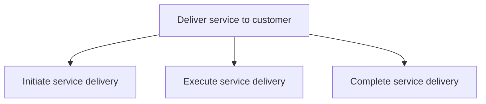
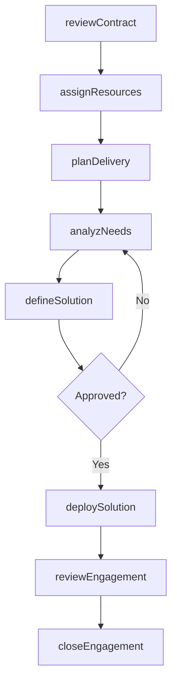

# Deliver service to customer

> Business-as-Code definition for customer-facing service delivery execution. Models engagement initiation, solution design and deployment, and project completion as programmable workflows.

## Overview

Rendering service to the customer by initiating, executing, and completing tasks associated with service delivery.

## Process Hierarchy



## GraphDL

```yaml
deliver:
  object: Service To Customer
  actor: EngagementManager
  result: DeliveredSolution
```

## Actions

| Action | Description |
|--------|-------------|
| reviewContract | Examine contract terms and confirm scope of engagement |
| assignResources | Identify, select, and assign qualified team members |
| planDelivery | Create detailed project plan with milestones and deliverables |
| analyzNeeds | Assess customer environment and refine requirements |
| defineSolution | Design the solution approach and obtain approval to proceed |
| deploySolution | Build, test, and deploy the solution to customer environment |
| reviewEngagement | Conduct project review and evaluate delivery success |
| closeEngagement | Finalize financials, release resources, and archive records |

## Events

| Event | Description |
|-------|-------------|
| contractReviewed | Contract terms confirmed and engagement scope validated |
| resourcesAssigned | Team members selected and allocated to engagement |
| deliveryPlanned | Delivery project plan approved by customer and sponsor |
| needsAnalyzed | Customer environment assessed and requirements refined |
| solutionDefined | Solution approach designed and customer approval obtained |
| solutionDeployed | Solution built, tested, and deployed to production |
| engagementReviewed | Post-delivery review completed and lessons learned captured |
| engagementClosed | Financials settled, resources released, records archived |

## Searches

| Search | Description |
|--------|-------------|
| getEngagementStatus | Retrieve engagement progress, milestones, and health indicators |
| findDeliverables | List deliverables by engagement, status, or due date |
| getProjectTimeline | Query project schedule with milestone completion status |
| getChangeRequests | Retrieve scope change requests and approval status |
| getEngagementFinancials | Query engagement budget, actuals, and margin data |

## Process Flow



## RACI Matrix

| Activity | Responsible | Accountable | Consulted | Informed |
|----------|-------------|-------------|-----------|----------|
| reviewContract | EngagementManager | VP Delivery | Legal, Sales | Finance |
| assignResources | ResourceManager | EngagementManager | DeliveryLeads | HR |
| planDelivery | ProjectManager | EngagementManager | SolutionArchitect, Customer | PMO |
| deploySolution | DeliveryLead | ProjectManager | Engineering, QA | CustomerSuccess |
| closeEngagement | EngagementManager | VP Delivery | Finance, Legal | Executive |

## Sub-Processes

| ID | Name | Description |
|----|------|-------------|
| 5.3.1 | Initiate service delivery | Collaborating with the customer to understand service needs. Review, understand, and modify the deli |
| 5.3.2 | Execute service delivery | Carrying out service delivery to the customer by creating and deploying the necessary solution. Anal |
| 5.3.3 | Complete service delivery | Implementing final steps to complete service delivery to the customer. Evaluate success through proj |

## Related Processes

| Process | Relationship |
|---------|-------------|
| 5.1 Establish service delivery governance and strategies | Upstream - governance standards guide delivery execution |
| 5.2 Manage service delivery resources | Upstream - resource plan provides available staff |
| 6.0 Manage Customer Service | Downstream - delivery outcomes impact customer support |
| 3.4 Manage sales orders | Upstream - signed contracts trigger engagement initiation |

## Related Departments

| Department | Role |
|-----------|------|
| Professional Services | Primary executor of service engagements |
| Project Management Office | Provides delivery methodology and oversight |
| Solution Architecture | Designs technical solutions for customer needs |
| Customer Success | Manages ongoing customer relationship post-delivery |
| Finance | Tracks engagement economics and billing milestones |

## Related Occupations

| Occupation | Involvement |
|-----------|-------------|
| Engagement Manager | Client relationship and engagement oversight |
| Project Manager | Delivery planning, tracking, and risk management |
| Solution Architect | Technical solution design and validation |
| Delivery Consultant | Hands-on execution of service deliverables |

## KPIs

| KPI | Description | Unit |
|-----|-------------|------|
| On-Time Delivery | Percentage of milestones delivered by agreed date | % |
| Scope Change Rate | Number of scope changes per engagement | Count |
| Customer Acceptance Rate | Percentage of deliverables accepted without rework | % |
| Engagement Margin | Gross margin achieved on service engagement | % |
| Knowledge Reuse | Percentage of deliverables leveraging existing assets | % |

## Usage

```typescript
import { deliverServiceToCustomer } from '@headlessly/deliver-service-to-customer'

const client = deliverServiceToCustomer()

// Initiate engagement from signed contract
const engagement = await client.reviewContract({
  contractId: 'SC-2025-0789',
  customerId: 'cust-456',
  kickoffDate: '2025-04-15'
})

// Define and deploy the solution
const solution = await client.deploySolution({
  engagementId: engagement.id,
  solutionType: 'cloud-migration',
  environment: 'production',
  approvalId: 'APR-2025-0123'
})

// Close the engagement
const closure = await client.closeEngagement({
  engagementId: engagement.id,
  customerSignOff: true,
  lessonsLearned: ['automation-reduced-timeline', 'early-stakeholder-alignment']
})
```
