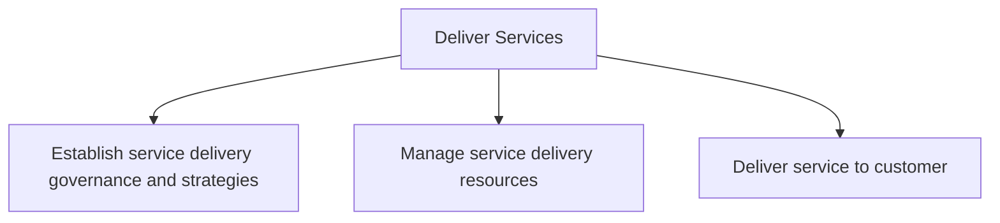
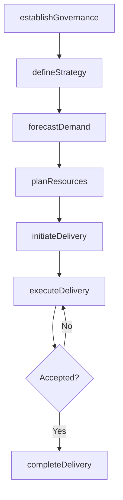

# Deliver Services

> Business-as-Code definition for end-to-end service delivery. Models service governance, resource management, and customer engagement as programmable workflows.

## Overview

Offering services to customers. This is the act of providing service delivery as a core business practice and covers identifying strategies for performing service delivery, managing resources, and delivering services to the customer.

## Process Hierarchy



## GraphDL

```yaml
deliver:
  object: Services
  actor: ServiceDeliveryManager
  result: CompletedEngagement
```

## Actions

| Action | Description |
|--------|-------------|
| establishGovernance | Set up service delivery governance framework and management system |
| defineStrategy | Develop service delivery strategies, goals, and labor policies |
| forecastDemand | Build resource demand forecasts based on pipeline and customer orders |
| planResources | Create and manage resource plans matching skills to demand |
| initiateDelivery | Review contracts, assign resources, and plan service engagement |
| executeDelivery | Analyze needs, define solutions, and deploy deliverables |
| completeDelivery | Finalize financials, release resources, and harvest knowledge |

## Events

| Event | Description |
|-------|-------------|
| governanceEstablished | Service delivery governance framework activated |
| strategyDefined | Service delivery strategy and goals finalized |
| demandForecasted | Resource demand forecast completed and validated |
| resourcesPlanned | Resource plan created and capacity matched |
| deliveryInitiated | Service engagement launched with assigned resources |
| deliveryExecuted | Service solution deployed to customer environment |
| deliveryCompleted | Engagement closed, financials settled, knowledge harvested |

## Searches

| Search | Description |
|--------|-------------|
| getEngagementStatus | Retrieve current status and progress of a service engagement |
| findAvailableResources | Query available resources by skill, location, or availability |
| getDeliveryMetrics | Retrieve service delivery performance metrics and SLA compliance |
| findActiveContracts | List active service contracts by customer or service type |

## Process Flow



## RACI Matrix

| Activity | Responsible | Accountable | Consulted | Informed |
|----------|-------------|-------------|-----------|----------|
| establishGovernance | ServiceDeliveryDirector | COO | Legal, Finance | Executive |
| forecastDemand | ResourcePlanner | VP Delivery | Sales, AccountManagement | Finance |
| initiateDelivery | EngagementManager | VP Delivery | SolutionArchitect | PMO |
| executeDelivery | DeliveryLead | EngagementManager | TechnicalTeam, Customer | PMO |
| completeDelivery | EngagementManager | VP Delivery | Finance, Legal | CustomerSuccess |

## Sub-Processes

| ID | Name | Description |
|----|------|-------------|
| 5.1 | Establish service delivery governance and strategies | Creating rules and regulations for service delivery to the customer. Establish a system to manage pe |
| 5.2 | Manage service delivery resources | Understanding the demands on resources and creating a plan to enable the delivery of services via th |
| 5.3 | Deliver service to customer | Rendering service to the customer by initiating, executing, and completing tasks associated with ser |

## Related Processes

| Process | Relationship |
|---------|-------------|
| 3.0 Market and Sell Products and Services | Upstream - sales engagements trigger service delivery |
| 4.0 Deliver Products | Parallel - shared fulfillment and customer delivery operations |
| 6.0 Manage Customer Service | Downstream - service delivery issues feed customer support |

## Related Departments

| Department | Role |
|-----------|------|
| Service Delivery | Primary owner of engagement execution and resource management |
| Professional Services | Delivers consulting, implementation, and technical services |
| Project Management Office | Oversees project governance and delivery standards |
| Human Resources | Supports resource planning and skills development |
| Finance | Manages engagement economics and billing |

## Related Occupations

| Occupation | Involvement |
|-----------|-------------|
| Service Delivery Manager | End-to-end delivery orchestration |
| Engagement Manager | Client relationship and project oversight |
| Resource Planner | Capacity planning and resource allocation |
| Solution Architect | Technical solution design and validation |

## KPIs

| KPI | Description | Unit |
|-----|-------------|------|
| Customer Satisfaction Score | Post-engagement satisfaction rating from customer surveys | Score (1-10) |
| On-Time Delivery Rate | Percentage of engagements completed by contracted deadline | % |
| Resource Utilization | Percentage of billable hours relative to total available hours | % |
| Engagement Profitability | Gross margin achieved per service engagement | % |
| First-Time-Right Rate | Percentage of deliverables accepted without rework | % |

## Usage

```typescript
import { deliverServices } from '@headlessly/deliver-services'

const client = deliverServices()

// Initiate a new service engagement
const engagement = await client.initiateDelivery({
  contractId: 'SC-2025-0456',
  customerId: 'cust-789',
  serviceType: 'implementation',
  startDate: '2025-04-01'
})

// Assign resources to the engagement
const resources = await client.planResources({
  engagementId: engagement.id,
  requiredSkills: ['solution-architecture', 'project-management'],
  duration: { weeks: 12 }
})

// Complete the engagement
const completion = await client.completeDelivery({
  engagementId: engagement.id,
  deliverables: ['solution-deployed', 'training-completed'],
  customerSignOff: true
})
```
