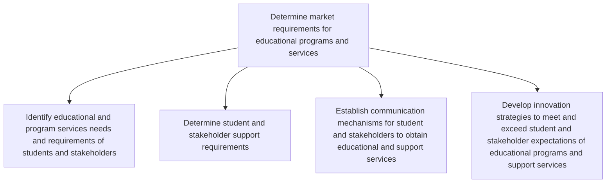

# Determine market requirements for educational programs and services

> TODO: Business-as-Code definition for determine market requirements for educational programs and services (education)

## Overview

TODO: Add process overview

## Process Hierarchy



## GraphDL

```yaml
determine:
  object: Market Requirements For Educational Programs And Services
  actor: TODO
  result: TODO
```

## Actions

| Action | Description |
|--------|-------------|
| TODO | TODO |

## Events

| Event | Description |
|-------|-------------|
| TODO | TODO |

## Searches

| Search | Description |
|--------|-------------|
| TODO | TODO |

## Process Flow


## RACI Matrix

| Activity | Responsible | Accountable | Consulted | Informed |
|----------|-------------|-------------|-----------|----------|
| TODO | TODO | TODO | TODO | TODO |

## Sub-Processes

| ID | Name | Description |
|----|------|-------------|
| 5.1.1.1 | Identify educational and program services needs and requirements of students and stakeholders | TODO |
| 5.1.1.2 | Determine student and stakeholder support requirements | TODO |
| 5.1.1.3 | Establish communication mechanisms for student and stakeholders to obtain educational and support services | TODO |
| 5.1.1.4 | Develop innovation strategies to meet and exceed student and stakeholder expectations of educational programs and support services | TODO |

## Related Processes

| Process | Relationship |
|---------|-------------|
| TODO | TODO |

## Related Departments

| Department | Role |
|-----------|------|
| TODO | TODO |

## Related Occupations

| Occupation | Involvement |
|-----------|-------------|
| TODO | TODO |

## KPIs

| KPI | Description | Unit |
|-----|-------------|------|
| TODO | TODO | TODO |

## Usage

```typescript
import { TODO } from '@headlessly/determine-market-requirements-for-educational-programs-and-services'

const client = TODO()

// TODO: Example action calls
```
