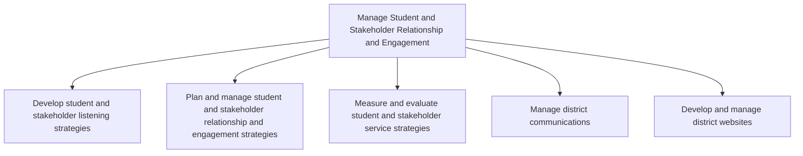

# Manage Student and Stakeholder Relationship and Engagement

> TODO: Business-as-Code definition for manage student and stakeholder relationship and engagement (education)

## Overview

TODO: Add process overview

## Process Hierarchy



## GraphDL

```yaml
manage:
  object: Student And Stakeholder Relationship And Engagement
  actor: TODO
  result: TODO
```

## Actions

| Action | Description |
|--------|-------------|
| TODO | TODO |

## Events

| Event | Description |
|-------|-------------|
| TODO | TODO |

## Searches

| Search | Description |
|--------|-------------|
| TODO | TODO |

## Process Flow


## RACI Matrix

| Activity | Responsible | Accountable | Consulted | Informed |
|----------|-------------|-------------|-----------|----------|
| TODO | TODO | TODO | TODO | TODO |

## Sub-Processes

| ID | Name | Description |
|----|------|-------------|
| 5.1 | Develop student and stakeholder listening strategies | TODO |
| 5.2 | Plan and manage student and stakeholder relationship and engagement strategies | TODO |
| 5.3 | Measure and evaluate student and stakeholder service strategies | TODO |
| 5.4 | Manage district communications | TODO |
| 5.5 | Develop and manage district websites | TODO |

## Related Processes

| Process | Relationship |
|---------|-------------|
| TODO | TODO |

## Related Departments

| Department | Role |
|-----------|------|
| TODO | TODO |

## Related Occupations

| Occupation | Involvement |
|-----------|-------------|
| TODO | TODO |

## KPIs

| KPI | Description | Unit |
|-----|-------------|------|
| TODO | TODO | TODO |

## Usage

```typescript
import { TODO } from '@headlessly/manage-student-and-stakeholder-relationship-and-engagement'

const client = TODO()

// TODO: Example action calls
```
