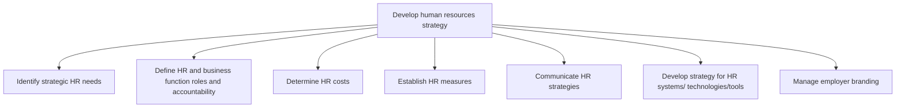

# Develop human resources strategy

> TODO: Business-as-Code definition for develop human resources strategy (education)

## Overview

TODO: Add process overview

## Process Hierarchy



## GraphDL

```yaml
develop:
  object: Human Resources Strategy
  actor: TODO
  result: TODO
```

## Actions

| Action | Description |
|--------|-------------|
| TODO | TODO |

## Events

| Event | Description |
|-------|-------------|
| TODO | TODO |

## Searches

| Search | Description |
|--------|-------------|
| TODO | TODO |

## Process Flow


## RACI Matrix

| Activity | Responsible | Accountable | Consulted | Informed |
|----------|-------------|-------------|-----------|----------|
| TODO | TODO | TODO | TODO | TODO |

## Sub-Processes

| ID | Name | Description |
|----|------|-------------|
| 6.1.1.1 | Identify strategic HR needs | TODO |
| 6.1.1.2 | Define HR and business function roles and accountability | TODO |
| 6.1.1.3 | Determine HR costs | TODO |
| 6.1.1.4 | Establish HR measures | TODO |
| 6.1.1.5 | Communicate HR strategies | TODO |
| 6.1.1.6 | Develop strategy for HR systems/ technologies/tools | TODO |
| 6.1.1.7 | Manage employer branding | TODO |

## Related Processes

| Process | Relationship |
|---------|-------------|
| TODO | TODO |

## Related Departments

| Department | Role |
|-----------|------|
| TODO | TODO |

## Related Occupations

| Occupation | Involvement |
|-----------|-------------|
| TODO | TODO |

## KPIs

| KPI | Description | Unit |
|-----|-------------|------|
| TODO | TODO | TODO |

## Usage

```typescript
import { TODO } from '@headlessly/develop-human-resources-strategy'

const client = TODO()

// TODO: Example action calls
```
