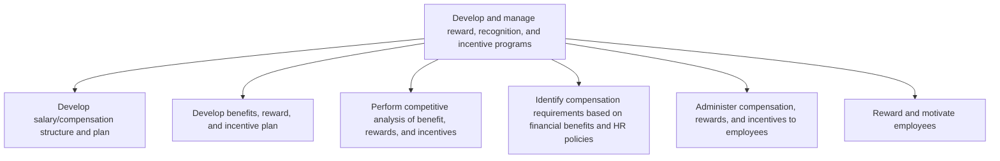

# Develop and manage reward, recognition, and incentive programs

> TODO: Business-as-Code definition for develop and manage reward, recognition, and incentive programs (education)

## Overview

TODO: Add process overview

## Process Hierarchy



## GraphDL

```yaml
develop:
  object: And Manage Reward, Recognition, And Incentive Programs
  actor: TODO
  result: TODO
```

## Actions

| Action | Description |
|--------|-------------|
| TODO | TODO |

## Events

| Event | Description |
|-------|-------------|
| TODO | TODO |

## Searches

| Search | Description |
|--------|-------------|
| TODO | TODO |

## Process Flow


## RACI Matrix

| Activity | Responsible | Accountable | Consulted | Informed |
|----------|-------------|-------------|-----------|----------|
| TODO | TODO | TODO | TODO | TODO |

## Sub-Processes

| ID | Name | Description |
|----|------|-------------|
| 6.5.1.1 | Develop salary/compensation structure and plan | TODO |
| 6.5.1.2 | Develop benefits, reward, and incentive plan | TODO |
| 6.5.1.3 | Perform competitive analysis of benefit, rewards, and incentives | TODO |
| 6.5.1.4 | Identify compensation requirements based on financial benefits and HR policies | TODO |
| 6.5.1.5 | Administer compensation, rewards, and incentives to employees | TODO |
| 6.5.1.6 | Reward and motivate employees | TODO |

## Related Processes

| Process | Relationship |
|---------|-------------|
| TODO | TODO |

## Related Departments

| Department | Role |
|-----------|------|
| TODO | TODO |

## Related Occupations

| Occupation | Involvement |
|-----------|-------------|
| TODO | TODO |

## KPIs

| KPI | Description | Unit |
|-----|-------------|------|
| TODO | TODO | TODO |

## Usage

```typescript
import { TODO } from '@headlessly/develop-and-manage-reward,-recognition,-and-incentive-programs'

const client = TODO()

// TODO: Example action calls
```
