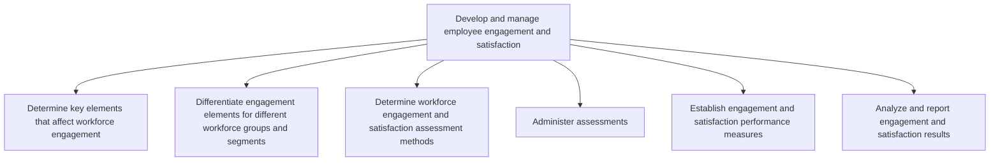

# Develop and manage employee engagement and satisfaction

> TODO: Business-as-Code definition for develop and manage employee engagement and satisfaction (education)

## Overview

TODO: Add process overview

## Process Hierarchy



## GraphDL

```yaml
develop:
  object: And Manage Employee Engagement And Satisfaction
  actor: TODO
  result: TODO
```

## Actions

| Action | Description |
|--------|-------------|
| TODO | TODO |

## Events

| Event | Description |
|-------|-------------|
| TODO | TODO |

## Searches

| Search | Description |
|--------|-------------|
| TODO | TODO |

## Process Flow


## RACI Matrix

| Activity | Responsible | Accountable | Consulted | Informed |
|----------|-------------|-------------|-----------|----------|
| TODO | TODO | TODO | TODO | TODO |

## Sub-Processes

| ID | Name | Description |
|----|------|-------------|
| 6.5.2.1 | Determine key elements that affect workforce engagement | TODO |
| 6.5.2.2 | Differentiate engagement elements for different workforce groups and segments | TODO |
| 6.5.2.3 | Determine workforce engagement and satisfaction assessment methods | TODO |
| 6.5.2.4 | Administer assessments | TODO |
| 6.5.2.5 | Establish engagement and satisfaction performance measures | TODO |
| 6.5.2.6 | Analyze and report engagement and satisfaction results | TODO |

## Related Processes

| Process | Relationship |
|---------|-------------|
| TODO | TODO |

## Related Departments

| Department | Role |
|-----------|------|
| TODO | TODO |

## Related Occupations

| Occupation | Involvement |
|-----------|-------------|
| TODO | TODO |

## KPIs

| KPI | Description | Unit |
|-----|-------------|------|
| TODO | TODO | TODO |

## Usage

```typescript
import { TODO } from '@headlessly/develop-and-manage-employee-engagement-and-satisfaction'

const client = TODO()

// TODO: Example action calls
```
