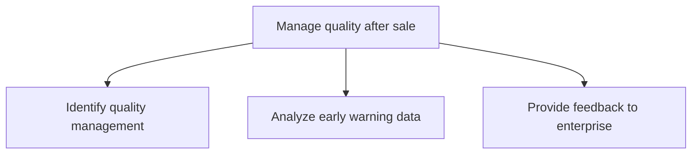

# Manage quality after sale

> TODO: Business-as-Code definition for manage quality after sale (automotive)

## Overview

In the “manage quality process group”, quality management is identified, early warning data is analyzed, feedback is provided to the enterprise based on the analysis and regulatory compliance is managed.

## Process Hierarchy



## GraphDL

```yaml
manage:
  object: Quality After Sale
  actor: TODO
  result: TODO
```

## Actions

| Action | Description |
|--------|-------------|
| TODO | TODO |

## Events

| Event | Description |
|-------|-------------|
| TODO | TODO |

## Searches

| Search | Description |
|--------|-------------|
| TODO | TODO |

## Process Flow


## RACI Matrix

| Activity | Responsible | Accountable | Consulted | Informed |
|----------|-------------|-------------|-----------|----------|
| TODO | TODO | TODO | TODO | TODO |

## Sub-Processes

| ID | Name | Description |
|----|------|-------------|
| 6.10.1 | Identify quality management | TODO |
| 6.10.2 | Analyze early warning data | TODO |
| 6.10.3 | Provide feedback to enterprise | TODO |

## Related Processes

| Process | Relationship |
|---------|-------------|
| TODO | TODO |

## Related Departments

| Department | Role |
|-----------|------|
| TODO | TODO |

## Related Occupations

| Occupation | Involvement |
|-----------|-------------|
| TODO | TODO |

## KPIs

| KPI | Description | Unit |
|-----|-------------|------|
| TODO | TODO | TODO |

## Usage

```typescript
import { TODO } from '@headlessly/manage-quality-after-sale'

const client = TODO()

// TODO: Example action calls
```
