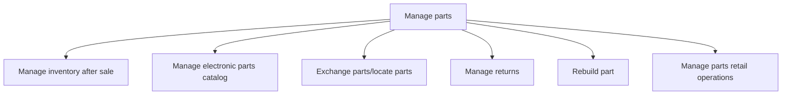

# Manage parts

> TODO: Business-as-Code definition for manage parts (automotive)

## Overview

The aftermarket parts sector also forms part of the automotive industry supply chain. Suppliers manufacture components, ready-made parts, and accessories for vehicles that have already been sold. During the retailing stage, these parts are sent to retailers and dealers, who sell these products to the customer. In the Manage parts process group, inventory and electronic parts catalogues are managed, parts are exchanged/located, returns are managed, parts are rebuilt, and the retail operations are managed.

## Process Hierarchy



## GraphDL

```yaml
manage:
  object: Parts
  actor: TODO
  result: TODO
```

## Actions

| Action | Description |
|--------|-------------|
| TODO | TODO |

## Events

| Event | Description |
|-------|-------------|
| TODO | TODO |

## Searches

| Search | Description |
|--------|-------------|
| TODO | TODO |

## Process Flow


## RACI Matrix

| Activity | Responsible | Accountable | Consulted | Informed |
|----------|-------------|-------------|-----------|----------|
| TODO | TODO | TODO | TODO | TODO |

## Sub-Processes

| ID | Name | Description |
|----|------|-------------|
| 6.11.1 | Manage inventory after sale | TODO |
| 6.11.2 | Manage electronic parts catalog | TODO |
| 6.11.3 | Exchange parts/locate parts | TODO |
| 6.11.4 | Manage returns | TODO |
| 6.11.5 | Rebuild part | TODO |
| 6.11.6 | Manage parts retail operations | TODO |

## Related Processes

| Process | Relationship |
|---------|-------------|
| TODO | TODO |

## Related Departments

| Department | Role |
|-----------|------|
| TODO | TODO |

## Related Occupations

| Occupation | Involvement |
|-----------|-------------|
| TODO | TODO |

## KPIs

| KPI | Description | Unit |
|-----|-------------|------|
| TODO | TODO | TODO |

## Usage

```typescript
import { TODO } from '@headlessly/manage-parts'

const client = TODO()

// TODO: Example action calls
```
