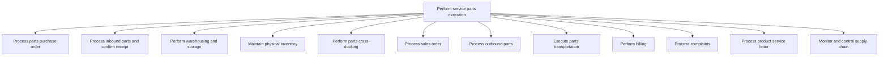

# Perform service parts execution

> TODO: Business-as-Code definition for perform service parts execution (automotive)

## Overview

TODO: Add process overview

## Process Hierarchy



## GraphDL

```yaml
perform:
  object: Service Parts Execution
  actor: TODO
  result: TODO
```

## Actions

| Action | Description |
|--------|-------------|
| TODO | TODO |

## Events

| Event | Description |
|-------|-------------|
| TODO | TODO |

## Searches

| Search | Description |
|--------|-------------|
| TODO | TODO |

## Process Flow


## RACI Matrix

| Activity | Responsible | Accountable | Consulted | Informed |
|----------|-------------|-------------|-----------|----------|
| TODO | TODO | TODO | TODO | TODO |

## Sub-Processes

| ID | Name | Description |
|----|------|-------------|
| 6.12.2.1 | Process parts purchase order | TODO |
| 6.12.2.2 | Process inbound parts and confirm receipt | TODO |
| 6.12.2.3 | Perform warehousing and storage | TODO |
| 6.12.2.4 | Maintain physical inventory | TODO |
| 6.12.2.5 | Perform parts cross-docking | TODO |
| 6.12.2.6 | Process sales order | TODO |
| 6.12.2.7 | Process outbound parts | TODO |
| 6.12.2.8 | Execute parts transportation | TODO |
| 6.12.2.9 | Perform billing | TODO |
| 6.12.2.10 | Process complaints | TODO |
| 6.12.2.11 | Process product service letter | TODO |
| 6.12.2.12 | Monitor and control supply chain | TODO |

## Related Processes

| Process | Relationship |
|---------|-------------|
| TODO | TODO |

## Related Departments

| Department | Role |
|-----------|------|
| TODO | TODO |

## Related Occupations

| Occupation | Involvement |
|-----------|-------------|
| TODO | TODO |

## KPIs

| KPI | Description | Unit |
|-----|-------------|------|
| TODO | TODO | TODO |

## Usage

```typescript
import { TODO } from '@headlessly/perform-service-parts-execution'

const client = TODO()

// TODO: Example action calls
```
