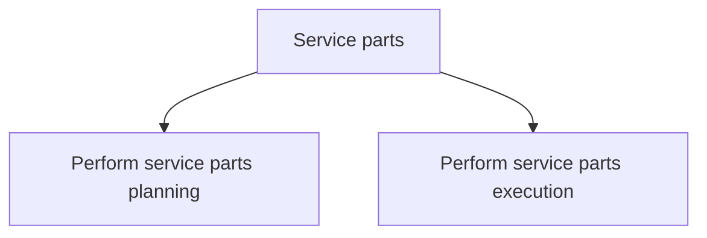

# Service parts

> TODO: Business-as-Code definition for service parts (automotive)

## Overview

The “service parts” group includes the planning and execution of service parts. This includes a full set of supply chain activities from planning parts demand, inventory, supply and distribution to processing of parts purchase orders, performing warehousing and storage, managing physical inventory, processing sales orders and outbound parts, billing, monitoring and controlling the supply chain.

## Process Hierarchy



## GraphDL

```yaml
service:
  object: Parts
  actor: TODO
  result: TODO
```

## Actions

| Action | Description |
|--------|-------------|
| TODO | TODO |

## Events

| Event | Description |
|-------|-------------|
| TODO | TODO |

## Searches

| Search | Description |
|--------|-------------|
| TODO | TODO |

## Process Flow


## RACI Matrix

| Activity | Responsible | Accountable | Consulted | Informed |
|----------|-------------|-------------|-----------|----------|
| TODO | TODO | TODO | TODO | TODO |

## Sub-Processes

| ID | Name | Description |
|----|------|-------------|
| 6.12.1 | Perform service parts planning | TODO |
| 6.12.2 | Perform service parts execution | TODO |

## Related Processes

| Process | Relationship |
|---------|-------------|
| TODO | TODO |

## Related Departments

| Department | Role |
|-----------|------|
| TODO | TODO |

## Related Occupations

| Occupation | Involvement |
|-----------|-------------|
| TODO | TODO |

## KPIs

| KPI | Description | Unit |
|-----|-------------|------|
| TODO | TODO | TODO |

## Usage

```typescript
import { TODO } from '@headlessly/service-parts'

const client = TODO()

// TODO: Example action calls
```
