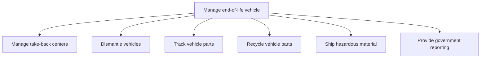

# Manage end-of-life vehicle

> TODO: Business-as-Code definition for manage end-of-life vehicle (automotive)

## Overview

An end-of-life vehicle (ELV) is any vehicle that has come to the end of its useful life and is categorized as waste. (The components and materials of these vehicles are also classed as waste and include material being sent for recycling or reuse). Every year, these motor vehicles create tons of millions of waste and some countries have issued directives/legislation to tackle this problem. For example, the European Union's End-of-Life Vehicle Directive (Directive 2000/53/EC - the “ELV” Directive) sets recovery targets for recycling of vehicles and components, encourages manufacturers to design their vehicles with part reuse and recycling in mind, and restricts the use of certain heavy metals in new vehicle manufacturing processes. Some ELVs will go to vehicle dismantlers and others go directly to scrapyards. The “manage end-of-life vehicle” process group includes processes that manage take-back centers, dismantle vehicles, track and recycle vehicle parts and ship hazardous material. The provision of government reporting on these processes is also included.

## Process Hierarchy



## GraphDL

```yaml
manage:
  object: End-of-life Vehicle
  actor: TODO
  result: TODO
```

## Actions

| Action | Description |
|--------|-------------|
| TODO | TODO |

## Events

| Event | Description |
|-------|-------------|
| TODO | TODO |

## Searches

| Search | Description |
|--------|-------------|
| TODO | TODO |

## Process Flow


## RACI Matrix

| Activity | Responsible | Accountable | Consulted | Informed |
|----------|-------------|-------------|-----------|----------|
| TODO | TODO | TODO | TODO | TODO |

## Sub-Processes

| ID | Name | Description |
|----|------|-------------|
| 6.13.1 | Manage take-back centers | Managing locations where end-of-life assets are evaluated for decommissioning, disassembly, recyclin |
| 6.13.2 | Dismantle vehicles | TODO |
| 6.13.3 | Track vehicle parts | TODO |
| 6.13.4 | Recycle vehicle parts | TODO |
| 6.13.5 | Ship hazardous material | Planning, conducting, and tracking shipment of hazardous materials. |
| 6.13.6 | Provide government reporting | Preparing and distributing government reports. |

## Related Processes

| Process | Relationship |
|---------|-------------|
| TODO | TODO |

## Related Departments

| Department | Role |
|-----------|------|
| TODO | TODO |

## Related Occupations

| Occupation | Involvement |
|-----------|-------------|
| TODO | TODO |

## KPIs

| KPI | Description | Unit |
|-----|-------------|------|
| TODO | TODO | TODO |

## Usage

```typescript
import { TODO } from '@headlessly/manage-end-of-life-vehicle'

const client = TODO()

// TODO: Example action calls
```
