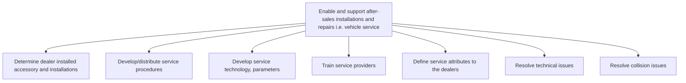

# Enable and support after-sales installations and repairs i.e. vehicle service

> TODO: Business-as-Code definition for enable and support after-sales installations and repairs i.e. vehicle service (automotive)

## Overview

This process group determines dealer installed accessory and installations, develops service technology parameters and service procedures, and distributes them to dealers. Dealers are then trained and the service attributes are defined to them. Also included in this group of processes is the resolution of technical and collision issues.

## Process Hierarchy



## GraphDL

```yaml
enable:
  object: And Support After-sales Installations And Repairs I.e. Vehicle Service
  actor: TODO
  result: TODO
```

## Actions

| Action | Description |
|--------|-------------|
| TODO | TODO |

## Events

| Event | Description |
|-------|-------------|
| TODO | TODO |

## Searches

| Search | Description |
|--------|-------------|
| TODO | TODO |

## Process Flow


## RACI Matrix

| Activity | Responsible | Accountable | Consulted | Informed |
|----------|-------------|-------------|-----------|----------|
| TODO | TODO | TODO | TODO | TODO |

## Sub-Processes

| ID | Name | Description |
|----|------|-------------|
| 6.3.1 | Determine dealer installed accessory and installations | TODO |
| 6.3.2 | Develop/distribute service procedures | TODO |
| 6.3.3 | Develop service technology, parameters | TODO |
| 6.3.4 | Train service providers | TODO |
| 6.3.5 | Define service attributes to the dealers | TODO |
| 6.3.6 | Resolve technical issues | TODO |
| 6.3.7 | Resolve collision issues | TODO |

## Related Processes

| Process | Relationship |
|---------|-------------|
| TODO | TODO |

## Related Departments

| Department | Role |
|-----------|------|
| TODO | TODO |

## Related Occupations

| Occupation | Involvement |
|-----------|-------------|
| TODO | TODO |

## KPIs

| KPI | Description | Unit |
|-----|-------------|------|
| TODO | TODO | TODO |

## Usage

```typescript
import { TODO } from '@headlessly/enable-and-support-after-sales-installations-and-repairs-i.e.-vehicle-service'

const client = TODO()

// TODO: Example action calls
```
