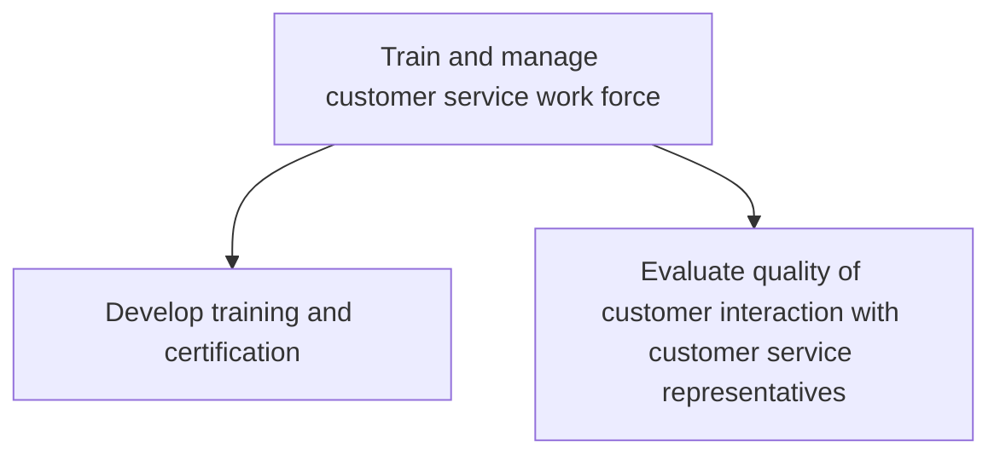

# Train and manage customer service work force

> TODO: Business-as-Code definition for train and manage customer service work force (automotive)

## Overview

This process group involves developing training and certification standards for OEM wholesale service support staff and dealer service advisors and technicians. It also includes evaluating the quality of customer interaction with customer service representatives.

## Process Hierarchy



## GraphDL

```yaml
train:
  object: And Manage Customer Service Work Force
  actor: TODO
  result: TODO
```

## Actions

| Action | Description |
|--------|-------------|
| TODO | TODO |

## Events

| Event | Description |
|-------|-------------|
| TODO | TODO |

## Searches

| Search | Description |
|--------|-------------|
| TODO | TODO |

## Process Flow


## RACI Matrix

| Activity | Responsible | Accountable | Consulted | Informed |
|----------|-------------|-------------|-----------|----------|
| TODO | TODO | TODO | TODO | TODO |

## Sub-Processes

| ID | Name | Description |
|----|------|-------------|
| 6.6.1 | Develop training and certification | TODO |
| 6.6.2 | Evaluate quality of customer interaction with customer service representatives | TODO |

## Related Processes

| Process | Relationship |
|---------|-------------|
| TODO | TODO |

## Related Departments

| Department | Role |
|-----------|------|
| TODO | TODO |

## Related Occupations

| Occupation | Involvement |
|-----------|-------------|
| TODO | TODO |

## KPIs

| KPI | Description | Unit |
|-----|-------------|------|
| TODO | TODO | TODO |

## Usage

```typescript
import { TODO } from '@headlessly/train-and-manage-customer-service-work-force'

const client = TODO()

// TODO: Example action calls
```
