# Manage Customer Service

> TODO: Business-as-Code definition for manage customer service (automotive)

## Overview

Managing customers before and after the delivery of services. This includes developing and planning customer service practices with an eye on steering processes relating to inquiries after sales, feedback, warranties, and recalls.

## Process Hierarchy

```mermaid
graph TD
    A[Manage Customer Service]
    A --> B[Develop post vehicle sale, customer care/customer service strategy]
    A --> C[Plan and manage customer service contacts]
    A --> D[Enable and support after-sales installations and repairs i.e. vehicle service]
    A --> E[Evaluate customer service operations and customer satisfaction]
    A --> F[Provide value-add services]
    A --> G[Train and manage customer service work force]
    A --> H[Service products after sales]
    A --> I[Manage product recalls and regulatory audits]
    A --> J[Provide telematics service]
    A --> K[Manage quality after sale]
    A --> L[Manage parts]
    A --> M[Service parts]
    A --> N[Manage end-of-life vehicle]
```



## GraphDL

```yaml
manage:
  object: Customer Service
  actor: TODO
  result: TODO
```

## Actions

| Action | Description |
|--------|-------------|
| TODO | TODO |

## Events

| Event | Description |
|-------|-------------|
| TODO | TODO |

## Searches

| Search | Description |
|--------|-------------|
| TODO | TODO |

## Process Flow


## RACI Matrix

| Activity | Responsible | Accountable | Consulted | Informed |
|----------|-------------|-------------|-----------|----------|
| TODO | TODO | TODO | TODO | TODO |

## Sub-Processes

| ID | Name | Description |
|----|------|-------------|
| 6.1 | Develop post vehicle sale, customer care/customer service strategy | This process group involves understanding and segmenting customers, creating policies to govern cust |
| 6.2 | Plan and manage customer service contacts | Planning and administering work force operations for customer service provision by taking care of cu |
| 6.3 | Enable and support after-sales installations and repairs i.e. vehicle service | This process group determines dealer installed accessory and installations, develops service technol |
| 6.4 | Evaluate customer service operations and customer satisfaction | Calculating and assessing the operational activities of the customer service function. Evaluation is |
| 6.5 | Provide value-add services | For this process, value-added services can include such perks as in-house call centers for new and e |
| 6.6 | Train and manage customer service work force | This process group involves developing training and certification standards for OEM wholesale servic |
| 6.7 | Service products after sales | Assigning post-sales policies and paying claims on purchased products.  This is a process that is an |
| 6.8 | Manage product recalls and regulatory audits | Removing defective products from the distribution chain. Participate in audits from watchdog agencie |
| 6.9 | Provide telematics service | TODO |
| 6.10 | Manage quality after sale | In the “manage quality process group”, quality management is identified, early warning data is analy |
| 6.11 | Manage parts | The aftermarket parts sector also forms part of the automotive industry supply chain. Suppliers manu |
| 6.12 | Service parts | The “service parts” group includes the planning and execution of service parts. This includes a full |
| 6.13 | Manage end-of-life vehicle | An end-of-life vehicle (ELV) is any vehicle that has come to the end of its useful life and is categ |

## Related Processes

| Process | Relationship |
|---------|-------------|
| TODO | TODO |

## Related Departments

| Department | Role |
|-----------|------|
| TODO | TODO |

## Related Occupations

| Occupation | Involvement |
|-----------|-------------|
| TODO | TODO |

## KPIs

| KPI | Description | Unit |
|-----|-------------|------|
| TODO | TODO | TODO |

## Usage

```typescript
import { TODO } from '@headlessly/manage-customer-service'

const client = TODO()

// TODO: Example action calls
```
