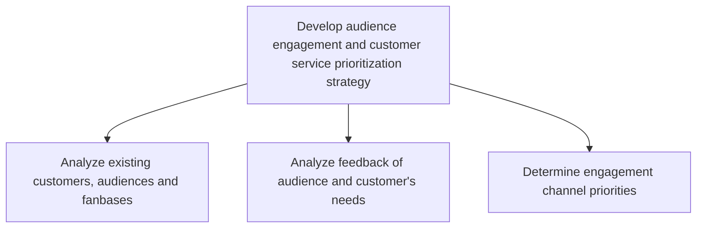

# Develop audience engagement and customer service prioritization strategy

> TODO: Business-as-Code definition for develop audience engagement and customer service prioritization strategy (broadcasting)

## Overview

Identifying and categorizing customer needs, and creating priority lists around them. Order and prioritize existing customers into segments. Adjust the customer service strategy accordingly. Analyze customer feedback.

## Process Hierarchy



## GraphDL

```yaml
develop:
  object: Audience Engagement And Customer Service Prioritization Strategy
  actor: TODO
  result: TODO
```

## Actions

| Action | Description |
|--------|-------------|
| TODO | TODO |

## Events

| Event | Description |
|-------|-------------|
| TODO | TODO |

## Searches

| Search | Description |
|--------|-------------|
| TODO | TODO |

## Process Flow


## RACI Matrix

| Activity | Responsible | Accountable | Consulted | Informed |
|----------|-------------|-------------|-----------|----------|
| TODO | TODO | TODO | TODO | TODO |

## Sub-Processes

| ID | Name | Description |
|----|------|-------------|
| 6.1.4.1 | Analyze existing customers, audiences and fanbases | Analyzing existing customers needs and behaviors to enhance the customer experience as a whole. Use  |
| 6.1.4.2 | Analyze feedback of audience and customer's needs | Adopting a feedback strategy by designing and implementing feedback forms--or through direct communi |
| 6.1.4.3 | Determine engagement channel priorities | TODO |

## Related Processes

| Process | Relationship |
|---------|-------------|
| TODO | TODO |

## Related Departments

| Department | Role |
|-----------|------|
| TODO | TODO |

## Related Occupations

| Occupation | Involvement |
|-----------|-------------|
| TODO | TODO |

## KPIs

| KPI | Description | Unit |
|-----|-------------|------|
| TODO | TODO | TODO |

## Usage

```typescript
import { TODO } from '@headlessly/develop-audience-engagement-and-customer-service-prioritization-strategy'

const client = TODO()

// TODO: Example action calls
```
