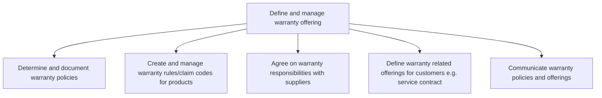

# Define and manage warranty offering

> TODO: Business-as-Code definition for define and manage warranty offering (consumer-products)

## Overview

TODO: Add process overview

## Process Hierarchy



## GraphDL

```yaml
define:
  object: And Manage Warranty Offering
  actor: TODO
  result: TODO
```

## Actions

| Action | Description |
|--------|-------------|
| TODO | TODO |

## Events

| Event | Description |
|-------|-------------|
| TODO | TODO |

## Searches

| Search | Description |
|--------|-------------|
| TODO | TODO |

## Process Flow


## RACI Matrix

| Activity | Responsible | Accountable | Consulted | Informed |
|----------|-------------|-------------|-----------|----------|
| TODO | TODO | TODO | TODO | TODO |

## Sub-Processes

| ID | Name | Description |
|----|------|-------------|
| 6.1.6.1 | Determine and document warranty policies | Establishing warranty policies to assure customers that the company will guarantee its warranties th |
| 6.1.6.2 | Create and manage warranty rules/claim codes for products | Establishing and maintaining claims processing and routing rules. Establish and maintain claims proc |
| 6.1.6.3 | Agree on warranty responsibilities with suppliers | TODO |
| 6.1.6.4 | Define warranty related offerings for customers e.g. service contract | TODO |
| 6.1.6.5 | Communicate warranty policies and offerings | Communicating rules and updates via training manuals for new products and training resources. |

## Related Processes

| Process | Relationship |
|---------|-------------|
| TODO | TODO |

## Related Departments

| Department | Role |
|-----------|------|
| TODO | TODO |

## Related Occupations

| Occupation | Involvement |
|-----------|-------------|
| TODO | TODO |

## KPIs

| KPI | Description | Unit |
|-----|-------------|------|
| TODO | TODO | TODO |

## Usage

```typescript
import { TODO } from '@headlessly/define-and-manage-warranty-offering'

const client = TODO()

// TODO: Example action calls
```
