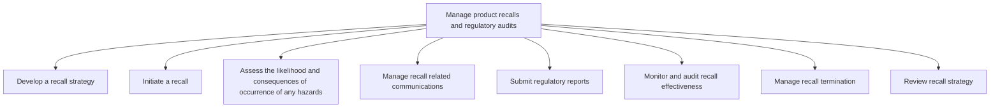

# Manage product recalls and regulatory audits

> TODO: Business-as-Code definition for manage product recalls and regulatory audits (consumer-products)

## Overview

Managing effective product recalls. To effectively manage product recalls, develop and initiate a clearly defined recall strategy while assessing the likelihood and consequences of occurrence of any hazards.  As part of the process, develop and manage recall related communications and submit the required regulatory reporting.  Monitoring effectiveness and reviewing and terminating the strategy are necessary components as well.  In order to define a cross functional/end-to-end manage recalls process, the following processes would be used in conjunction with Manage product recalls and regulatory audits: Manage customer complaints [10389]; Manage returns and reverse logistics [10342]; Report incidents, adverse events, and corrective action/preventive action [12840]; Manage public relations program [11014], Manage legal and ethical issues [11013], and Maintain production records and manage lot traceability [10370].)

## Process Hierarchy



## GraphDL

```yaml
manage:
  object: Product Recalls And Regulatory Audits
  actor: TODO
  result: TODO
```

## Actions

| Action | Description |
|--------|-------------|
| TODO | TODO |

## Events

| Event | Description |
|-------|-------------|
| TODO | TODO |

## Searches

| Search | Description |
|--------|-------------|
| TODO | TODO |

## Process Flow


## RACI Matrix

| Activity | Responsible | Accountable | Consulted | Informed |
|----------|-------------|-------------|-----------|----------|
| TODO | TODO | TODO | TODO | TODO |

## Sub-Processes

| ID | Name | Description |
|----|------|-------------|
| 6.4.1 | Develop a recall strategy | TODO |
| 6.4.2 | Initiate a recall | TODO |
| 6.4.3 | Assess the likelihood and consequences of occurrence of any hazards | TODO |
| 6.4.4 | Manage recall related communications | TODO |
| 6.4.5 | Submit regulatory reports | TODO |
| 6.4.6 | Monitor and audit recall effectiveness | TODO |
| 6.4.7 | Manage recall termination | TODO |
| 6.4.8 | Review recall strategy | TODO |

## Related Processes

| Process | Relationship |
|---------|-------------|
| TODO | TODO |

## Related Departments

| Department | Role |
|-----------|------|
| TODO | TODO |

## Related Occupations

| Occupation | Involvement |
|-----------|-------------|
| TODO | TODO |

## KPIs

| KPI | Description | Unit |
|-----|-------------|------|
| TODO | TODO | TODO |

## Usage

```typescript
import { TODO } from '@headlessly/manage-product-recalls-and-regulatory-audits'

const client = TODO()

// TODO: Example action calls
```
