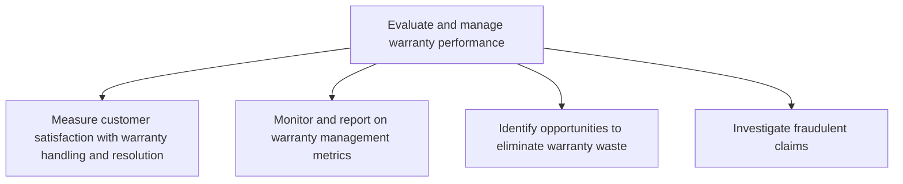

# Evaluate and manage warranty performance

> TODO: Business-as-Code definition for evaluate and manage warranty performance (consumer-products)

## Overview

TODO: Add process overview

## Process Hierarchy



## GraphDL

```yaml
evaluate:
  object: And Manage Warranty Performance
  actor: TODO
  result: TODO
```

## Actions

| Action | Description |
|--------|-------------|
| TODO | TODO |

## Events

| Event | Description |
|-------|-------------|
| TODO | TODO |

## Searches

| Search | Description |
|--------|-------------|
| TODO | TODO |

## Process Flow


## RACI Matrix

| Activity | Responsible | Accountable | Consulted | Informed |
|----------|-------------|-------------|-----------|----------|
| TODO | TODO | TODO | TODO | TODO |

## Sub-Processes

| ID | Name | Description |
|----|------|-------------|
| 6.5.6.1 | Measure customer satisfaction with warranty handling and resolution | TODO |
| 6.5.6.2 | Monitor and report on warranty management metrics | Comparing warranties by using applicable metrics to see how they are handled and resolved. Develop a |
| 6.5.6.3 | Identify opportunities to eliminate warranty waste | Finding ways to phase out unused or seldom used warranties. |
| 6.5.6.4 | Investigate fraudulent claims | TODO |

## Related Processes

| Process | Relationship |
|---------|-------------|
| TODO | TODO |

## Related Departments

| Department | Role |
|-----------|------|
| TODO | TODO |

## Related Occupations

| Occupation | Involvement |
|-----------|-------------|
| TODO | TODO |

## KPIs

| KPI | Description | Unit |
|-----|-------------|------|
| TODO | TODO | TODO |

## Usage

```typescript
import { TODO } from '@headlessly/evaluate-and-manage-warranty-performance'

const client = TODO()

// TODO: Example action calls
```
