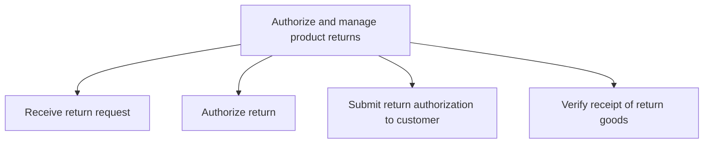

# Authorize and manage product returns

> TODO: Business-as-Code definition for authorize and manage product returns (life-sciences)

## Overview

Verifying, authorizing, and processing of returns and receipt of returned products.   This builds on Manage returns; manage reverse logistics [10342] and includes customer-focused activities related to the  receipt of return requests, authorization of returns, submission of returns to the customer, and verification of receipt of returned goods.

## Process Hierarchy



## GraphDL

```yaml
authorize:
  object: And Manage Product Returns
  actor: TODO
  result: TODO
```

## Actions

| Action | Description |
|--------|-------------|
| TODO | TODO |

## Events

| Event | Description |
|-------|-------------|
| TODO | TODO |

## Searches

| Search | Description |
|--------|-------------|
| TODO | TODO |

## Process Flow


## RACI Matrix

| Activity | Responsible | Accountable | Consulted | Informed |
|----------|-------------|-------------|-----------|----------|
| TODO | TODO | TODO | TODO | TODO |

## Sub-Processes

| ID | Name | Description |
|----|------|-------------|
| 6.2.6.1 | Receive return request | TODO |
| 6.2.6.2 | Authorize return | TODO |
| 6.2.6.3 | Submit return authorization to customer | TODO |
| 6.2.6.4 | Verify receipt of return goods | TODO |

## Related Processes

| Process | Relationship |
|---------|-------------|
| TODO | TODO |

## Related Departments

| Department | Role |
|-----------|------|
| TODO | TODO |

## Related Occupations

| Occupation | Involvement |
|-----------|-------------|
| TODO | TODO |

## KPIs

| KPI | Description | Unit |
|-----|-------------|------|
| TODO | TODO | TODO |

## Usage

```typescript
import { TODO } from '@headlessly/authorize-and-manage-product-returns'

const client = TODO()

// TODO: Example action calls
```
