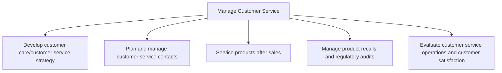

# Manage Customer Service

> TODO: Business-as-Code definition for manage customer service (life-sciences)

## Overview

TODO: Add process overview

## Process Hierarchy



## GraphDL

```yaml
manage:
  object: Customer Service
  actor: TODO
  result: TODO
```

## Actions

| Action | Description |
|--------|-------------|
| TODO | TODO |

## Events

| Event | Description |
|-------|-------------|
| TODO | TODO |

## Searches

| Search | Description |
|--------|-------------|
| TODO | TODO |

## Process Flow


## RACI Matrix

| Activity | Responsible | Accountable | Consulted | Informed |
|----------|-------------|-------------|-----------|----------|
| TODO | TODO | TODO | TODO | TODO |

## Sub-Processes

| ID | Name | Description |
|----|------|-------------|
| 6.1 | Develop customer care/customer service strategy | Defining a plan that removes customer obstacles by gathering operational insight and competitive ins |
| 6.2 | Plan and manage customer service contacts | Planning and administering work force operations for customer service provision by taking care of cu |
| 6.3 | Service products after sales | Assigning post-sales policies and paying claims on purchased products.  This is a process that is an |
| 6.4 | Manage product recalls and regulatory audits | Removing defective products from the distribution chain. Participate in audits from watchdog agencie |
| 6.5 | Evaluate customer service operations and customer satisfaction | Calculating and assessing the operational activities of the customer service function. Evaluation is |

## Related Processes

| Process | Relationship |
|---------|-------------|
| TODO | TODO |

## Related Departments

| Department | Role |
|-----------|------|
| TODO | TODO |

## Related Occupations

| Occupation | Involvement |
|-----------|-------------|
| TODO | TODO |

## KPIs

| KPI | Description | Unit |
|-----|-------------|------|
| TODO | TODO | TODO |

## Usage

```typescript
import { TODO } from '@headlessly/manage-customer-service'

const client = TODO()

// TODO: Example action calls
```
