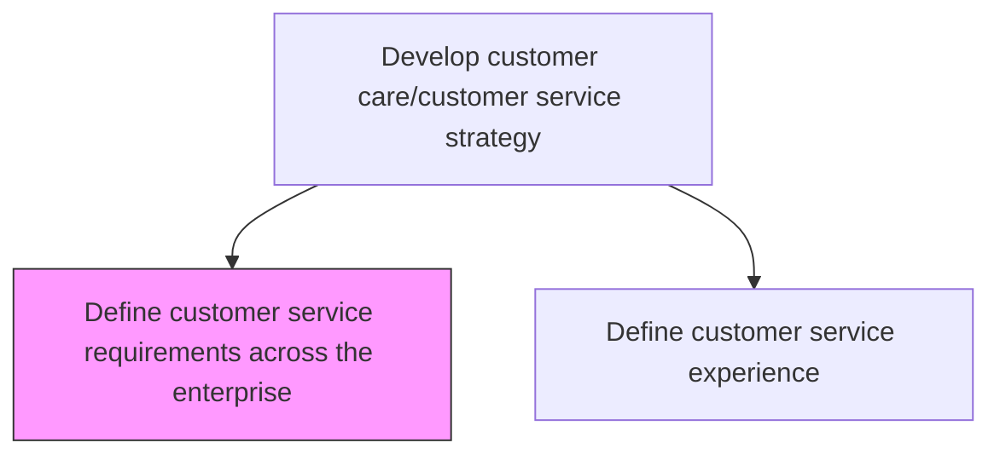
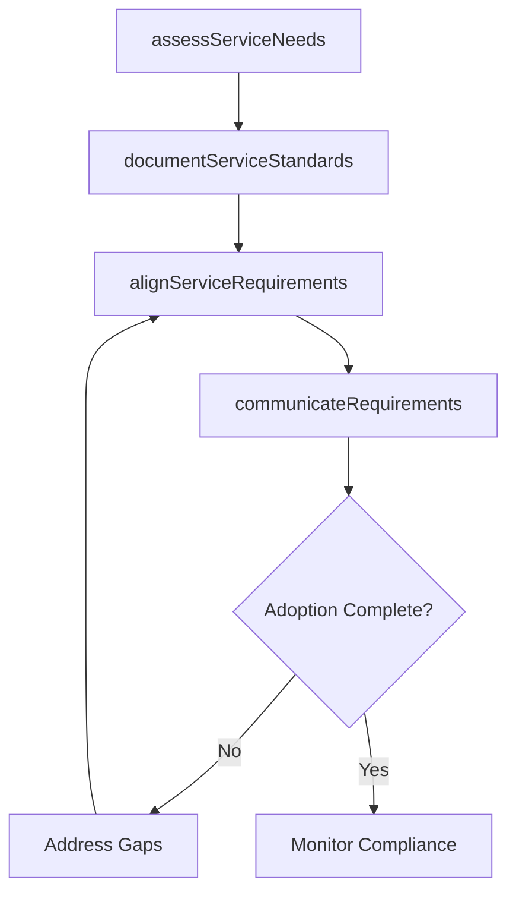

# Define customer service requirements across the enterprise

> Business-as-Code definition for enterprise-wide customer service requirements. Models the assessment, documentation, and communication of service standards across all business units.

## Overview

Defining a set of behaviors, skills, and policies needed to provide customer service effectively across the enterprise.

## Process Hierarchy



## GraphDL

```yaml
define:
  object: Customer Service Requirements Across Enterprise
  actor: CustomerServiceDirector
  result: ServiceRequirementsDocument
```

## Actions

| Action | Description |
|--------|-------------|
| assessServiceNeeds | Evaluate customer service capabilities required across all business units |
| documentServiceStandards | Formalize enterprise-wide service standards and behavioral expectations |
| alignServiceRequirements | Ensure service requirements are consistent across divisions and geographies |
| communicateRequirements | Distribute service requirements to all customer-facing teams |

## Events

| Event | Description |
|-------|-------------|
| serviceNeedsAssessed | Enterprise customer service capability assessment completed |
| serviceStandardsDocumented | Service standards and behavioral expectations formalized |
| serviceRequirementsAligned | Cross-divisional service requirements harmonized |
| requirementsCommunicated | Service requirements distributed to all teams |

## Searches

| Search | Description |
|--------|-------------|
| getServiceRequirements | Retrieve service requirements by business unit or function |
| getComplianceStatus | Query adherence to enterprise service standards by department |
| getRequirementsHistory | List changes to service requirements over time |

## Process Flow



## RACI Matrix

| Activity | Responsible | Accountable | Consulted | Informed |
|----------|-------------|-------------|-----------|----------|
| assessServiceNeeds | CX Analyst | VP Customer Service | Department Heads | Executive Team |
| documentServiceStandards | CX Manager | VP Customer Service | Legal, Quality | All Service Staff |
| alignServiceRequirements | CX Manager | VP Customer Service | Regional Managers | Operations |
| communicateRequirements | Communications Lead | VP Customer Service | Training | All Employees |

## Related Processes

| Process | Relationship |
|---------|-------------|
| 6.1.2 Define customer service experience | Downstream - requirements inform experience standards |
| 6.1.4 Define customer service policies and procedures | Downstream - requirements drive policy creation |

## Related Departments

| Department | Role |
|-----------|------|
| Customer Service | Defines and owns enterprise service requirements |
| Operations | Ensures operational capability to meet requirements |
| Human Resources | Aligns hiring and training with service competencies |

## Related Occupations

| Occupation | Involvement |
|-----------|-------------|
| Customer Service Director | Leads enterprise requirements definition |
| Customer Experience Analyst | Assesses needs and benchmarks standards |

## KPIs

| KPI | Description | Unit |
|-----|-------------|------|
| Requirements Coverage | Percentage of business units with documented service requirements | % |
| Standards Compliance Rate | Percentage of teams meeting enterprise service standards | % |
| Requirements Update Frequency | Number of requirements revisions per year | Count |

## Usage

```typescript
import { defineCustomerServiceRequirementsAcrossEnterprise } from '@headlessly/define-customer-service-requirements-across-enterprise'

const requirements = defineCustomerServiceRequirementsAcrossEnterprise()

// Assess service needs
const needs = await requirements.assessServiceNeeds({
  businessUnits: ['retail', 'enterprise', 'support'],
  includeGapAnalysis: true
})

// Document service standards
await requirements.documentServiceStandards({
  standards: needs.recommendations,
  effectiveDate: '2025-07-01'
})
```
