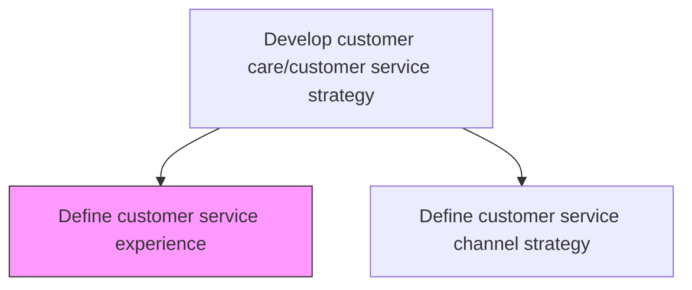
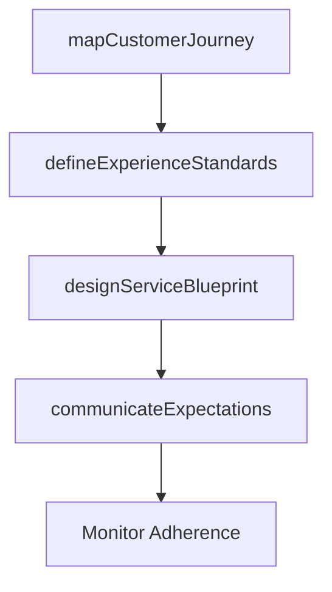

# Define customer service experience

> Business-as-Code definition for customer service experience design. Models experience standard creation, journey mapping, service level communication, and workforce expectation alignment.

## Overview

Communicating to the customer service resources what is expected when engaging the customer. Relate service level expectations to the workforce. Ensure positive customer experience.

## Process Hierarchy



## GraphDL

```yaml
define:
  object: Customer Service Experience
  actor: CustomerExperienceDesigner
  result: ServiceExperienceBlueprint
```

## Actions

| Action | Description |
|--------|-------------|
| mapCustomerJourney | Document end-to-end customer interaction touchpoints and expectations |
| defineExperienceStandards | Establish target experience quality levels for each customer interaction |
| communicateExpectations | Distribute service experience standards and guidelines to all agents |
| designServiceBlueprint | Create detailed service delivery blueprint with front-stage and back-stage activities |

## Events

| Event | Description |
|-------|-------------|
| customerJourneyMapped | Customer interaction touchpoints and expectations documented |
| experienceStandardsDefined | Target service experience quality levels established |
| expectationsCommunicated | Service standards distributed to customer-facing teams |
| serviceBlueprintDesigned | Service delivery blueprint completed and approved |

## Searches

| Search | Description |
|--------|-------------|
| getExperienceStandards | Retrieve service experience standards by channel or interaction type |
| getJourneyMaps | List customer journey maps by segment or product |
| getServiceBlueprints | Query service delivery blueprints by channel or process |

## Process Flow



## RACI Matrix

| Activity | Responsible | Accountable | Consulted | Informed |
|----------|-------------|-------------|-----------|----------|
| mapCustomerJourney | CX Designer | VP Customer Service | Marketing | Service Teams |
| defineExperienceStandards | CX Manager | VP Customer Service | Quality | All Service Staff |
| communicateExpectations | Training Manager | VP Customer Service | HR | All Service Staff |

## Related Processes

| Process | Relationship |
|---------|-------------|
| 6.1.1 Define customer service requirements across the enterprise | Upstream - enterprise requirements inform experience design |
| 6.1.3 Define and manage customer service channel strategy | Downstream - experience standards applied to channels |

## Related Departments

| Department | Role |
|-----------|------|
| Customer Experience | Designs service experience standards and blueprints |
| Training | Communicates experience expectations to service workforce |
| Marketing | Aligns brand promise with service experience delivery |

## Related Occupations

| Occupation | Involvement |
|-----------|-------------|
| Customer Experience Designer | Creates journey maps and service blueprints |
| CX Manager | Defines and monitors experience standards |

## KPIs

| KPI | Description | Unit |
|-----|-------------|------|
| Customer Effort Score | Customer-reported ease of interaction with service | Score (1-7) |
| Experience Standard Adherence | Percentage of interactions meeting defined experience standards | % |
| Journey Completion Rate | Percentage of customers completing intended service journey | % |

## Usage

```typescript
import { defineCustomerServiceExperience } from '@headlessly/define-customer-service-experience'

const experience = defineCustomerServiceExperience()

// Map the customer journey
const journey = await experience.mapCustomerJourney({
  segment: 'enterprise',
  channels: ['phone', 'chat', 'self-service'],
  includeEmotionMapping: true
})

// Define experience standards
await experience.defineExperienceStandards({
  journeyId: journey.id,
  standards: [
    { touchpoint: 'first-contact', maxWaitSeconds: 30 },
    { touchpoint: 'resolution', maxDays: 1 }
  ]
})
```
