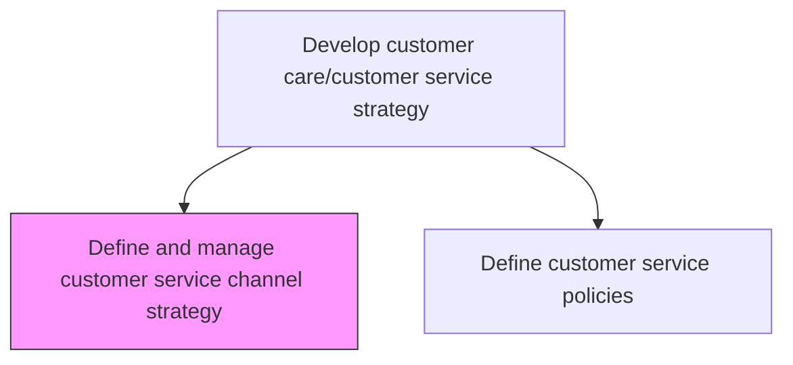
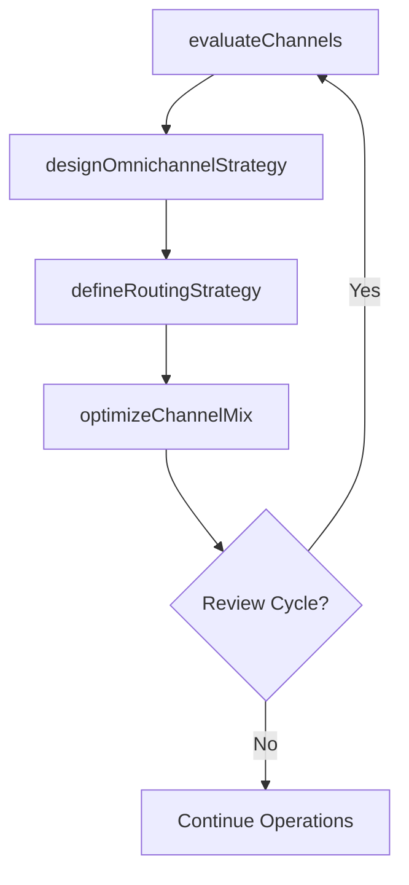

# Define and manage customer service channel strategy

> Business-as-Code definition for customer service channel strategy management. Models channel evaluation, omnichannel design, channel performance optimization, and customer routing strategy.

## Overview

Establishing and refining procedures for customer service and technical support.

## Process Hierarchy



## GraphDL

```yaml
define:
  object: And Manage Customer Service Channel Strategy
  actor: ChannelStrategyManager
  result: ChannelStrategy
```

## Actions

| Action | Description |
|--------|-------------|
| evaluateChannels | Assess current service channels for effectiveness, cost, and customer preference |
| designOmnichannelStrategy | Create integrated multi-channel service delivery approach |
| optimizeChannelMix | Adjust channel investment based on volume, cost, and satisfaction data |
| defineRoutingStrategy | Establish rules for directing customers to the optimal service channel |

## Events

| Event | Description |
|-------|-------------|
| channelsEvaluated | Service channel effectiveness assessment completed |
| omnichannelStrategyDesigned | Integrated multi-channel strategy approved |
| channelMixOptimized | Channel investment reallocated based on performance data |
| routingStrategyDefined | Customer channel routing rules established |

## Searches

| Search | Description |
|--------|-------------|
| getChannelPerformance | Retrieve performance metrics by service channel |
| getChannelCostData | Query cost-per-interaction data by channel |
| getChannelPreferences | List customer channel preference data by segment |

## Process Flow



## RACI Matrix

| Activity | Responsible | Accountable | Consulted | Informed |
|----------|-------------|-------------|-----------|----------|
| evaluateChannels | Channel Strategy Manager | VP Customer Service | IT, Finance | Operations |
| designOmnichannelStrategy | Channel Strategy Manager | VP Customer Service | Marketing | All Service Teams |
| optimizeChannelMix | Channel Strategy Manager | VP Customer Service | Finance | Operations |

## Related Processes

| Process | Relationship |
|---------|-------------|
| 6.1.2 Define customer service experience | Upstream - experience standards guide channel design |
| 6.2.1 Plan and manage customer service work force | Downstream - channel strategy drives staffing needs |

## Related Departments

| Department | Role |
|-----------|------|
| Customer Service Strategy | Defines and manages channel portfolio |
| Information Technology | Enables channel platforms and integrations |
| Finance | Tracks channel cost-effectiveness |

## Related Occupations

| Occupation | Involvement |
|-----------|-------------|
| Channel Strategy Manager | Designs and optimizes service channel portfolio |
| Digital Experience Manager | Manages digital and self-service channels |

## KPIs

| KPI | Description | Unit |
|-----|-------------|------|
| Channel Deflection Rate | Percentage of interactions handled by lower-cost channels | % |
| Cross-Channel Resolution Rate | Percentage of issues resolved without channel switching | % |
| Cost per Contact by Channel | Average cost of a customer interaction per channel | USD |

## Usage

```typescript
import { defineAndManageCustomerServiceChannelStrategy } from '@headlessly/define-and-manage-customer-service-channel-strategy'

const channels = defineAndManageCustomerServiceChannelStrategy()

// Evaluate channels
const evaluation = await channels.evaluateChannels({
  channels: ['phone', 'chat', 'email', 'self-service', 'social'],
  metrics: ['cost', 'satisfaction', 'resolution-rate'],
  period: '2025-Q1'
})

// Optimize channel mix
await channels.optimizeChannelMix({
  evaluationId: evaluation.id,
  targetCostReduction: 0.10,
  constraints: { minPhoneCoverage: 0.80 }
})
```
