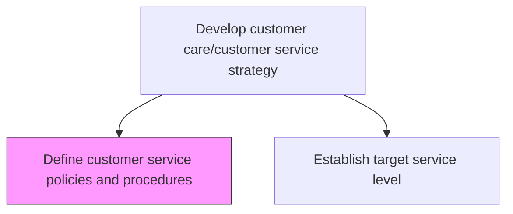
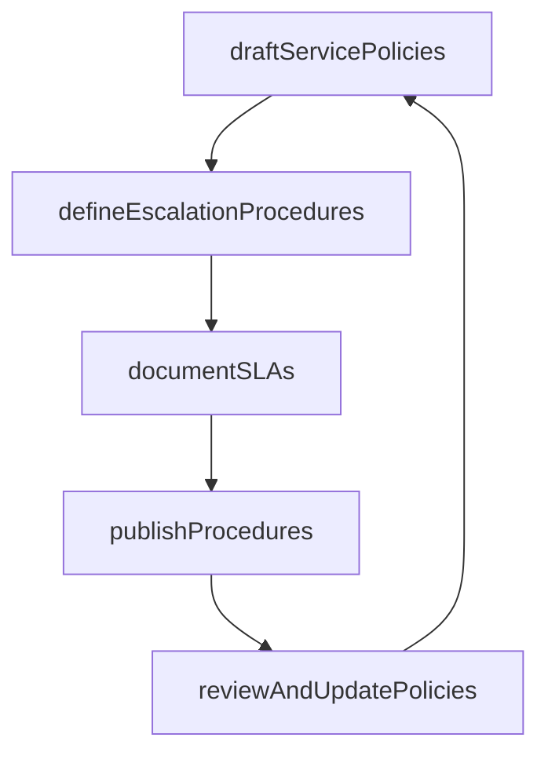

# Define customer service policies and procedures

> Business-as-Code definition for customer service policy and procedure definition. Models policy creation, escalation rule design, SLA documentation, and procedure publication.

## Overview

Outlining the framework of policies and methods for developing customer service strategy. Establish the rules and regulations that serve as a guideline for the customer service strategy. Take into account customer needs and behavior.

## Process Hierarchy



## GraphDL

```yaml
define:
  object: Customer Service Policies And Procedures
  actor: ServicePolicyManager
  result: PolicyAndProcedureManual
```

## Actions

| Action | Description |
|--------|-------------|
| draftServicePolicies | Create formal rules governing customer interactions, escalations, and resolutions |
| defineEscalationProcedures | Establish tiered escalation paths with criteria and response timeframes |
| documentSLAs | Formalize service level agreements with response and resolution targets |
| publishProcedures | Distribute approved policies and procedures to all service teams |
| reviewAndUpdatePolicies | Periodically assess policy effectiveness and revise based on outcomes |

## Events

| Event | Description |
|-------|-------------|
| servicePoliciesDrafted | Customer service policies created and submitted for approval |
| escalationProceduresDefined | Escalation paths and criteria documented |
| slasDocumented | Service level agreements formalized and approved |
| proceduresPublished | Policies and procedures distributed to service teams |
| policiesReviewedAndUpdated | Policy effectiveness review completed with revisions |

## Searches

| Search | Description |
|--------|-------------|
| getServicePolicies | Retrieve active customer service policies by category or channel |
| getEscalationProcedures | Query escalation paths and criteria by issue type |
| getSLATargets | List service level targets by customer segment or priority |

## Process Flow



## RACI Matrix

| Activity | Responsible | Accountable | Consulted | Informed |
|----------|-------------|-------------|-----------|----------|
| draftServicePolicies | Service Policy Manager | VP Customer Service | Legal | All Service Staff |
| defineEscalationProcedures | Service Policy Manager | VP Customer Service | Operations | Quality |
| documentSLAs | Service Policy Manager | VP Customer Service | Sales, Legal | Customers |

## Related Processes

| Process | Relationship |
|---------|-------------|
| 6.1.1 Define customer service requirements across the enterprise | Upstream - requirements drive policy creation |
| 6.1.5 Establish target service level for each customer segment | Downstream - policies inform segment-specific SLAs |

## Related Departments

| Department | Role |
|-----------|------|
| Customer Service Operations | Authors and maintains service policies |
| Legal | Reviews policies for regulatory compliance |
| Quality Assurance | Monitors policy adherence and effectiveness |

## Related Occupations

| Occupation | Involvement |
|-----------|-------------|
| Service Policy Manager | Drafts, reviews, and publishes service policies |
| Quality Manager | Monitors compliance and recommends policy updates |

## KPIs

| KPI | Description | Unit |
|-----|-------------|------|
| Policy Compliance Rate | Percentage of interactions adhering to documented procedures | % |
| Policy Review Cadence | Frequency of formal policy review and update cycles | Per Year |
| SLA Achievement Rate | Percentage of interactions meeting documented SLA targets | % |

## Usage

```typescript
import { defineCustomerServicePoliciesAndProcedures } from '@headlessly/define-customer-service-policies-and-procedures'

const policies = defineCustomerServicePoliciesAndProcedures()

// Draft service policies
const policy = await policies.draftServicePolicies({
  category: 'refund-policy',
  effectiveDate: '2025-07-01',
  rules: [
    { condition: 'within-30-days', action: 'full-refund' },
    { condition: '30-to-90-days', action: 'store-credit' }
  ]
})

// Document SLAs
await policies.documentSLAs({
  segment: 'enterprise',
  targets: {
    firstResponseMinutes: 15,
    resolutionHours: 4,
    escalationThresholdMinutes: 30
  }
})
```
