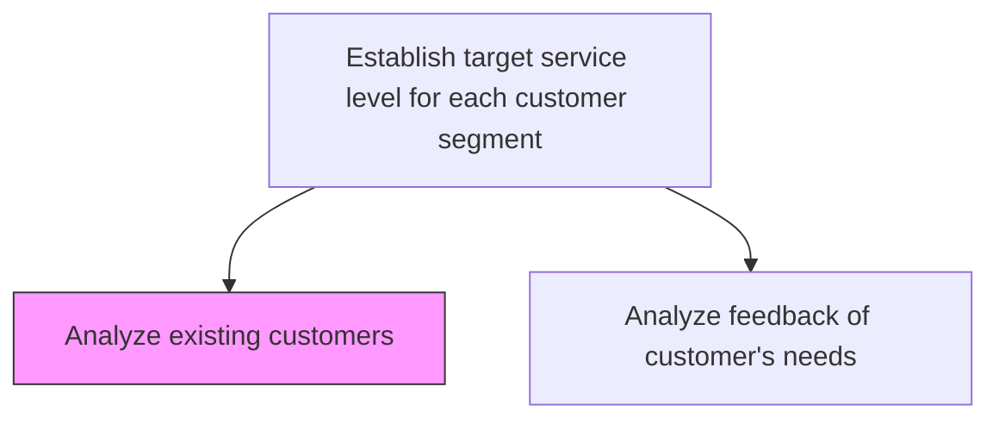
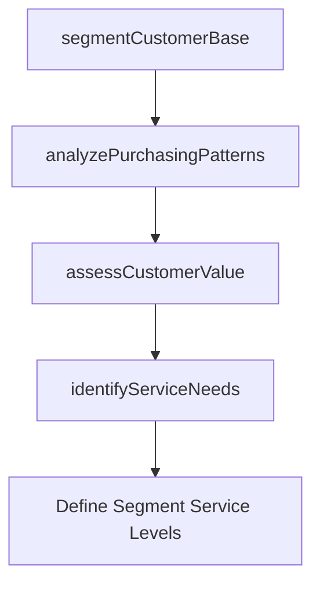

# Analyze existing customers

> Business-as-Code definition for existing customer analysis. Models behavioral segmentation, purchase pattern analysis, value assessment, and needs identification for service level targeting.

## Overview

Analyzing existing customers needs and behaviors to enhance the customer experience as a whole. Use techniques such as behavior analysis, purchasing analysis, and ceiling price analysis.

## Process Hierarchy



## GraphDL

```yaml
analyze:
  object: Existing Customers
  actor: CustomerAnalyst
  result: CustomerSegmentProfile
```

## Actions

| Action | Description |
|--------|-------------|
| segmentCustomerBase | Categorize existing customers by value, behavior, and service needs |
| analyzePurchasingPatterns | Examine transaction history to identify buying behaviors and trends |
| assessCustomerValue | Calculate customer lifetime value and profitability by segment |
| identifyServiceNeeds | Determine service requirements and preferences for each segment |

## Events

| Event | Description |
|-------|-------------|
| customerBaseSegmented | Customer segmentation analysis completed |
| purchasingPatternsAnalyzed | Transaction behavior analysis finalized |
| customerValueAssessed | Lifetime value and profitability calculated by segment |
| serviceNeedsIdentified | Segment-specific service requirements documented |

## Searches

| Search | Description |
|--------|-------------|
| getCustomerSegments | Retrieve customer segments by value tier or behavior |
| getPurchasingData | Query transaction history and buying patterns by segment |
| getCustomerValueMetrics | List customer lifetime value data by segment or account |

## Process Flow



## RACI Matrix

| Activity | Responsible | Accountable | Consulted | Informed |
|----------|-------------|-------------|-----------|----------|
| segmentCustomerBase | Customer Analyst | VP Customer Service | Marketing | Sales |
| analyzePurchasingPatterns | Customer Analyst | VP Customer Service | Finance | Product |
| assessCustomerValue | Customer Analyst | VP Customer Service | Finance | Executive Team |

## Related Processes

| Process | Relationship |
|---------|-------------|
| 6.1.5.2 Analyze feedback of customer's needs | Parallel - feedback data enriches customer analysis |
| 6.1.5 Establish target service level for each customer segment | Parent - analysis feeds service level targeting |

## Related Departments

| Department | Role |
|-----------|------|
| Customer Analytics | Conducts customer segmentation and value analysis |
| Marketing | Provides customer data and segmentation frameworks |
| Finance | Supplies revenue and profitability data |

## Related Occupations

| Occupation | Involvement |
|-----------|-------------|
| Customer Analyst | Performs segmentation and behavioral analysis |
| Data Analyst | Supports data extraction and statistical modeling |

## KPIs

| KPI | Description | Unit |
|-----|-------------|------|
| Segment Coverage | Percentage of customer base covered by defined segments | % |
| Analysis Recency | Days since last comprehensive customer analysis refresh | Days |
| Segment Value Accuracy | Variance between predicted and actual customer segment value | % |

## Usage

```typescript
import { analyzeExistingCustomers } from '@headlessly/analyze-existing-customers'

const analysis = analyzeExistingCustomers()

// Segment customer base
const segments = await analysis.segmentCustomerBase({
  criteria: ['revenue', 'frequency', 'recency', 'product-mix'],
  method: 'rfm-clustering',
  minSegmentSize: 100
})

// Assess customer value
const values = await analysis.assessCustomerValue({
  segmentIds: segments.map(s => s.id),
  timeHorizon: '3-years',
  includeChurnRisk: true
})
```
