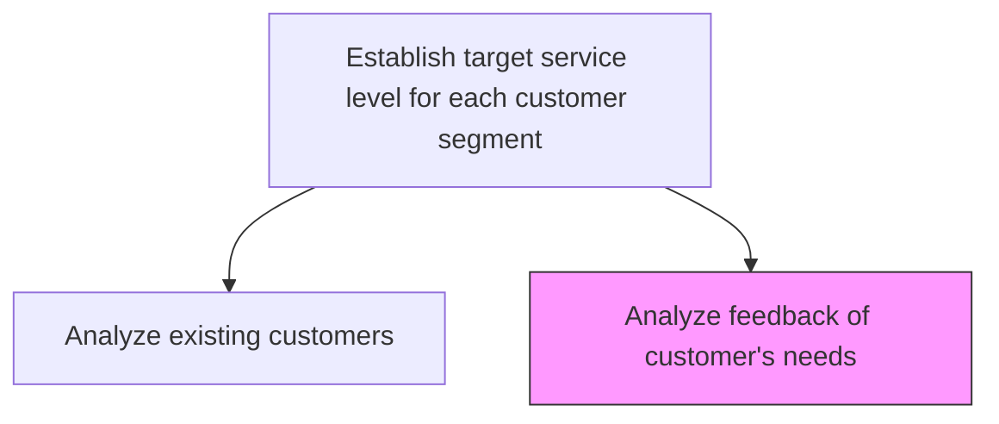
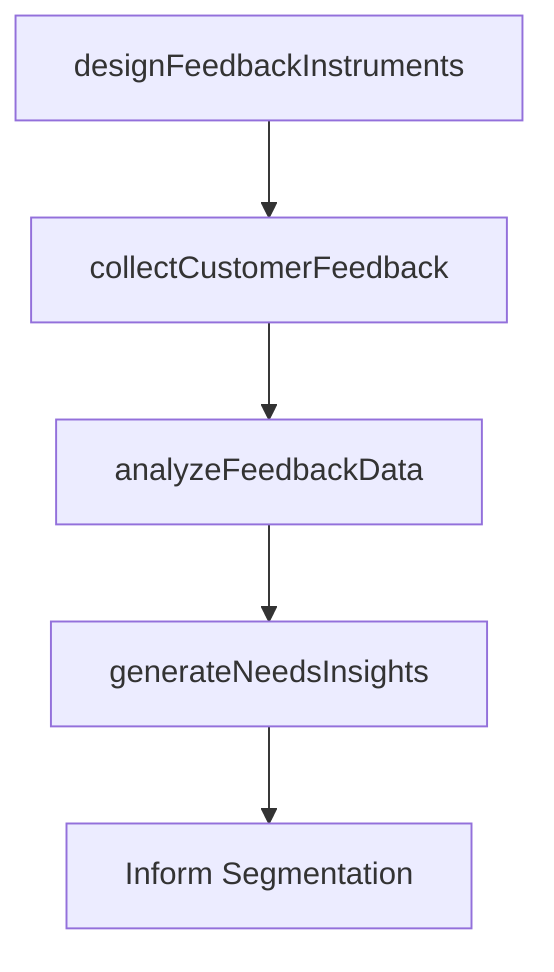

# Analyze feedback of customer's needs

> Business-as-Code definition for customer needs feedback analysis. Models feedback collection design, response analysis, needs identification, and segmentation insight generation.

## Overview

Adopting a feedback strategy by designing and implementing feedback forms--or through direct communication by phone or online. Comprehend the customer needs and behavior to help develop customer segmentation.

## Process Hierarchy



## GraphDL

```yaml
analyze:
  object: Feedback Of Customer's Needs
  actor: VoiceOfCustomerAnalyst
  result: NeedsAnalysisReport
```

## Actions

| Action | Description |
|--------|-------------|
| designFeedbackInstruments | Create surveys, forms, and interview guides to capture customer needs |
| collectCustomerFeedback | Gather feedback through surveys, calls, digital channels, and focus groups |
| analyzeFeedbackData | Process and categorize feedback to identify patterns and unmet needs |
| generateNeedsInsights | Produce actionable insights from feedback to inform segmentation and service levels |

## Events

| Event | Description |
|-------|-------------|
| feedbackInstrumentsDesigned | Feedback collection tools created and deployed |
| customerFeedbackCollected | Customer needs feedback gathered from target audiences |
| feedbackDataAnalyzed | Feedback patterns and themes identified |
| needsInsightsGenerated | Actionable customer needs insights produced |

## Searches

| Search | Description |
|--------|-------------|
| getFeedbackResponses | Retrieve customer feedback by segment, channel, or topic |
| getNeedsThemes | List identified customer needs themes ranked by frequency |
| getFeedbackTrends | Query customer needs evolution over time |

## Process Flow



## RACI Matrix

| Activity | Responsible | Accountable | Consulted | Informed |
|----------|-------------|-------------|-----------|----------|
| designFeedbackInstruments | VoC Analyst | VP Customer Service | Marketing | IT |
| collectCustomerFeedback | VoC Analyst | VP Customer Service | Service Teams | Customer |
| analyzeFeedbackData | VoC Analyst | VP Customer Service | Data Science | Product |

## Related Processes

| Process | Relationship |
|---------|-------------|
| 6.1.5.1 Analyze existing customers | Parallel - customer data enriches feedback analysis |
| 6.1.5 Establish target service level for each customer segment | Parent - feedback drives segment service levels |

## Related Departments

| Department | Role |
|-----------|------|
| Customer Experience | Designs and executes feedback collection programs |
| Marketing | Provides segmentation data and customer communications |
| Product Management | Receives unmet needs insights for product development |

## Related Occupations

| Occupation | Involvement |
|-----------|-------------|
| Voice of Customer Analyst | Designs feedback programs and analyzes responses |
| Market Research Analyst | Supports survey design and statistical analysis |

## KPIs

| KPI | Description | Unit |
|-----|-------------|------|
| Feedback Collection Rate | Percentage of target customers providing feedback | % |
| Needs Theme Coverage | Number of distinct customer need themes identified | Count |
| Insight Actionability Score | Percentage of insights rated as actionable by stakeholders | % |

## Usage

```typescript
import { analyzeFeedbackOfCustomersNeeds } from '@headlessly/analyze-feedback-of-customers-needs'

const feedback = analyzeFeedbackOfCustomersNeeds()

// Collect customer feedback
const responses = await feedback.collectCustomerFeedback({
  segment: 'enterprise',
  channels: ['email-survey', 'in-app', 'phone-interview'],
  targetResponses: 500
})

// Analyze feedback data
const analysis = await feedback.analyzeFeedbackData({
  responseSetId: responses.id,
  analysisType: 'thematic',
  sentimentAnalysis: true
})
```
