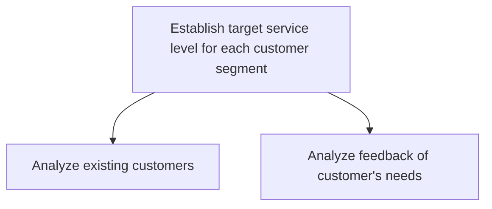
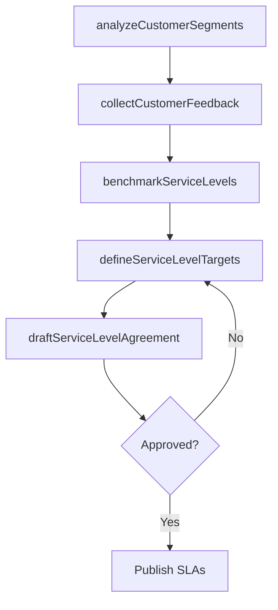

# Establish target service level for each customer segment

> Business-as-Code definition for service level target establishment by customer segment. Models customer analysis, needs assessment, SLA design, and service level benchmarking across segments.

## Overview

Determining and implementing levels for customer services. Benchmark certain customer service practices, and base customer level services on those benchmarks. Create a service level agreement, which is a negotiated agreement designed to create a common understanding about services, priorities, and responsibilities.

## Process Hierarchy



## GraphDL

```yaml
establish:
  object: Target Service Level For Each Customer Segment
  actor: ServiceLevelAnalyst
  result: ServiceLevelAgreement
```

## Actions

| Action | Description |
|--------|-------------|
| analyzeCustomerSegments | Profile existing customers by value, volume, and needs |
| collectCustomerFeedback | Gather feedback on service expectations from each segment |
| benchmarkServiceLevels | Compare service levels against industry and competitor standards |
| defineServiceLevelTargets | Set response time, resolution time, and availability targets per segment |
| draftServiceLevelAgreement | Create formal SLA documents with defined metrics and penalties |

## Events

| Event | Description |
|-------|-------------|
| customerSegmentsAnalyzed | Customer segmentation analysis completed |
| customerFeedbackCollected | Service expectation feedback gathered from segments |
| serviceLevelsBenchmarked | Industry and competitor service level comparison completed |
| serviceLevelTargetsDefined | Per-segment service level targets approved |
| serviceLevelAgreementDrafted | SLA document finalized and communicated |

## Searches

| Search | Description |
|--------|-------------|
| getSegmentProfiles | Retrieve customer segment profiles by tier, value, or geography |
| getServiceLevelTargets | Query service level targets by segment or metric type |
| getBenchmarkData | Retrieve industry service level benchmarking data |

## Process Flow



## RACI Matrix

| Activity | Responsible | Accountable | Consulted | Informed |
|----------|-------------|-------------|-----------|----------|
| analyzeCustomerSegments | Customer Insights Analyst | VP Customer Service | Sales, Marketing | Finance |
| benchmarkServiceLevels | Service Level Analyst | VP Customer Service | Operations | IT |
| defineServiceLevelTargets | Service Level Analyst | VP Customer Service | Finance, Operations | Account Managers |

## Sub-Processes

| ID | Name | Description |
|----|------|-------------|
| 6.1.5.1 | Analyze existing customers | Analyzing existing customers needs and behaviors to enhance the customer experience as a whole. Use  |
| 6.1.5.2 | Analyze feedback of customer's needs | Adopting a feedback strategy by designing and implementing feedback forms--or through direct communi |

## Related Processes

| Process | Relationship |
|---------|-------------|
| 6.1.4 Define customer service policies and procedures | Upstream - policies frame SLA boundaries |
| 6.5.1 Identify key metrics for assessing customer service | Downstream - SLA targets define measurement criteria |
| 6.2.2 Manage customer service problems, requests, and inquiries | Consumer - operations measured against SLA targets |

## Related Departments

| Department | Role |
|-----------|------|
| Customer Service | Implements and operates within defined service levels |
| Sales | Communicates SLAs to customers and manages expectations |
| Finance | Approves cost implications of service level commitments |

## Related Occupations

| Occupation | Involvement |
|-----------|-------------|
| Service Level Manager | Defines and monitors SLA compliance |
| Customer Insights Analyst | Performs segmentation and needs analysis |

## KPIs

| KPI | Description | Unit |
|-----|-------------|------|
| SLA Coverage | Percentage of customer segments with defined SLAs | % |
| SLA Compliance Rate | Percentage of interactions meeting SLA targets | % |
| Customer Segment Satisfaction Variance | Satisfaction score difference between segments | Score Delta |

## Usage

```typescript
import { establishTargetServiceLevelForEachCustomerSegment } from '@headlessly/establish-target-service-level-for-each-customer-segment'

const sla = establishTargetServiceLevelForEachCustomerSegment()

// Analyze customer segments
const segments = await sla.analyzeCustomerSegments({
  dimensions: ['annual-revenue', 'contract-tier', 'industry'],
  period: '2025-FY'
})

// Define service level targets
const targets = await sla.defineServiceLevelTargets({
  segment: 'enterprise',
  responseTime: { target: 15, unit: 'minutes' },
  resolutionTime: { target: 4, unit: 'hours' },
  availability: 99.9
})
```
