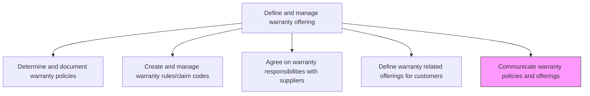
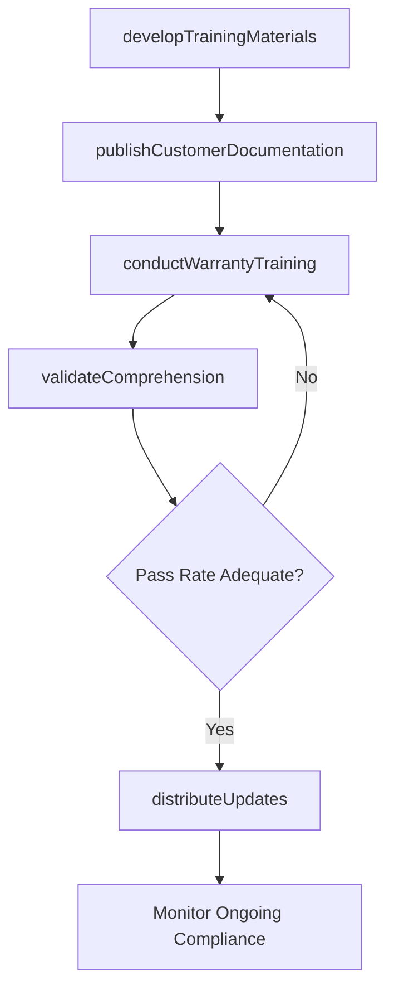

# Communicate warranty policies and offerings

> Business-as-Code definition for distributing warranty policies and offerings to internal teams, customers, dealers, and partners. Models the creation of training materials, customer-facing documentation, and multi-channel communication campaigns.

## Overview

Communicating rules and updates via training manuals for new products and training resources.

## Process Hierarchy



## GraphDL

```yaml
communicate:
  object: Warranty Policies And Offerings
  actor: TrainingCoordinator
  result: WarrantyCommunicationPlan
```

## Actions

| Action | Description |
|--------|-------------|
| developTrainingMaterials | Create training manuals and resources for service teams on warranty policies |
| publishCustomerDocumentation | Produce customer-facing warranty guides, brochures, and web content |
| conductWarrantyTraining | Deliver training sessions to service agents, dealers, and channel partners |
| distributeUpdates | Communicate warranty policy changes and updates to all stakeholders |
| validateComprehension | Assess understanding of warranty policies through quizzes and certification |

## Events

| Event | Description |
|-------|-------------|
| trainingMaterialsDeveloped | Warranty training materials created and reviewed |
| customerDocumentationPublished | Customer-facing warranty documentation published across channels |
| warrantyTrainingConducted | Training session delivered to service teams or partners |
| updatesDistributed | Warranty policy updates communicated to all stakeholders |
| comprehensionValidated | Agent and dealer warranty knowledge assessments completed |

## Searches

| Search | Description |
|--------|-------------|
| getTrainingMaterials | Retrieve warranty training resources by product line or audience |
| getCustomerDocuments | List customer-facing warranty documents by product or language |
| getTrainingCompletion | Query training completion rates by team, region, or individual |
| getUpdateHistory | Retrieve history of warranty policy communications and updates |

## Process Flow



## RACI Matrix

| Activity | Responsible | Accountable | Consulted | Informed |
|----------|-------------|-------------|-----------|----------|
| developTrainingMaterials | Training Coordinator | Warranty Program Manager | Product Management | Service Teams |
| publishCustomerDocumentation | Technical Writer | Warranty Program Manager | Marketing, Legal | Sales |
| conductWarrantyTraining | Training Coordinator | Warranty Program Manager | Subject Matter Experts | Dealers |
| distributeUpdates | Communications Specialist | Warranty Program Manager | IT | All Stakeholders |
| validateComprehension | Training Coordinator | Warranty Program Manager | Quality | Team Leads |

## Related Processes

| Process | Relationship |
|---------|-------------|
| 6.1.6.1 Determine and document warranty policies | Upstream - documented policies are the source content for communications |
| 6.1.6.4 Define warranty related offerings for customers | Upstream - new offerings require communication to sales channels |
| 6.3.2 Process warranty claims | Downstream - informed teams process claims more accurately |

## Related Departments

| Department | Role |
|-----------|------|
| Training and Development | Creates and delivers warranty training programs |
| Marketing | Produces customer-facing warranty communication materials |
| Customer Service | Receives training and applies warranty knowledge in interactions |
| Channel Management | Distributes warranty information to dealers and partners |

## Related Occupations

| Occupation | Involvement |
|-----------|-------------|
| Training Coordinator | Develops and delivers warranty training programs |
| Technical Writer | Creates warranty documentation and user guides |
| Communications Specialist | Manages multi-channel warranty policy distribution |

## KPIs

| KPI | Description | Unit |
|-----|-------------|------|
| Training Completion Rate | Percentage of service staff who completed warranty training | % |
| Knowledge Assessment Score | Average score on warranty policy comprehension assessments | Score (1-100) |
| Communication Reach | Percentage of stakeholders reached with latest policy updates | % |
| Time to Communicate Update | Days from policy approval to full stakeholder notification | Days |

## Usage

```typescript
import { communicateWarrantyPoliciesAndOfferings } from '@headlessly/communicate-warranty-policies-and-offerings'

const comms = communicateWarrantyPoliciesAndOfferings()

// Develop training materials for a new product line
const materials = await comms.developTrainingMaterials({
  productLine: 'industrial-motors',
  audience: ['service-agents', 'dealers'],
  format: ['manual', 'video', 'quick-reference']
})

// Conduct warranty training
const session = await comms.conductWarrantyTraining({
  materialId: materials.id,
  team: 'tier-1-support',
  deliveryMethod: 'virtual-classroom',
  assessmentRequired: true
})
```
