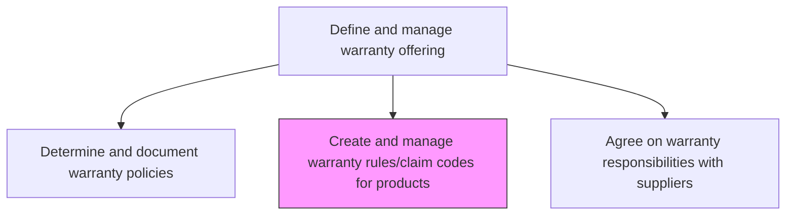
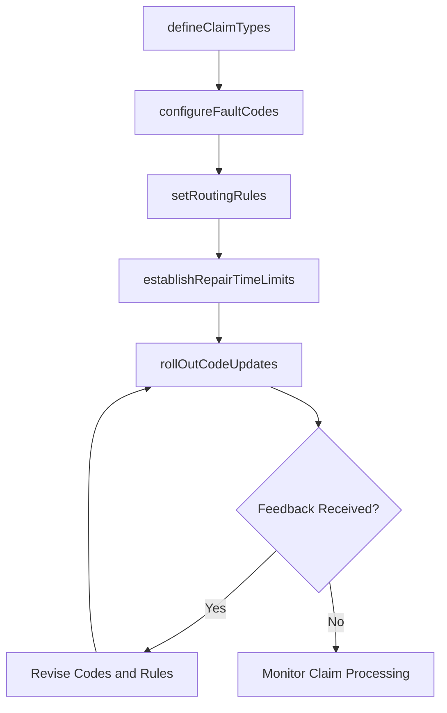

# Create and manage warranty rules/claim codes for products

> Business-as-Code definition for warranty rules and claim code management. Models the creation, configuration, and maintenance of warranty claim types, fault codes, repair codes, routing rules, and coverage lists used to process warranty claims.

## Overview

Establishing and maintaining claims processing and routing rules. Establish and maintain claims processing and routing rules for product warranties, coverage lists, repair, fault, trouble codes, repair time setup, and warranty policy registration. This also includes rolling out the codes and rules, and the improvements/updates to these rules and codes via systematic updates.

## Process Hierarchy



## GraphDL

```yaml
create:
  object: And Manage Warranty Rules/claim Codes For Products
  actor: WarrantyAdministrator
  result: ClaimCodeConfiguration
```

## Actions

| Action | Description |
|--------|-------------|
| defineClaimTypes | Establish categories for warranty claims such as defect, DOA, and premature failure |
| configureFaultCodes | Create fault and trouble codes mapped to product components and failure modes |
| setRoutingRules | Define rules for automatic claim routing based on type, value, and product |
| establishRepairTimeLimits | Set standard repair time allowances for each product and claim type |
| rollOutCodeUpdates | Distribute new or updated claim codes and rules to service teams and systems |

## Events

| Event | Description |
|-------|-------------|
| claimTypesDefined | Warranty claim type categories established and published |
| faultCodesConfigured | Fault and trouble codes mapped and activated in the system |
| routingRulesSet | Claim routing rules configured and tested |
| repairTimeLimitsEstablished | Standard repair time allowances published for all product lines |
| codeUpdatesRolledOut | Updated claim codes and rules distributed to all service channels |

## Searches

| Search | Description |
|--------|-------------|
| getClaimCodes | List active claim codes filtered by product, type, or fault category |
| getRoutingRules | Retrieve claim routing rules by product line or claim value threshold |
| getFaultCodes | Query fault codes by component, product, or failure mode |
| getRepairTimeStandards | Retrieve standard repair time allowances by product and claim type |

## Process Flow



## RACI Matrix

| Activity | Responsible | Accountable | Consulted | Informed |
|----------|-------------|-------------|-----------|----------|
| defineClaimTypes | Warranty Administrator | Warranty Program Manager | Product Engineering | Claims Team |
| configureFaultCodes | Warranty Administrator | Warranty Program Manager | Quality, Engineering | Field Service |
| setRoutingRules | IT Systems Analyst | Warranty Program Manager | Claims Team | Finance |
| establishRepairTimeLimits | Field Service Manager | Warranty Program Manager | Engineering | Claims Team |
| rollOutCodeUpdates | Training Coordinator | Warranty Program Manager | IT | All Service Teams |

## Related Processes

| Process | Relationship |
|---------|-------------|
| 6.1.6.1 Determine and document warranty policies | Upstream - policies define the framework for claim codes |
| 6.3.2 Process warranty claims | Downstream - claim codes and rules govern claims processing |
| 6.5.6 Evaluate and manage warranty performance | Feedback loop - performance data informs code refinements |

## Related Departments

| Department | Role |
|-----------|------|
| Warranty Administration | Creates and maintains claim codes and routing rules |
| Information Technology | Implements codes and rules in warranty management systems |
| Product Engineering | Provides technical input on fault codes and failure modes |
| Field Service | Uses repair codes and time standards during service delivery |

## Related Occupations

| Occupation | Involvement |
|-----------|-------------|
| Warranty Administrator | Configures and maintains claim codes and processing rules |
| Systems Analyst | Implements coding structures in warranty management platforms |
| Quality Engineer | Defines fault codes based on product failure analysis |

## KPIs

| KPI | Description | Unit |
|-----|-------------|------|
| Code Coverage Rate | Percentage of active products with complete claim code mappings | % |
| Routing Accuracy | Percentage of claims correctly routed on first assignment | % |
| Code Update Cycle Time | Average days to implement and roll out code changes | Days |
| Fault Code Utilization | Percentage of configured fault codes actively used in claims | % |

## Usage

```typescript
import { createAndManageWarrantyRulesClaimCodesForProducts } from '@headlessly/create-and-manage-warranty-rules-claim-codes-for-products'

const claimCodes = createAndManageWarrantyRulesClaimCodesForProducts()

// Define claim types for a product line
const types = await claimCodes.defineClaimTypes({
  productLine: 'industrial-pumps',
  types: ['manufacturer-defect', 'premature-failure', 'DOA', 'shipping-damage']
})

// Configure fault codes
await claimCodes.configureFaultCodes({
  productLine: 'industrial-pumps',
  faultCodes: [
    { code: 'FP-001', component: 'motor', failure: 'overheating' },
    { code: 'FP-002', component: 'seal', failure: 'leakage' }
  ]
})
```
