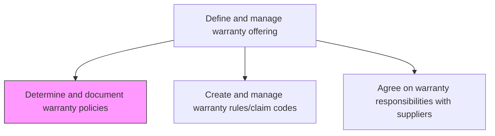
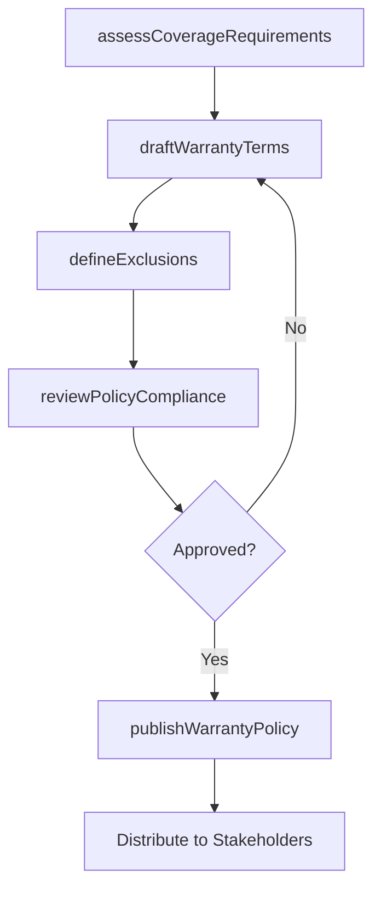

# Determine and document warranty policies

> Business-as-Code definition for warranty policy determination and documentation. Models the end-to-end process of defining warranty terms, coverage conditions, exclusions, and documenting policies for organizational alignment.

## Overview

Establishing warranty policies to assure customers that the company will guarantee its warranties that it issues.

## Process Hierarchy



## GraphDL

```yaml
determine:
  object: And Document Warranty Policies
  actor: WarrantyPolicyManager
  result: WarrantyPolicyDocument
```

## Actions

| Action | Description |
|--------|-------------|
| assessCoverageRequirements | Evaluate product lines and customer expectations to define coverage needs |
| draftWarrantyTerms | Write warranty terms including duration, coverage scope, and conditions |
| defineExclusions | Specify conditions and circumstances excluded from warranty coverage |
| reviewPolicyCompliance | Ensure warranty policies comply with consumer protection regulations |
| publishWarrantyPolicy | Finalize and distribute approved warranty policy documents |

## Events

| Event | Description |
|-------|-------------|
| coverageRequirementsAssessed | Product coverage analysis completed and documented |
| warrantyTermsDrafted | Draft warranty terms prepared for review |
| exclusionsDefined | Warranty exclusion criteria established |
| policyComplianceReviewed | Regulatory compliance review of warranty terms completed |
| warrantyPolicyPublished | Approved warranty policy documents distributed to stakeholders |

## Searches

| Search | Description |
|--------|-------------|
| getWarrantyPolicies | Retrieve warranty policies filtered by product line, region, or effective date |
| getCoverageTerms | Query coverage details for a specific product or product family |
| getExclusionCriteria | List warranty exclusion criteria by product or policy version |
| getPolicyVersionHistory | Retrieve revision history for a specific warranty policy |

## Process Flow



## RACI Matrix

| Activity | Responsible | Accountable | Consulted | Informed |
|----------|-------------|-------------|-----------|----------|
| assessCoverageRequirements | Warranty Policy Manager | VP Customer Service | Product Management | Finance |
| draftWarrantyTerms | Warranty Policy Manager | VP Customer Service | Legal | Sales |
| defineExclusions | Warranty Policy Manager | VP Customer Service | Engineering, Quality | Claims Team |
| reviewPolicyCompliance | Legal Counsel | VP Customer Service | Regulatory Affairs | Executive Team |
| publishWarrantyPolicy | Training Coordinator | Warranty Policy Manager | Marketing | All Service Teams |

## Related Processes

| Process | Relationship |
|---------|-------------|
| 6.1.6.2 Create and manage warranty rules/claim codes for products | Downstream - policies define the rules for claim processing |
| 6.1.6.5 Communicate warranty policies and offerings | Downstream - documented policies are communicated to stakeholders |
| 6.3.2 Process warranty claims | Consumer - claims are adjudicated against documented policies |

## Related Departments

| Department | Role |
|-----------|------|
| Warranty Administration | Drafts and maintains warranty policy documents |
| Legal | Reviews policies for regulatory compliance and liability exposure |
| Product Management | Provides product specifications to define coverage parameters |
| Finance | Assesses financial impact of warranty coverage commitments |

## Related Occupations

| Occupation | Involvement |
|-----------|-------------|
| Warranty Policy Manager | Leads policy development and documentation |
| Legal Counsel | Reviews warranty terms for regulatory compliance |
| Product Manager | Advises on product-specific coverage requirements |

## KPIs

| KPI | Description | Unit |
|-----|-------------|------|
| Policy Coverage Rate | Percentage of active products with documented warranty policies | % |
| Policy Update Cycle Time | Average days to revise and republish warranty policies | Days |
| Regulatory Compliance Rate | Percentage of policies passing compliance review on first submission | % |

## Usage

```typescript
import { determineAndDocumentWarrantyPolicies } from '@headlessly/determine-and-document-warranty-policies'

const policies = determineAndDocumentWarrantyPolicies()

// Assess coverage requirements for a product line
const requirements = await policies.assessCoverageRequirements({
  productLine: 'industrial-motors',
  market: 'North America',
  customerSegments: ['enterprise', 'mid-market']
})

// Draft warranty terms
const terms = await policies.draftWarrantyTerms({
  productLine: 'industrial-motors',
  coveragePeriod: { months: 24 },
  coverageType: 'parts-and-labor',
  exclusions: ['cosmetic-damage', 'unauthorized-modification']
})
```
