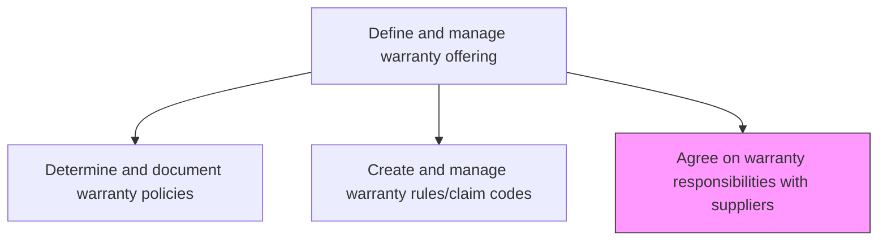
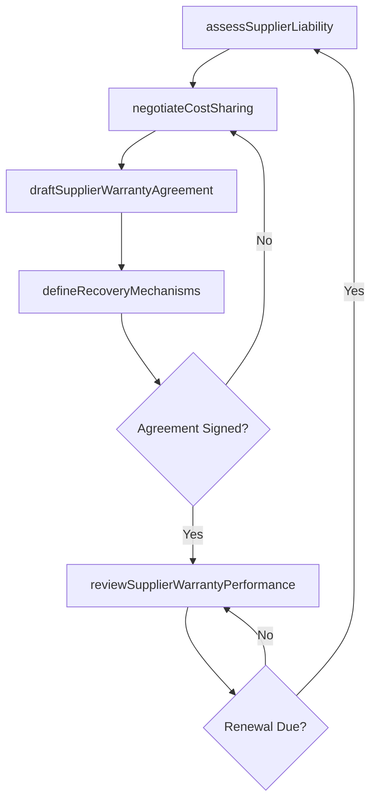

# Agree on warranty responsibilities with suppliers

> Business-as-Code definition for negotiating and formalizing warranty responsibility agreements with suppliers. Models the process of defining cost-sharing arrangements, liability allocation, and recovery mechanisms for supplier-sourced components.

## Overview

Negotiating and establishing formal agreements with suppliers regarding their warranty obligations for components and materials they provide. This includes defining liability allocation for defective parts, cost-sharing arrangements for warranty claims, and mechanisms for cost recovery when supplier-sourced components cause warranty issues.

## Process Hierarchy



## GraphDL

```yaml
agree:
  object: On Warranty Responsibilities With Suppliers
  actor: ProcurementManager
  result: SupplierWarrantyAgreement
```

## Actions

| Action | Description |
|--------|-------------|
| assessSupplierLiability | Evaluate supplier responsibility for component defects and failures |
| negotiateCostSharing | Establish cost-sharing terms for warranty claims involving supplier parts |
| draftSupplierWarrantyAgreement | Formalize warranty responsibility terms in supplier contracts |
| defineRecoveryMechanisms | Specify procedures for recovering warranty costs from responsible suppliers |
| reviewSupplierWarrantyPerformance | Evaluate supplier compliance with warranty responsibility agreements |

## Events

| Event | Description |
|-------|-------------|
| supplierLiabilityAssessed | Supplier warranty liability evaluation completed |
| costSharingNegotiated | Warranty cost-sharing terms agreed with supplier |
| supplierWarrantyAgreementDrafted | Formal warranty responsibility agreement finalized |
| recoveryMechanismsDefined | Supplier cost recovery procedures established |
| supplierWarrantyPerformanceReviewed | Supplier warranty compliance evaluation completed |

## Searches

| Search | Description |
|--------|-------------|
| getSupplierAgreements | Retrieve supplier warranty agreements by supplier, product, or status |
| getCostSharingTerms | Query cost-sharing arrangements by supplier or component type |
| getSupplierWarrantyMetrics | Retrieve supplier warranty claim frequency and recovery data |
| getPendingNegotiations | List supplier warranty agreements pending negotiation or renewal |

## Process Flow



## RACI Matrix

| Activity | Responsible | Accountable | Consulted | Informed |
|----------|-------------|-------------|-----------|----------|
| assessSupplierLiability | Procurement Manager | VP Supply Chain | Quality, Engineering | Warranty Administration |
| negotiateCostSharing | Procurement Manager | VP Supply Chain | Finance, Legal | Warranty Program Manager |
| draftSupplierWarrantyAgreement | Contract Manager | VP Supply Chain | Legal | Procurement |
| defineRecoveryMechanisms | Warranty Program Manager | VP Customer Service | Finance, Procurement | Accounts Payable |
| reviewSupplierWarrantyPerformance | Supplier Quality Engineer | VP Supply Chain | Warranty Administration | Procurement |

## Related Processes

| Process | Relationship |
|---------|-------------|
| 6.1.6.1 Determine and document warranty policies | Upstream - warranty policies define the framework for supplier agreements |
| 6.3.3 Manage supplier recovery | Downstream - agreements define the basis for cost recovery claims |
| 6.5.6 Evaluate and manage warranty performance | Feedback loop - warranty data informs supplier renegotiations |

## Related Departments

| Department | Role |
|-----------|------|
| Procurement | Leads supplier warranty negotiations and contract management |
| Legal | Reviews and approves warranty responsibility contract terms |
| Quality Assurance | Provides defect data and root cause analysis for liability assessment |
| Finance | Models cost-sharing impacts and tracks supplier recovery amounts |

## Related Occupations

| Occupation | Involvement |
|-----------|-------------|
| Procurement Manager | Negotiates warranty terms with suppliers |
| Contract Manager | Drafts and maintains supplier warranty agreements |
| Supplier Quality Engineer | Evaluates supplier defect rates and warranty compliance |

## KPIs

| KPI | Description | Unit |
|-----|-------------|------|
| Supplier Agreement Coverage | Percentage of key suppliers with warranty responsibility agreements | % |
| Cost Recovery Rate | Percentage of eligible warranty costs recovered from suppliers | % |
| Agreement Renewal Timeliness | Percentage of agreements renewed before expiration | % |
| Supplier Warranty Claim Rate | Number of warranty claims attributable to supplier components per period | Count |

## Usage

```typescript
import { agreeOnWarrantyResponsibilitiesWithSuppliers } from '@headlessly/agree-on-warranty-responsibilities-with-suppliers'

const supplierWarranty = agreeOnWarrantyResponsibilitiesWithSuppliers()

// Assess supplier liability for a component
const assessment = await supplierWarranty.assessSupplierLiability({
  supplierId: 'SUP-2025-100',
  componentType: 'motor-assembly',
  defectRate: 0.02,
  claimHistory: { period: '2024-FY', totalClaims: 47 }
})

// Negotiate cost-sharing terms
const terms = await supplierWarranty.negotiateCostSharing({
  supplierId: 'SUP-2025-100',
  costSplit: { supplier: 80, manufacturer: 20 },
  coveragePeriod: { months: 36 }
})
```
