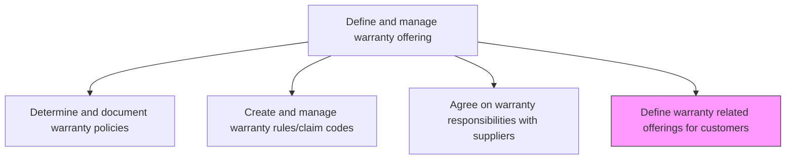
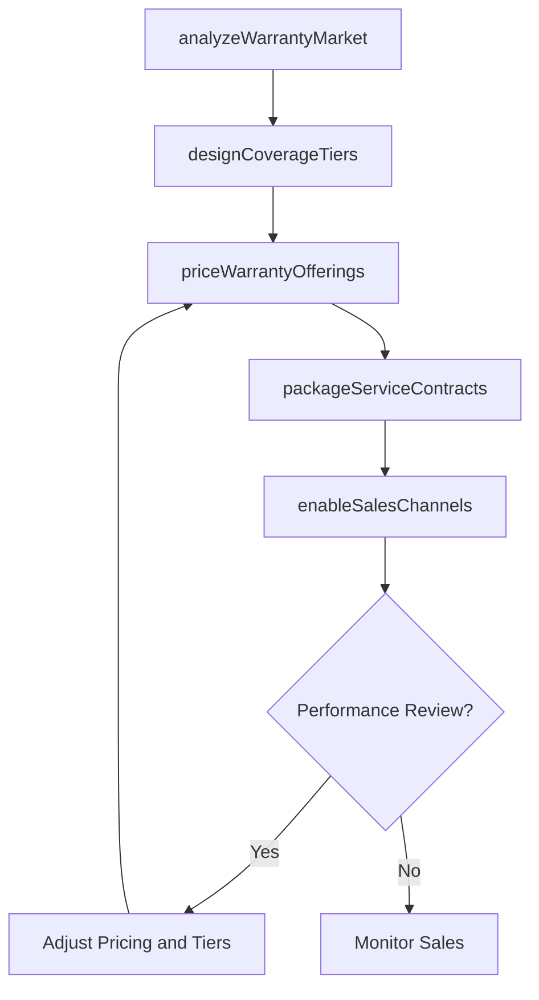

# Define warranty related offerings for customers e.g. service contract

> Business-as-Code definition for creating customer-facing warranty offerings and service contracts. Models the design, pricing, and packaging of extended warranties, service agreements, and preventive maintenance plans.

## Overview

Designing and establishing warranty-related offerings that customers can purchase, including extended warranty plans, service contracts, preventive maintenance agreements, and premium support packages. This involves market analysis, pricing strategy, packaging of coverage tiers, and integration with sales channels.

## Process Hierarchy



## GraphDL

```yaml
define:
  object: Warranty Related Offerings For Customers E.g. Service Contract
  actor: ProductManager
  result: WarrantyOfferingCatalog
```

## Actions

| Action | Description |
|--------|-------------|
| analyzeWarrantyMarket | Research customer demand and competitor offerings for extended warranty products |
| designCoverageTiers | Create differentiated warranty coverage levels with specific terms and benefits |
| priceWarrantyOfferings | Establish pricing for warranty products based on cost modeling and market analysis |
| packageServiceContracts | Bundle warranty coverage with maintenance services into purchasable contracts |
| enableSalesChannels | Configure warranty offerings for sale through direct and partner channels |

## Events

| Event | Description |
|-------|-------------|
| warrantyMarketAnalyzed | Customer demand and competitive landscape analysis completed |
| coverageTiersDesigned | Extended warranty coverage tiers defined and documented |
| warrantyOfferingsPriced | Pricing established for all warranty products and tiers |
| serviceContractsPackaged | Service contracts bundled and ready for customer sale |
| salesChannelsEnabled | Warranty offerings activated in all applicable sales channels |

## Searches

| Search | Description |
|--------|-------------|
| getWarrantyOfferings | Retrieve available warranty offerings by product, tier, or price range |
| getServiceContracts | List service contract options by product line or customer segment |
| getOfferingPerformance | Query sales and attach rate metrics for warranty offerings |
| getCompetitiveAnalysis | Retrieve competitor warranty offering comparison data |

## Process Flow



## RACI Matrix

| Activity | Responsible | Accountable | Consulted | Informed |
|----------|-------------|-------------|-----------|----------|
| analyzeWarrantyMarket | Market Analyst | Product Manager | Sales, Marketing | VP Customer Service |
| designCoverageTiers | Product Manager | VP Customer Service | Engineering, Legal | Sales |
| priceWarrantyOfferings | Pricing Analyst | Product Manager | Finance, Actuarial | Sales |
| packageServiceContracts | Product Manager | VP Customer Service | Marketing | Channel Partners |
| enableSalesChannels | Sales Operations Manager | Product Manager | IT, Channel Partners | Training |

## Related Processes

| Process | Relationship |
|---------|-------------|
| 6.1.6.1 Determine and document warranty policies | Upstream - base warranty defines the extension starting point |
| 6.1.6.5 Communicate warranty policies and offerings | Downstream - offerings must be communicated to customers and sales teams |
| 3.3.1 Develop pricing strategy | Parallel - warranty pricing aligns with product pricing strategy |

## Related Departments

| Department | Role |
|-----------|------|
| Product Management | Designs warranty offerings and coverage tiers |
| Finance | Models warranty economics and validates pricing |
| Marketing | Develops promotional materials for warranty products |
| Sales | Sells warranty offerings to customers at point of purchase |

## Related Occupations

| Occupation | Involvement |
|-----------|-------------|
| Product Manager | Leads warranty offering design and go-to-market |
| Pricing Analyst | Develops pricing models for warranty products |
| Sales Representative | Presents and sells warranty offerings to customers |

## KPIs

| KPI | Description | Unit |
|-----|-------------|------|
| Extended Warranty Attach Rate | Percentage of product purchases that include an extended warranty | % |
| Warranty Revenue Per Unit | Average revenue generated from warranty sales per product sold | USD |
| Service Contract Renewal Rate | Percentage of expiring service contracts that are renewed | % |
| Warranty Margin | Profit margin on warranty and service contract revenue | % |

## Usage

```typescript
import { defineWarrantyRelatedOfferingsForCustomers } from '@headlessly/define-warranty-related-offerings-for-customers'

const offerings = defineWarrantyRelatedOfferingsForCustomers()

// Design coverage tiers for a product line
const tiers = await offerings.designCoverageTiers({
  productLine: 'industrial-motors',
  tiers: [
    { name: 'Standard', duration: { months: 12 }, coverage: 'parts-only' },
    { name: 'Premium', duration: { months: 36 }, coverage: 'parts-and-labor' },
    { name: 'Comprehensive', duration: { months: 60 }, coverage: 'full-replacement' }
  ]
})

// Price the warranty offerings
const pricing = await offerings.priceWarrantyOfferings({
  tierId: tiers[1].id,
  costModel: 'actuarial',
  targetMargin: 0.35
})
```
